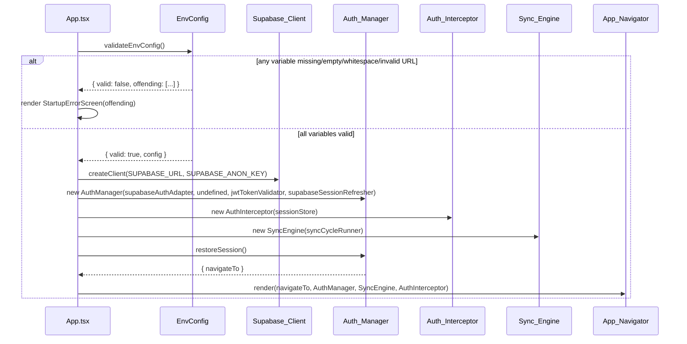
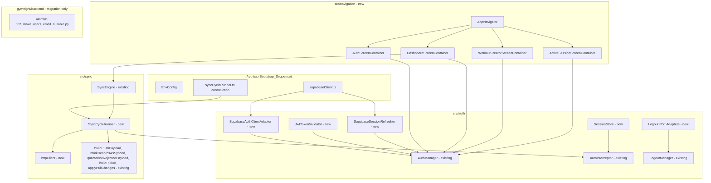
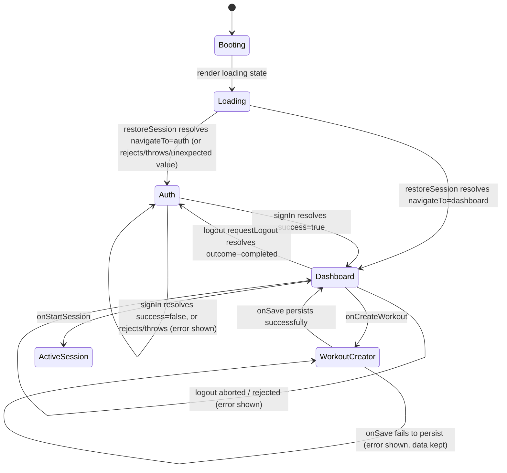

# Design Document: Frontend-Backend Integration

## Overview

This feature wires already-implemented, already-tested modules together so the GymNight Mobile app runs against real infrastructure instead of test doubles. It does **not** introduce new business logic in `src/auth/*` or `src/sync/*`, does **not** touch `src/designSystem/*`, and does **not** modify any of the four screen components or their tests (Requirement 14). Every module referenced below (`AuthManager`, `AuthInterceptor`, `LogoutManager`, `SyncEngine`, `syncAdapters`, `pullRequest`, `pullApply`, `conflictResolution`, `TokenRefreshCoordinator`, `classify401Response`, the four screens and their hooks) already exists and is out of scope for redesign. This design covers exactly five new concerns:

1. **Env_Config** — reading and validating `EXPO_PUBLIC_*` variables at two designated construction points.
2. **Concrete adapters** for the four injectable interfaces the Auth_Manager/Auth_Interceptor/Logout_Manager already declare (`SupabaseAuthClient`, `TokenValidator`, `SessionRefresher`, `SessionProvider`, `SupabaseLogoutPort`, `LogoutStoragePort`, `LogoutWipePort`).
3. **Sync_Cycle_Runner** — the concrete `() => Promise<void>` that drives push-then-pull against the real `Sync_Router`, composed entirely from existing pure helpers (`buildPushPayload`, `markRecordsAsSynced`, `quarantineRejectedPayload`, `buildPullUrl`, `applyPullChanges`).
4. **App_Navigator + Screen_Containers** — real `@react-navigation/native` wiring and per-screen prop assembly from `Reactive_Query`, `Sync_Engine`, and `Auth_Manager`.
5. **Backend migration** — dropping `NOT NULL` on `users.email` without touching the `User` model, `UserProfileCreate` schema, or the `POST /users` handler.

### Key Design Decision: "Wiring only" boundary

Every new file introduced by this design either (a) implements one of the dependency-injection interfaces already declared by the existing auth/sync modules, (b) is a thin composition root (`App.tsx`, `AppNavigator.tsx`, a `*Container.tsx` per screen), or (c) is a database migration. No new file redefines behavior that already has a tested implementation. Where a screen needs a prop its interface doesn't expose, Requirement 14.4 requires leaving that need unimplemented rather than editing the screen's interface — with one narrow, explicit exception per Criterion 14.5: `DashboardScreenProps` gains exactly two new callback props, `onStartSession` and `onLogout`, to satisfy Requirements 7.5 and 8.5. That exception is scoped to those two props only; Dashboard_Screen's rendering logic is touched only minimally to invoke them, and no other screen's interface is affected. This is called out explicitly in Components and Interfaces below rather than silently worked around.

## Architecture

### Bootstrap sequence



### Component overview



### Navigation state machine



## Components and Interfaces

### 1. Env_Config — `src/config/env.ts`

Pure, side-effect-free module that reads and validates the three `EXPO_PUBLIC_*` variables. This is the **only** file (together with the two construction files below) allowed to read these variables (Requirement 2.5).

```typescript
export interface EnvConfig {
  supabaseUrl: string;
  supabaseAnonKey: string;
  backendBaseUrl: string;
}

export type EnvValidationResult =
  | { valid: true; config: EnvConfig }
  | { valid: false; offending: string[] }; // exact names of missing/empty/whitespace/invalid vars

/** Reads process.env.EXPO_PUBLIC_* and validates presence + URL-well-formedness. */
export function validateEnvConfig(
  source: Record<string, string | undefined> = process.env,
): EnvValidationResult;
```

Validation rules (Requirement 1.6):
- A variable is "offending" if it is `undefined`, `''`, or matches `/^\s*$/` (whitespace-only).
- `EXPO_PUBLIC_SUPABASE_URL` and `EXPO_PUBLIC_BACKEND_BASE_URL` are additionally offending if `new URL(value)` throws (not a syntactically valid absolute URL). `EXPO_PUBLIC_SUPABASE_ANON_KEY` has no URL-shape requirement.
- `offending` lists the **environment variable names**, not values, in the fixed order `[EXPO_PUBLIC_SUPABASE_URL, EXPO_PUBLIC_SUPABASE_ANON_KEY, EXPO_PUBLIC_BACKEND_BASE_URL]`, filtered to only those that failed.

`App.tsx` calls `validateEnvConfig()` once at the start of the Bootstrap_Sequence. On `{ valid: false }` it renders a `StartupErrorScreen` (new, trivial presentational component — not one of the four screens governed by Requirement 14) listing every name in `offending`, and does not construct the Supabase_Client, Auth_Manager, Sync_Engine, or App_Navigator (Requirement 1.6).

### 2. Supabase_Client construction — `src/auth/supabaseClient.ts`

The **single** file permitted to call `createClient` (Requirement 2.3).

```typescript
import { createClient } from '@supabase/supabase-js';
import { validateEnvConfig } from '../config/env';

// Called only after Bootstrap_Sequence has confirmed env validity.
export function createSupabaseClient(config: EnvConfig): SupabaseClient {
  return createClient(config.supabaseUrl, config.supabaseAnonKey);
}
```

### 3. SupabaseAuthClient adapter — `src/auth/supabaseAuthClientAdapter.ts`

Implements the existing `SupabaseAuthClient` interface from `AuthManager.ts` **without modifying that interface** (Requirement 14.3).

```typescript
import type { SupabaseClient } from '@supabase/supabase-js';
import type { SupabaseAuthClient } from './AuthManager';

export function createSupabaseAuthClientAdapter(client: SupabaseClient): SupabaseAuthClient {
  return {
    async signInWithPassword(credentials) {
      try {
        const { data, error } = await client.auth.signInWithPassword(credentials);
        if (error) {
          return { data: { session: null }, error: { message: error.message } };
        }
        if (!data.session) {
          return { data: { session: null }, error: null };
        }
        return {
          data: {
            session: {
              access_token: data.session.access_token,
              refresh_token: data.session.refresh_token,
              user_id: data.session.user.id,
            },
          },
          error: null,
        };
      } catch (err) {
        const message = err instanceof Error ? err.message : String(err);
        return { data: { session: null }, error: { message } };
      }
    },
  };
}
```

This single `try/catch` around the whole method satisfies both the mapping requirements (3.2, 3.3) and the never-throws requirement (3.4): Supabase-returned errors go through the `if (error)` branch, thrown/rejected failures go through `catch`, and both terminate in the same declared error shape.

### 4. Token_Validator — `src/auth/jwtTokenValidator.ts`

```typescript
import type { TokenValidator } from './AuthManager';

function decodeJwtPayload(token: string): Record<string, unknown> | null {
  try {
    const [, payloadB64] = token.split('.');
    if (!payloadB64) return null;
    const json = base64UrlDecode(payloadB64); // helper: base64url -> utf8 string
    return JSON.parse(json);
  } catch {
    return null;
  }
}

export const jwtTokenValidator: TokenValidator = {
  isExpired(accessToken: string): boolean {
    const payload = decodeJwtPayload(accessToken);
    const exp = payload?.exp;
    if (typeof exp !== 'number') return true; // undecodable or missing exp → expired (Req 4.2)
    return Math.floor(Date.now() / 1000) >= exp;
  },
};
```

No JWT-decoding library is required (`Auth_Interceptor`/`AuthManager` never need the signature verified — only the backend verifies signatures via `SUPABASE_JWT_SECRET`); a plain base64url + `JSON.parse` decode of the payload segment is sufficient and keeps this module dependency-free.

### 5. Session_Refresher — `src/auth/supabaseSessionRefresher.ts`

```typescript
import type { SupabaseClient } from '@supabase/supabase-js';
import type { SessionRefresher } from './AuthManager';

export function createSupabaseSessionRefresher(client: SupabaseClient): SessionRefresher {
  return {
    async refresh(refreshToken: string) {
      try {
        const { data, error } = await client.auth.refreshSession({ refresh_token: refreshToken });
        if (error || !data.session) {
          return { session: null, error: error ? new Error(error.message) : new Error('No session returned') };
        }
        return {
          session: {
            access_token: data.session.access_token,
            refresh_token: data.session.refresh_token,
            user_id: data.session.user.id,
          },
          error: null,
        };
      } catch (err) {
        return { session: null, error: err instanceof Error ? err : new Error(String(err)) };
      }
    },
  };
}
```

### 6. Session_Store / SessionProvider — `src/auth/sessionStore.ts`

`AuthInterceptor` requires a `SessionProvider` (`getCurrentSession(): Session | null`) that always reflects the latest sign-in/restore/refresh, or `null` after logout (Requirement 10.2). Rather than re-deriving this from `SecureStorage` on every call (which would be async and couldn't satisfy the synchronous `SessionProvider` interface), a small in-memory store is the single source of truth for "the current session", updated by every producer:

```typescript
export interface SessionStore {
  set(session: Session): void;
  clear(): void;
  getCurrentSession(): Session | null; // satisfies AuthInterceptor's SessionProvider
}

export function createSessionStore(): SessionStore {
  let current: Session | null = null;
  return {
    set(session) { current = session; },
    clear() { current = null; },
    getCurrentSession() { return current; },
  };
}
```

Wiring in the Bootstrap_Sequence (Requirement 10.3): `AuthManager.signIn()` and `.restoreSession()` results, and every successful `SessionRefresher.refresh()`, call `sessionStore.set(session)`; `LogoutManager`'s `LogoutStoragePort` adapter calls `sessionStore.clear()` in the same call that clears `SecureStorage`. Since `AuthManager`/`SessionRefresher` don't natively call out to the store (their interfaces predate this feature and are not modified per Requirement 14.3), the Bootstrap_Sequence wraps their call sites: every place that calls `authManager.signIn(...)`, `authManager.restoreSession()`, or receives a refreshed session from the 401-retry path (`Requirement 4.6`) also calls `sessionStore.set(...)` with the resulting session before proceeding, and the Logout_Manager's storage/wipe adapters call `sessionStore.clear()`.

### 7. Logout port adapters — `src/auth/logoutAdapters.ts`

Implements the three ports declared in `LogoutManager.ts` without modifying that file:

```typescript
import type { SupabaseLogoutPort, LogoutStoragePort, LogoutWipePort } from './LogoutManager';

export function createSupabaseLogoutPort(client: SupabaseClient): SupabaseLogoutPort {
  return {
    async invalidateSession() {
      const { error } = await client.auth.signOut();
      if (error) throw new Error(error.message); // propagate, never swallow (Req 7.1)
    },
  };
}

export function createLogoutStoragePort(sessionStore: SessionStore): LogoutStoragePort {
  return {
    async clearSession() {
      await clearSession(); // from SecureStorage.ts — unmodified
      sessionStore.clear();
    },
  };
}

export function createLogoutWipePort(db: Database): LogoutWipePort {
  const TABLES = ['users', 'exercises', 'workouts', 'workout_exercises', 'workout_sessions', 'logged_sets'] as const;
  return {
    async wipeAllTablesAndCursor() {
      await db.write(async () => {
        for (const table of TABLES) {
          const records = await db.get(table).query().fetch();
          await db.batch(...records.map((r) => r.prepareDestroyPermanently()));
        }
      });
      clearLastPulledAt(); // from lastPulledAt.ts — unmodified
    },
  };
}
```

Each adapter lets any thrown/rejected error from the underlying call propagate unchanged, matching `LogoutManager`'s expectation that ports either resolve cleanly or reject (Requirements 7.1–7.3).

### 8. Sync_Cycle_Runner — `src/sync/syncCycleRunner.ts`

The **only** file permitted to read `Backend_Base_URL` from Env_Config (Requirement 2.4) and the sole implementation of the `SyncCycleRunner` type from `SyncEngine.ts`. It is a composition of existing pure helpers plus a thin HTTP layer — no new sync business logic is introduced here beyond control flow.

```typescript
export interface SyncHttpClient {
  post(url: string, body: unknown, headers: Record<string, string>): Promise<HttpResult>;
  get(url: string, headers: Record<string, string>): Promise<HttpResult>;
}

export type HttpResult =
  | { kind: 'success'; status: number; body: unknown }
  | { kind: 'network_error'; error: Error };

export function createSyncCycleRunner(deps: {
  backendBaseUrl: string;
  http: SyncHttpClient;
  authInterceptor: AuthInterceptor;
  tokenRefreshCoordinator: TokenRefreshCoordinator;
  sessionRefresher: SessionRefresher;
  db: Database; // WatermelonDB — reads Pending_Sync_Queue, applies pull changes
}): SyncCycleRunner {
  return async function runSyncCycle(): Promise<void> {
    const pending = await loadPendingRecords(deps.db); // existing WatermelonDB read pattern

    const pushOutcome = await runPushBranch(pending, deps);
    if (pushOutcome === 'abort_cycle') return;

    await runPullBranch(deps);
  };
}
```

`runPushBranch` and `runPullBranch` implement exactly the outcome tables in **Error Handling** below, built entirely from `buildPushPayload`, `markRecordsAsSynced`, `quarantineRejectedPayload`, `buildPullUrl`, `applyPullChanges`, `loadLastPulledAt`/`saveLastPulledAt`, `classify401Response`, and `TokenRefreshCoordinator.refresh` — all pre-existing and unmodified. The runner never throws; every branch resolves the outer promise (Requirements 11.3, 11.4, 11.5).

`deps.backendBaseUrl` is read once from `EnvConfig` at construction time in the Bootstrap_Sequence, satisfying Requirement 2.4.

### 9. App_Navigator — `src/navigation/AppNavigator.tsx`

Built on `@react-navigation/native` + `@react-navigation/native-stack` (Requirement 5.1). Two nested stacks, switched by an outer conditional:

```typescript
type RootStackParamList = {
  Auth: undefined;
  Dashboard: undefined;
  WorkoutCreator: undefined;
  ActiveSession: { sessionId: string };
};

export function AppNavigator(props: {
  authManager: AuthManager;
  syncEngine: SyncEngine;
  sessionStore: SessionStore;
}) {
  const [phase, setPhase] = useState<'loading' | 'auth' | 'authenticated'>('loading');

  useEffect(() => {
    props.authManager.restoreSession()
      .then((result) => setPhase(result.navigateTo === 'dashboard' ? 'authenticated' : 'auth'))
      .catch(() => setPhase('auth')); // Requirement 6.7: reject/throw/unexpected -> auth
  }, []);

  if (phase === 'loading') return <LoadingScreenContainer />;

  const Stack = createNativeStackNavigator<RootStackParamList>();
  return (
    <NavigationContainer>
      <Stack.Navigator screenOptions={{ headerShown: false }}>
        {phase === 'auth' ? (
          <Stack.Screen name="Auth">
            {(navProps) => <AuthScreenContainer {...navProps} authManager={props.authManager} sessionStore={props.sessionStore} />}
          </Stack.Screen>
        ) : (
          <>
            <Stack.Screen name="Dashboard">
              {(navProps) => <DashboardScreenContainer {...navProps} syncEngine={props.syncEngine} authManager={props.authManager} sessionStore={props.sessionStore} />}
            </Stack.Screen>
            <Stack.Screen name="WorkoutCreator">
              {(navProps) => <WorkoutCreatorScreenContainer {...navProps} />}
            </Stack.Screen>
            <Stack.Screen name="ActiveSession">
              {(navProps) => <ActiveSessionScreenContainer {...navProps} />}
            </Stack.Screen>
          </>
        )}
      </Stack.Navigator>
    </NavigationContainer>
  );
}
```

Note on Requirement 6.7's precise wording ("resolves with a `navigateTo` value other than `'dashboard'` or `'auth'`"): the `AuthManager.restoreSession()` return type is `RestoreSessionResult = { navigateTo: 'dashboard' } | { navigateTo: 'auth' }`, so at the TypeScript level no third value is representable. The `.catch(() => setPhase('auth'))` branch handles reject/throw; the ternary's `else` branch (`phase !== 'authenticated'` → `'auth'`) is the defensive fallback for any runtime value that doesn't strictly equal `'dashboard'`, satisfying the acceptance criterion's intent without requiring a change to `AuthManager`'s typed contract.

**Requirement 5.2/5.4 satisfied**: four uniquely named routes, no duplicates; `App.tsx` renders `Bootstrap_Sequence` then `<AppNavigator .../>` in place of the placeholder `View`/`Text`.

### 10. Screen_Containers — `src/navigation/containers/*.tsx`

One container per screen, each supplying exactly the screen's declared props from live sources and navigation callbacks — never hardcoded values (Requirement 5.3):

| Container | Screen props supplied | Source |
|---|---|---|
| `AuthScreenContainer` | `isOnline`, `isLoading`, `error`, `onSubmit` | NetInfo, local `useState` around `authManager.signIn()`, `sessionStore.set(...)` on success |
| `DashboardScreenContainer` | `isOnline`, `isLoading`, `workouts`, `syncStatus`, `onCreateWorkout`, `onStartSession`, `onLogout` | NetInfo, `useObserveDashboard` (Reactive_Query), a `useSyncStatus` hook derived from `syncEngine.isCycleInProgress`/`cyclesCompleted`/queue length, `navigation.navigate('WorkoutCreator')`, `navigation.navigate('ActiveSession', ...)`, `Logout_Manager.requestLogout()` |
| `WorkoutCreatorScreenContainer` | `isLoading`, `exercises`, `error`, `onSave` | `useObserveExerciseCatalog` (Reactive_Query), `saveWorkoutWithExercises` (existing), `navigation.goBack()` on success |
| `ActiveSessionScreenContainer` | `session`, `loggedSets`, `totalVolume`, `onLogSet` | `useObserveActiveSession` (Reactive_Query) keyed by `route.params.sessionId`, `sessionLifecycle.createLoggedSet` + `persistLoggedSetWithIsolation` (existing) |

Per Criterion 14.5, `DashboardScreenProps` now includes `onStartSession: () => void` and `onLogout: () => void`, wired by `DashboardScreenContainer` to `navigation.navigate('ActiveSession', ...)` and to `Logout_Manager.requestLogout()` respectively. This is the one narrow, explicit exception to Requirement 14.4's general rule: Dashboard_Screen's internal rendering logic is touched only minimally to invoke these two new callbacks (e.g., wiring an existing button's `onPress` to `onStartSession` or `onLogout`) — no other rendering or logic change is made, and no other screen's interface is affected.

### 11. Backend migration — `alembic/versions/007_make_users_email_nullable.py`

Follows the existing migration module convention (see `006_add_user_profile_fields.py`):

```python
"""Make users.email nullable (remove NOT NULL constraint)

Revision ID: 007
Revises: 006
Description:
    Removes the NOT NULL constraint on users.email. Does not change the
    column's type, default, or the existing unique index (ix_users_email).
    Does not touch the User SQLAlchemy model, UserProfileCreate schema, or
    the POST /users route handler (Requirement 12.5).

Requirements: 12.1, 12.2, 12.5
"""
revision = "007"
down_revision = "006"

def upgrade():
    op.alter_column("users", "email", nullable=True)

def downgrade():
    op.alter_column("users", "email", nullable=False)
```

`models/user.py`'s `email = Column(String(255), unique=True, index=True, nullable=False)` is left untouched at the ORM level intentionally: SQLAlchemy's `nullable` flag on the model only affects DDL generated by `create_all()`/autogeneration, not runtime `INSERT` behavior — the ORM will happily insert `None` for `email` as long as Postgres itself doesn't reject it, and the migration is what changes what Postgres allows. `POST /users` never sets `email` today (confirmed in `app/routers/users.py`), so no handler change is needed once the constraint is gone.

## Data Models

No new domain data models are introduced. This design reuses:
- `Session` (`{ access_token, refresh_token, user_id }`) — `SecureStorage.ts`, unchanged.
- `SignInResult`, `RestoreSessionResult` — `AuthManager.ts`, unchanged.
- `PendingRecord`, `PushPayload`, `TableChanges` — `syncAdapters.ts`, unchanged.
- `PullResponse`, `TablePullChanges` — `pullApply.ts`, unchanged.

New, purely infrastructural types introduced by this design:

```typescript
// src/config/env.ts
interface EnvConfig { supabaseUrl: string; supabaseAnonKey: string; backendBaseUrl: string; }
type EnvValidationResult = { valid: true; config: EnvConfig } | { valid: false; offending: string[] };

// src/auth/sessionStore.ts
interface SessionStore { set(s: Session): void; clear(): void; getCurrentSession(): Session | null; }

// src/sync/syncCycleRunner.ts
interface SyncHttpClient { post(...): Promise<HttpResult>; get(...): Promise<HttpResult>; }
type HttpResult = { kind: 'success'; status: number; body: unknown } | { kind: 'network_error'; error: Error };
```

Backend data model change: `users.email` becomes `NULLABLE` (was `NOT NULL`); type (`VARCHAR(255)`), default (`none`), and the unique index `ix_users_email` are unchanged. `NULL` values are excluded from a unique index's duplicate-checking in Postgres by definition, so multiple users may have `NULL` email simultaneously without violating uniqueness.

## Correctness Properties

*A property is a characteristic or behavior that should hold true across all valid executions of a system-essentially, a formal statement about what the system should do. Properties serve as the bridge between human-readable specifications and machine-verifiable correctness guarantees.*

### Property 1: Env validation reports exactly the offending variables

*For any* combination of presence/absence/emptiness/whitespace/URL-validity across `EXPO_PUBLIC_SUPABASE_URL`, `EXPO_PUBLIC_SUPABASE_ANON_KEY`, and `EXPO_PUBLIC_BACKEND_BASE_URL`, `validateEnvConfig` SHALL return `{ valid: false, offending }` where `offending` contains exactly the names of variables that are missing, empty, whitespace-only, or (for the two URL variables) not a syntactically valid absolute URL, and SHALL return `{ valid: true }` if and only if none of the three variables meet any of those conditions.

**Validates: Requirements 1.6**

### Property 2: SupabaseAuthClient adapter preserves successful sign-in fields

*For any* Supabase `signInWithPassword` response containing a non-null session with arbitrary user id, email, access_token, and refresh_token, the adapter SHALL map the response into the `SupabaseAuthClient` success shape with each field carried through unchanged.

**Validates: Requirements 3.2**

### Property 3: SupabaseAuthClient adapter preserves error messages

*For any* Supabase `signInWithPassword` response resolving with a non-null error object, the adapter SHALL return the declared error shape carrying that error's message unchanged, and SHALL NOT return a session.

**Validates: Requirements 3.3**

### Property 4: SupabaseAuthClient adapter never propagates an uncaught exception

*For any* value thrown or rejected by `signInWithPassword` (Error instances, plain objects, strings, undefined), the adapter's returned promise SHALL always resolve (never reject) with the declared error shape.

**Validates: Requirements 3.4**

### Property 5: Token expiration matches the exp-claim comparison, and undecodable tokens are always expired

*For any* JWT-like access token — including well-formed tokens with an `exp` claim in the past, present, or future, tokens with no `exp` claim, and syntactically malformed strings — `isExpired` SHALL return `true` if and only if the token is undecodable, has no numeric `exp` claim, or the current time (seconds) is greater than or equal to `exp`.

**Validates: Requirements 4.1, 4.2**

### Property 6: SessionRefresher adapter preserves successful refresh fields

*For any* Supabase `refreshSession` response containing a non-null session with arbitrary access_token, refresh_token, and exp, the adapter SHALL map the response into the `SessionRefresher` success shape carrying every field unchanged.

**Validates: Requirements 4.3**

### Property 7: Failed refresh never updates the stored session

*For any* `refreshSession` outcome that is an explicit error or a null session, the adapter SHALL return the `SessionRefresher` error shape, and no session-persisting operation (`saveSession`, `sessionStore.set`) SHALL be invoked as a result.

**Validates: Requirements 4.4**

### Property 8: Successful refresh propagates identically to storage and the session provider

*For any* new `{ access_token, refresh_token, exp }` produced by a successful refresh, after the refresh completes, both the persisted session (via `saveSession`) and `SessionProvider.getCurrentSession()` SHALL reflect exactly those new values.

**Validates: Requirements 4.7**

### Property 9: Bootstrap navigation routing is a total function of restoreSession's outcome

*For any* outcome of `Auth_Manager.restoreSession()` — resolving `{ navigateTo: 'dashboard' }`, resolving `{ navigateTo: 'auth' }`, resolving any other value, rejecting, or throwing — the App_Navigator SHALL render Dashboard_Screen if and only if the outcome is exactly `{ navigateTo: 'dashboard' }`, and SHALL render Auth_Screen for every other outcome.

**Validates: Requirements 6.3, 6.4, 6.7**

### Property 10: Sign-in navigation routing is a total function of signIn's outcome

*For any* outcome of `Auth_Manager.signIn()` — resolving `{ success: true, navigateTo: 'dashboard' }`, resolving `{ success: false, error }` with an arbitrary error message, rejecting, or throwing — the App_Navigator SHALL navigate to Dashboard_Screen if and only if the outcome is exactly the success case, and for every other outcome SHALL remain on Auth_Screen with a non-empty error message passed to its `error` prop.

**Validates: Requirements 6.5, 6.6, 6.8**

### Property 11: Supabase logout port adapter always propagates signOut failures

*For any* value thrown or rejected by `auth.signOut`, the `SupabaseLogoutPort` adapter's `invalidateSession()` SHALL reject or throw rather than resolving successfully.

**Validates: Requirements 7.1**

### Property 12: Logout storage port adapter always propagates clearSession failures

*For any* value thrown or rejected by the underlying `clearSession`, the `LogoutStoragePort` adapter's `clearSession()` SHALL reject or throw rather than resolving successfully.

**Validates: Requirements 7.2**

### Property 13: Logout wipe port adapter always propagates a failure in any sub-operation

*For any* subset of the six WatermelonDB table deletions or the `last_pulled_at` clear that is made to fail, `wipeAllTablesAndCursor()` SHALL reject or throw rather than resolving successfully.

**Validates: Requirements 7.3**

### Property 14: Logout navigation and state preservation is a total function of requestLogout's outcome

*For any* outcome of `Logout_Manager.requestLogout()` — `{ outcome: 'completed' }`, `{ outcome: 'aborted' }`, or a rejection/throw — the App_Navigator SHALL navigate to Auth_Screen if and only if the outcome is `'completed'`; for both `'aborted'` and rejection/throw, the App_Navigator SHALL remain on Dashboard_Screen and session data, WatermelonDB records, and `last_pulled_at` SHALL remain byte-for-byte unmodified, with an error indication surfaced only in the rejection/throw case.

**Validates: Requirements 7.5, 7.6, 7.7**

### Property 15: Concurrent logout triggers collapse to a single call

*For any* number (2 to 10) of near-simultaneous logout triggers fired while a prior `requestLogout()` call has not yet settled, `requestLogout()` SHALL have been invoked exactly once until that call resolves or rejects.

**Validates: Requirements 7.8**

### Property 16: Workout save navigation, error display, and data preservation is a total function of persistence outcome

*For any* workout name and exercise list entered on Workout_Creator_Screen and any outcome of the underlying persistence call (success or failure), the App_Navigator SHALL navigate back to Dashboard_Screen if and only if persistence succeeded; on failure, the App_Navigator SHALL remain on Workout_Creator_Screen, an error message indicating the save failed SHALL be displayed, and the entered workout name and exercise list SHALL remain exactly as entered.

**Validates: Requirements 8.2, 8.3, 8.4**

### Property 17: Auth_Screen is unreachable via in-app navigation while a session is present

*For any* sequence of navigation actions among Dashboard_Screen, Workout_Creator_Screen, and Active_Session_Screen performed while an authenticated session is held in memory, Auth_Screen SHALL NOT be rendered at any point during that sequence.

**Validates: Requirements 8.6**

### Property 18: Push branch outcome is a total function of the pending queue and the push response

*For any* Pending_Sync_Queue (including the empty queue) and any push response outcome — no session available, HTTP 200 `{status:'ok'}`, HTTP 403, HTTP 401 `"Token expirado"` (with refresh then succeeding, or refresh/retry failing), HTTP 500, or a network error — the Sync_Cycle_Runner SHALL:
- send no push request and proceed directly to the pull step when the queue is empty;
- send exactly one `POST` with a body equal to `buildPushPayload(queue)` when the queue is non-empty and a session is available;
- send no push request and leave the queue unmodified when no session is available;
- on HTTP 200 `{status:'ok'}`, apply `markRecordsAsSynced` to exactly the records included in that push body and then proceed to the pull step;
- on HTTP 403, apply `quarantineRejectedPayload` to the entire pushed payload as a single unit, not retry it in the same cycle, and still proceed to the pull step;
- on HTTP 401 `"Token expirado"`, trigger exactly one refresh via `Token_Refresh_Coordinator` and retry the push exactly once; if the retry succeeds, proceed as its outcome dictates; if refresh fails or the retry also returns 401, abort the entire cycle without proceeding to pull, leaving the queue and `last_pulled_at` unmodified, and without throwing;
- on HTTP 500 or a network error, leave the queue unmodified, not proceed to the pull step in that cycle, and not throw.

**Validates: Requirements 9.2, 9.3, 10.4, 11.1, 11.2, 11.3, 11.4, 11.6**

### Property 19: Pull branch outcome is a total function of the cursor and the pull response

*For any* persisted `last_pulled_at` cursor (`null` or any timestamp) and any pull response outcome reached after a push outcome that permits the cycle to continue — no session available, HTTP 200, HTTP 401 `"Token expirado"` (with refresh then succeeding or failing), HTTP 500, or a network error — the Sync_Cycle_Runner SHALL:
- always build the request URL as `buildPullUrl(backendBaseUrl + '/api/v1/sync/pull', cursor)`;
- on HTTP 200, apply `applyPullChanges` with exactly the response body received;
- when no session is available, skip the pull request entirely, leave `last_pulled_at` unmodified, and not reverse any push already applied in that cycle;
- on HTTP 401 `"Token expirado"`, trigger exactly one refresh and retry the pull exactly once; on success, apply the retried response; if refresh fails or the retry also returns 401, abort the cycle leaving `last_pulled_at` unmodified and not reversing any applied push, without throwing;
- on HTTP 500 or a network error, leave `last_pulled_at` unmodified, not reverse any applied push, and not throw.

**Validates: Requirements 9.4, 9.5, 10.5, 11.2, 11.3, 11.5, 11.7**

### Property 20: Every push and pull request carries exactly one Authorization header attached at dispatch time

*For any* push or pull request body/URL the Sync_Cycle_Runner constructs, the request actually dispatched over HTTP SHALL be the result of passing that request through `Auth_Interceptor.attachAuthHeader` immediately before the network call, carrying exactly one `Authorization: Bearer <token>` header reflecting the session held at that moment.

**Validates: Requirements 10.1**

### Property 21: SessionProvider always reflects the most recent session-producing event, or null after logout

*For any* sequence of sign-in-success, restore-session-success, refresh-success, and logout events with arbitrary session payloads, `SessionProvider.getCurrentSession()` immediately after the sequence SHALL equal the session from the most recent sign-in/restore/refresh success in that sequence, or `null` if the most recent event was logout, or `null` if no session-producing event has occurred yet.

**Validates: Requirements 10.2**

## Error Handling

### Sync_Cycle_Runner outcome tables

**Push branch** (implements Property 18):

| Condition | Queue | Proceeds to pull? | Throws? |
|---|---|---|---|
| Queue empty | unmodified | yes | no |
| No session for push | unmodified | **no** | no |
| HTTP 200 `{status:'ok'}` | pushed records marked synced via `markRecordsAsSynced` | yes | no |
| HTTP 403 | pushed records quarantined via `quarantineRejectedPayload` (whole payload, no per-cycle retry) | yes | no |
| HTTP 401 `"Token expirado"`, refresh + retry succeed | per retry's own outcome above | per retry's outcome | no |
| HTTP 401 `"Token expirado"`, refresh fails or retry 401s again | unmodified | **no** (abort cycle) | no |
| HTTP 500 | unmodified (records remain pending) | **no** | no |
| Network error (timeout/refused/offline) | unmodified | **no** | no |

**Pull branch** (implements Property 19, only reached when the push branch permits continuation):

| Condition | `last_pulled_at` | Rolls back prior push? | Throws? |
|---|---|---|---|
| No session for pull | unmodified | no | no |
| HTTP 200 | advanced to response `timestamp` via `applyPullChanges` | n/a | no |
| HTTP 401 `"Token expirado"`, refresh + retry succeed | per retry's own outcome | no | no |
| HTTP 401 `"Token expirado"`, refresh fails or retry 401s again | unmodified | no | no |
| HTTP 500 | unmodified | no | no |
| Network error | unmodified | no | no |

`SyncCycleRunner` catches every exception internally and resolves normally in all cases; `Sync_Engine.requestSyncCycle()`'s own `try/finally` (unmodified) releases its concurrency lock regardless.

### Auth error handling

- `SupabaseAuthClient`/`SessionRefresher` adapters: every failure mode (declared error, thrown exception, rejected promise) converges on the interfaces' existing declared error shapes — no new error types are introduced, and nothing is ever allowed to propagate as an unhandled rejection past the adapter boundary (Properties 3, 4, 7).
- Bootstrap env validation failure: rendered as a dedicated `StartupErrorScreen` naming every offending variable; the app never proceeds to construct network clients or render the navigator (Requirement 1.6).
- Logout failures: surfaced by `DashboardScreenContainer` as a transient error indication (e.g., a toast/inline banner assembled by the container, independent of the `onLogout` callback prop added per Criterion 14.5), while leaving all local state untouched (Property 14).

### Backend migration error handling

The migration itself has no runtime error surface — it's a single `alter_column` DDL statement. The risk it removes is `POST /users` raising `IntegrityError` (Postgres `NOT NULL` violation) when `email` is omitted; after the migration, `INSERT ... (email) VALUES (NULL)` succeeds because Postgres unique indexes never treat `NULL` as a duplicate. `alembic upgrade head` failing (e.g., prior data with empty-string emails colliding with the unique index) is a pre-existing operational concern outside this migration's diff, since the migration touches only the nullability flag, not the index.

## Testing Strategy

### Unit and example-based tests

Cover the SMOKE/EXAMPLE/INTEGRATION items identified in the acceptance-criteria classification, in particular:
- Structural/grep-based checks: no hardcoded secrets (2.1), single `createClient` call site (2.3), single `Backend_Base_URL` read site (2.4), no stray `EXPO_PUBLIC_*` reads outside the two designated files (2.5), `.env.example` contents (1.4), `.gitignore` coverage (1.5).
- One-shot wiring checks: `AuthManager`/`AuthInterceptor`/`LogoutManager`/`SyncEngine` constructed with the correct concrete adapters during Bootstrap_Sequence (3.5, 4.5, 4.6, 7.4, 9.1, 10.3); `App.tsx` no longer renders the placeholder (5.4); exactly 4 uniquely named routes (5.2); loading state while `restoreSession()` is pending (6.1, 6.2); `onCreateWorkout` → navigate (8.1).
- Per-screen container example tests asserting live props change with the underlying source rather than being hardcoded (5.3).
- Backend migration structure test (static inspection of the Alembic script — asserts only `nullable=True` on `users.email` is changed) plus one integration test against a real/ephemeral Postgres asserting the column accepts `NULL` after `alembic upgrade head` and that type/default/unique index are otherwise unchanged (12.1, 12.2, 12.5).
- Backend integration tests: `POST /users` with omitted/null email and with a real email, against a migrated test database, asserting HTTP 201 and no `IntegrityError` (12.3, 12.4).
- One documented/scripted end-to-end run of Requirement 13's full flow against a locally running Backend_API with the migration applied (13.1–13.4) — not automated as a repeated test, since it exercises real external services (Supabase Auth, Postgres) and is inherently a single-path validation, not a property over varying input.
- Requirement 14's "no modification" constraints verified via a file-diff/hash check against the four screen files, their tests, and `src/designSystem/**`, plus an export-shape check on the four governed interface files.

### Property-based tests

The frontend already uses **fast-check** (`^3.23.2`, see `package.json`) with the project's established convention of one file per property under `__tests__/`, tagged in a header comment and run with `numRuns: 100` (see `src/auth/__tests__/AuthManager.property22.test.ts` for the existing style, which this feature's new property tests follow exactly). The backend already uses **Hypothesis** (`6.155.2`) for its own property tests; this feature adds no new backend properties (Requirement 12/13 are SMOKE/INTEGRATION only), so no new Hypothesis test files are required.

Each property test:
- Lives in `src/{auth,sync,navigation}/__tests__/<Module>.propertyN.test.ts`.
- Is tagged with a header comment: **Feature: frontend-backend-integration, Property N: {property text}**.
- Runs with `fc.assert(fc.asyncProperty(...), { numRuns: 100 })` at minimum.
- Implements exactly one design property from the list above with a single focused test (mirroring the existing convention of splitting sub-assertions into multiple `it()` blocks within one `describe` when useful, as `AuthManager.property22.test.ts` does).

| Property | Test file |
|---|---|
| 1 | `src/config/__tests__/env.property1.test.ts` |
| 2–4 | `src/auth/__tests__/supabaseAuthClientAdapter.property{2,3,4}.test.ts` |
| 5 | `src/auth/__tests__/jwtTokenValidator.property5.test.ts` |
| 6–7 | `src/auth/__tests__/supabaseSessionRefresher.property{6,7}.test.ts` |
| 8 | `src/auth/__tests__/sessionRefreshPropagation.property8.test.ts` |
| 9–10 | `src/navigation/__tests__/AppNavigator.property{9,10}.test.ts` |
| 11–13 | `src/auth/__tests__/logoutAdapters.property{11,12,13}.test.ts` |
| 14–15 | `src/navigation/__tests__/DashboardScreenContainer.property{14,15}.test.ts` |
| 16 | `src/navigation/__tests__/WorkoutCreatorScreenContainer.property16.test.ts` |
| 17 | `src/navigation/__tests__/AppNavigator.property17.test.ts` |
| 18–20 | `src/sync/__tests__/syncCycleRunner.property{18,19,20}.test.ts` |
| 21 | `src/auth/__tests__/sessionStore.property21.test.ts` |

All HTTP interactions in Properties 18–20 are exercised against a mocked `SyncHttpClient` (never a real network call), keeping the 100-iteration cost low while covering the full outcome space, consistent with the "use mocks for PBT, integration tests for end-to-end" guidance applied to Requirement 13's real end-to-end run.

### Balance

Property tests carry the burden of proving the sync/auth/navigation state machines are correct across their full outcome space (Properties 9, 10, 14, 16, 18, 19 in particular collapse what would otherwise be dozens of hand-written example tests per acceptance criterion into one generator-driven test each). Unit/example tests are reserved for one-shot wiring, structural constraints, and the single scripted end-to-end and migration validations that inherently don't vary with input.
