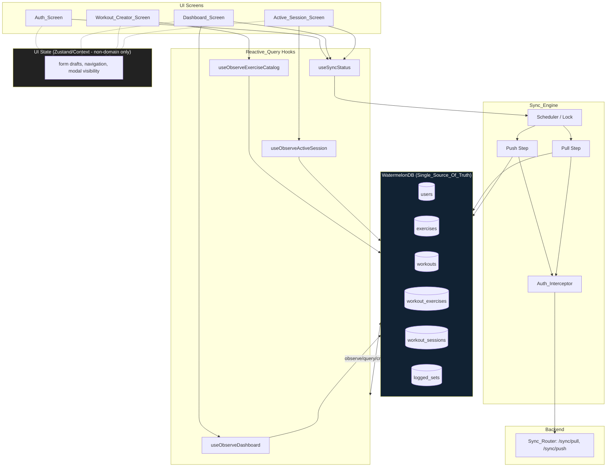
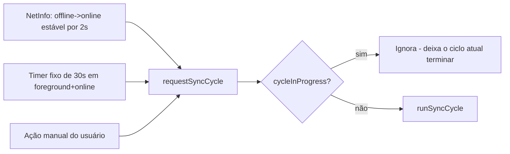
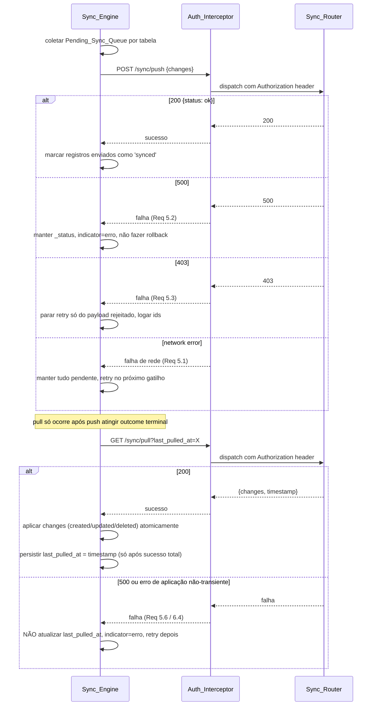
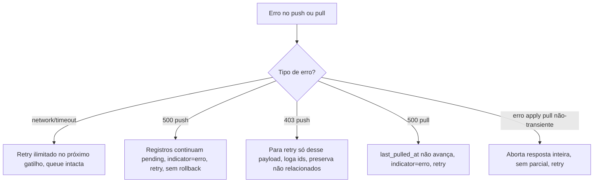
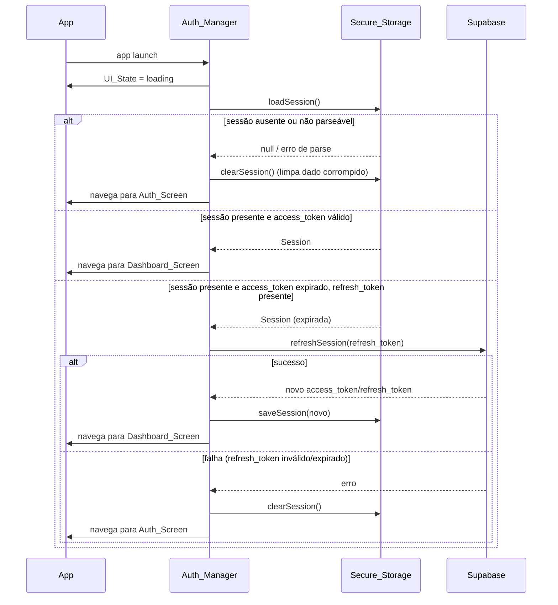
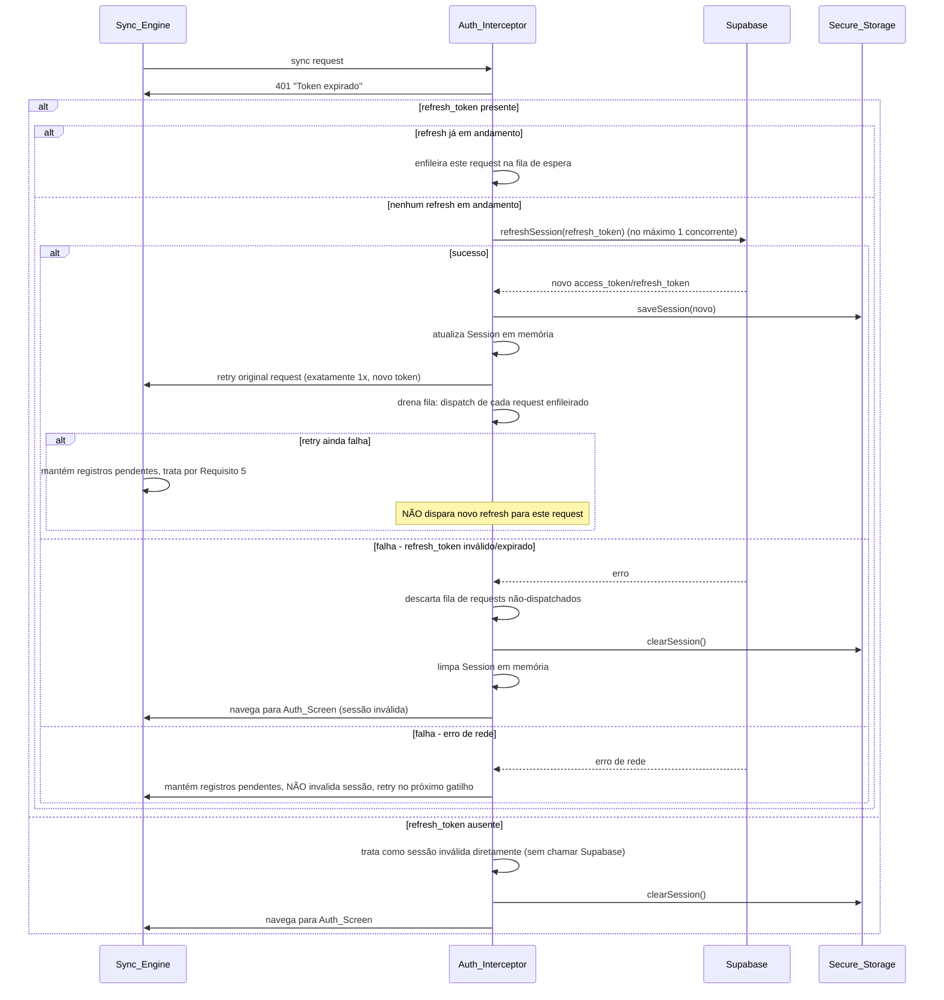
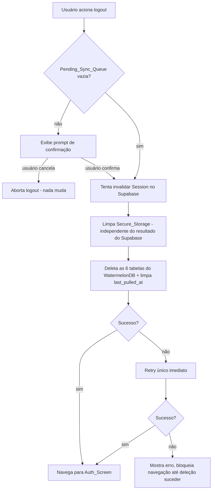
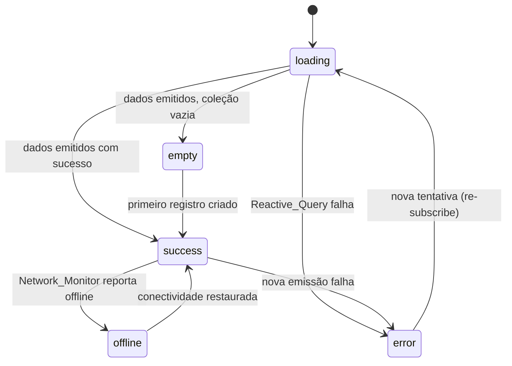
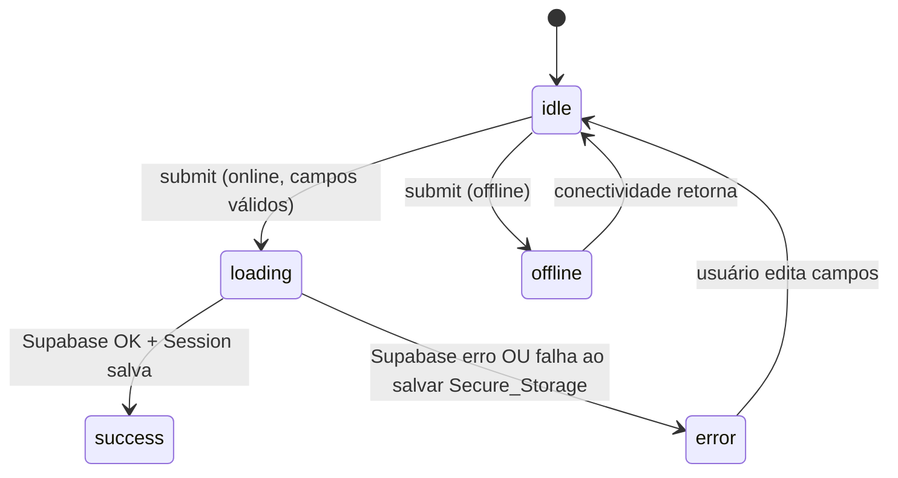
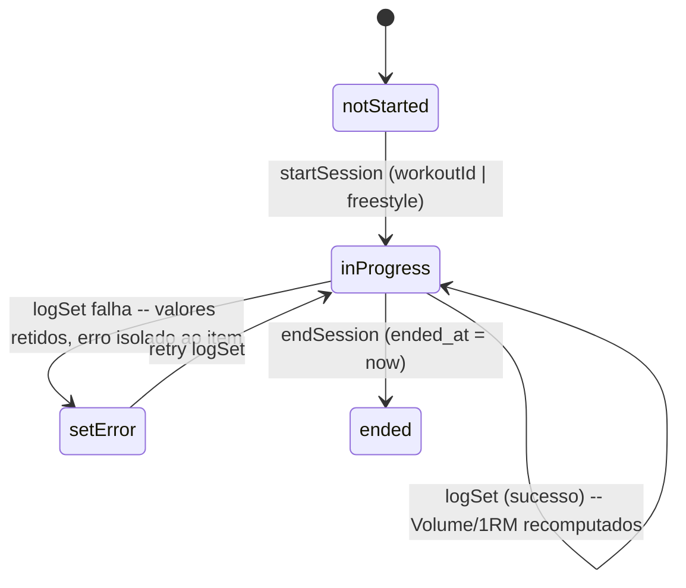

# Design Document: Frontend Mobile Implementation (GymNight)

## Overview

Este documento descreve a arquitetura técnica de implementação do frontend do GymNight Mobile: um app React Native (Expo SDK 57) + TypeScript, offline-first, que usa WatermelonDB como banco local reativo e `@supabase/supabase-js` exclusivamente para autenticação. O backend FastAPI já existe e seu contrato (rotas, formatos de payload, regras de propriedade multi-tenant) é tratado como fixo — este design apenas especifica como o frontend consome esse contrato corretamente, sem reabrir decisões de schema ou API.

O design está organizado em cinco áreas que espelham os pilares do `requirements.md`:

1. Arquitetura offline-first (WatermelonDB como Single_Source_Of_Truth, camadas, schema local, Reactive_Query patterns).
2. Sync_Engine (agendamento, ciclo push→pull, payloads, conflitos, resiliência).
3. Auth_Manager / Auth_Interceptor (Supabase Auth, Secure_Storage, refresh automático, sessão inválida, logout).
4. Design System (tokens centralizados, zero-hardcode).
5. Telas (Auth, Dashboard, Workout Creator, Active Session) e sua máquina de estados de UI.

A estratégia de testes (Mock_Database_Adapter, testes de componente por UI_State, property-based tests) é descrita ao final, cobrindo os Requisitos 20 e 21.

**Convenção de nomenclatura de código**: os termos do Glossary do requirements.md (`Sync_Engine`, `Auth_Manager`, `Auth_Interceptor`, `Network_Monitor`, `Design_Token_Module`, etc.) mapeiam 1:1 para módulos/arquivos de mesmo nome (em `camelCase`/`PascalCase` conforme convenção TypeScript) na estrutura de pastas proposta.

---

## Architecture

### Estrutura de Pastas Proposta

```
src/
  db/
    schema.ts                # WatermelonDB schema (6 tabelas)
    database.ts               # instância singleton do Database
    models/
      User.ts
      Exercise.ts
      Workout.ts
      WorkoutExercise.ts
      WorkoutSession.ts
      LoggedSet.ts
  sync/
    SyncEngine.ts             # orquestração push -> pull
    syncAdapters.ts            # wrappers finos sobre synchronize() do WatermelonDB
    lastPulledAt.ts            # persistência do cursor
    NetworkMonitor.ts
  auth/
    AuthManager.ts
    AuthInterceptor.ts
    SecureStorage.ts
    SessionContext.tsx         # Context de sessão em memória (não é domain state)
  designSystem/
    tokens.ts                  # Design_Token_Module (único, named exports)
  hooks/
    useObserveWorkouts.ts
    useObserveDashboard.ts
    useObserveExerciseCatalog.ts
    useObserveActiveSession.ts
    useSyncStatus.ts
  screens/
    AuthScreen/
    DashboardScreen/
    WorkoutCreatorScreen/
    ActiveSessionScreen/
  test/
    mocks/MockDatabaseAdapter.ts
```

### Diagrama de Camadas



**Princípio central (Requisito 1)**: nenhuma tela lê `useState`/Zustand/Context para dados de domínio. Toda tela que exibe dados de domínio consome exclusivamente um hook de Reactive_Query (`useObserveX`), que internamente chama `.observe()` (para listas/queries) ou `withObservables` sobre uma `Collection` do WatermelonDB. Bibliotecas de estado global (Zustand ou Context) são usadas apenas para: rascunhos de formulário não persistidos, estado de navegação, visibilidade de modais e estado de sessão em memória (`SessionContext`, que não é dado de domínio, e sim um artefato de autenticação).

Derivações (filtro, ordenação, agrupamento) feitas em componentes (ex.: agrupar `WorkoutExercises` por `Workout`) são funções puras aplicadas sobre o array emitido pela Reactive_Query a cada emissão (via `useMemo` com a emissão como dependência) — nunca armazenadas fora do WatermelonDB (Requisito 1.7).

### WatermelonDB Schema

O schema espelha exatamente as 6 tabelas do backend. Colunas de metadata (`_status`, `_changed`) são geridas automaticamente pelo WatermelonDB e não aparecem no schema declarado (são colunas internas do adapter SQLite).

```ts
// src/db/schema.ts
import { appSchema, tableSchema } from '@nozbe/watermelondb';

export const schema = appSchema({
  version: 1,
  tables: [
    tableSchema({
      name: 'users',
      columns: [
        { name: 'name', type: 'string' },
        { name: 'email', type: 'string' },
        { name: 'weight', type: 'number', isOptional: true },
        { name: 'height', type: 'number', isOptional: true },
        { name: 'birth_date', type: 'number', isOptional: true },
        { name: 'gender', type: 'string', isOptional: true },
        { name: 'created_at', type: 'number' },
        { name: 'updated_at', type: 'number' },
      ],
    }),
    tableSchema({
      name: 'exercises', // catálogo compartilhado, sem user_id
      columns: [
        { name: 'name', type: 'string' },
        { name: 'created_at', type: 'number' },
        { name: 'updated_at', type: 'number' },
      ],
    }),
    tableSchema({
      name: 'workouts',
      columns: [
        { name: 'user_id', type: 'string', isIndexed: true },
        { name: 'name', type: 'string' },
        { name: 'created_at', type: 'number' },
        { name: 'updated_at', type: 'number' },
      ],
    }),
    tableSchema({
      name: 'workout_exercises',
      columns: [
        { name: 'workout_id', type: 'string', isIndexed: true },
        { name: 'exercise_id', type: 'string', isIndexed: true },
        { name: 'series_target', type: 'number' },
        { name: 'reps_target', type: 'number' },
        { name: 'weight_target', type: 'number' },
        { name: 'created_at', type: 'number' },
        { name: 'updated_at', type: 'number' },
      ],
    }),
    tableSchema({
      name: 'workout_sessions',
      columns: [
        { name: 'user_id', type: 'string', isIndexed: true },
        { name: 'workout_id', type: 'string', isIndexed: true, isOptional: true },
        { name: 'started_at', type: 'number' },
        { name: 'ended_at', type: 'number', isOptional: true },
        { name: 'created_at', type: 'number' },
        { name: 'updated_at', type: 'number' },
      ],
    }),
    tableSchema({
      name: 'logged_sets',
      columns: [
        { name: 'session_id', type: 'string', isIndexed: true },
        { name: 'exercise_id', type: 'string', isIndexed: true },
        { name: 'weight', type: 'number' },
        { name: 'repetitions', type: 'number' },
        { name: 'estimated_one_rm', type: 'number' },
        { name: 'completed_at', type: 'number' },
        { name: 'created_at', type: 'number' },
        { name: 'updated_at', type: 'number' },
      ],
    }),
  ],
});
```

### Model Classes (uma por tabela)

Cada tabela tem uma `Model` class do WatermelonDB com decorators (`@field`, `@date`, `@relation`, `@children`). Exemplo representativo (os demais seguem o mesmo padrão):

```ts
// src/db/models/WorkoutSession.ts
import { Model } from '@nozbe/watermelondb';
import { field, date, children, relation } from '@nozbe/watermelondb/decorators';

export default class WorkoutSession extends Model {
  static table = 'workout_sessions';
  static associations = {
    workouts: { type: 'belongs_to', key: 'workout_id' },
    logged_sets: { type: 'has_many', foreignKey: 'session_id' },
  } as const;

  @field('user_id') userId!: string;
  @field('workout_id') workoutId!: string | null;
  @date('started_at') startedAt!: Date;
  @date('ended_at') endedAt!: Date | null;
  @date('created_at') createdAt!: Date;
  @date('updated_at') updatedAt!: Date;

  @relation('workouts', 'workout_id') workout: any;
  @children('logged_sets') loggedSets: any;
}
```

### Reactive_Query Hook Pattern

Cada tela possui um hook customizado que encapsula a query e a observação, retornando dados já tipados e nunca um estado copiado:

```ts
// src/hooks/useObserveDashboard.ts
export function useObserveDashboard(userId: string): {
  workouts: Workout[];
  recentSessions: WorkoutSession[];
  isLoading: boolean;
  error: Error | null;
} {
  // internamente: database.get('workouts').query(Q.where('user_id', userId)).observe()
  //               database.get('workout_sessions').query(...).observe()
  // combinados via combineLatest/rxjs, com estado local apenas para isLoading/error
  // (não para os dados em si)
}
```

Regras aplicadas por todo hook `useObserveX`:
- `isLoading` inicia `true` e só passa a `false` na primeira emissão da observable (Requisito 1.3/17.3/18.4).
- Se a observable emitir erro (ou lançar na inicialização), o hook retorna `error` não-nulo e **descarta** o último valor de dados bem-sucedido (não deixa dado obsoleto acessível) — a tela deve então renderizar exclusivamente `error` ou `loading` (Requisito 1.6).
- Toda derivação (filter/sort/group) é feita com `useMemo(() => derive(latestEmission), [latestEmission])`, nunca gravada em Zustand/Context.

---

## Sync Engine

### Visão Geral e Gatilhos

O `Sync_Engine` expõe uma única função de entrada `runSyncCycle()` que é chamada por três gatilhos distintos, todos passando pelo mesmo mecanismo de lock:



```ts
// src/sync/SyncEngine.ts
class SyncEngine {
  private cycleInProgress = false;

  async requestSyncCycle(): Promise<void> {
    if (this.cycleInProgress) return; // Requisito 4.8 - lock anti-concorrência
    this.cycleInProgress = true;
    try {
      await this.runSyncCycle();
    } finally {
      this.cycleInProgress = false;
    }
  }

  private async runSyncCycle(): Promise<void> {
    const session = authManager.getInMemorySession();
    if (!session) return; // Requisito 9.3 - skip sem sessão, queue intacta

    await this.push();  // deve atingir outcome terminal antes do pull (Requisito 4.1)
    await this.pull();
  }
}
```

Gatilhos concretos:
- `NetworkMonitor` (NetInfo) emite transições; o Sync_Engine só dispara após a conectividade permanecer estável "online" por >= 2s (debounce), conforme Requisito 3.2.
- `setInterval` de 30s ativo apenas enquanto app em foreground e dispositivo online (Requisito 4.7); pausado via `AppState` listener quando o app vai para background.
- Chamada manual (ex.: pull-to-refresh no Dashboard) invoca `requestSyncCycle()` diretamente.

### Ciclo Push → Pull



### Formato de Payload/Response

**Push** (`POST /api/v1/sync/push`):

```ts
type PushPayload = {
  changes: {
    [table in SyncableTable]?: {
      created: RawRecord[];
      updated: RawRecord[];
      deleted: string[]; // apenas ids
    };
  };
};
// SyncableTable = 'users' | 'exercises' | 'workouts' | 'workout_exercises'
//               | 'workout_sessions' | 'logged_sets'
```

Resposta esperada: `200 { "status": "ok" }` | `403` (ownership inválido) | `500` (erro de persistência).

**Pull** (`GET /api/v1/sync/pull?last_pulled_at=<unix_ms>`):

```ts
type PullResponse = {
  changes: {
    [table in SyncableTable]?: {
      created: RawRecord[];
      updated: RawRecord[];
      deleted: string[]; // Tombstones
    };
  };
  timestamp: number; // novo last_pulled_at
};
```

Na primeira sincronização (nenhum `last_pulled_at` persistido ainda), a query string é omitida por completo (Requisito 4.2) — não é enviado `last_pulled_at=0` nem `last_pulled_at=null`.

O Sync_Engine é implementado como uma camada fina sobre a função `synchronize()` nativa do WatermelonDB (`@nozbe/watermelondb/sync`), fornecendo `pullChanges` e `pushChanges` que fazem a tradução HTTP <-> formato interno do WatermelonDB. Isso garante que o merge por coluna (`_changed`) e o versionamento de sync sejam delegados à implementação já testada da biblioteca, e não reimplementados manualmente.

### Persistência de `last_pulled_at`

Armazenado em uma tabela local não-sincronizável (`local_storage` do próprio WatermelonDB, via `database.localStorage`) ou em `AsyncStorage` dedicado — nunca em Secure_Storage (que é reservado para tokens). Atualizado **somente** após o `pull` aplicar 100% das mudanças com sucesso (Requisito 4.5, 6.4).

### Resolução de Conflitos

| Cenário | Resolução |
|---|---|
| Pull `updated` × Pending local `updated` (mesmo id) | Merge nativo do WatermelonDB por `_changed` (coluna a coluna); `_status` permanece `updated` para reenvio no próximo push (Req 6.1) |
| Pull Tombstone (`deleted`) × Pending local `updated` | Registro local é deletado; update pendente é descartado (Req 6.2) |
| Pull `updated`/`created` × registro local `_status = deleted` | Dado do pull é descartado; `_status` local permanece `deleted`; deleção é incluída no próximo push (Req 6.3) |
| Erro não-transiente ao aplicar pull (schema mismatch, payload malformado) | Aborta a aplicação inteira da resposta, nenhuma mudança parcial é persistida, `last_pulled_at` não avança, retry no próximo ciclo (Req 6.4) |

**Regra geral**: "deleted vence updated" — em qualquer conflito envolvendo uma deleção (local ou remota), a deleção prevalece.

### Resiliência por Tipo de Erro



O push é tratado como seguro para reenvio (idempotente no id) — o backend garante insert idempotente por id duplicado, então o Sync_Engine pode reenviar o mesmo payload após falha sem gerar duplicatas (Requisito 5.5).

Enquanto uma sincronização está em andamento, novas escritas locais no WatermelonDB **não** são bloqueadas: `runSyncCycle()` roda de forma assíncrona sem lock sobre a UI thread, e novas escritas apenas aumentam a Pending_Sync_Queue que será varrida no próximo ciclo.

---

## Auth Manager e Auth Interceptor

### Componentes

- **AuthManager**: encapsula `supabase.auth.signInWithPassword`, `signUp`, `refreshSession`, `signOut`; gerencia `SessionContext` (estado em memória, via React Context) e a persistência em `SecureStorage`.
- **SecureStorage**: wrapper sobre `expo-secure-store`, com métodos `saveSession`, `loadSession`, `clearSession`.
- **AuthInterceptor**: intercepta toda chamada HTTP do Sync_Engine ao Sync_Router, injeta `Authorization: Bearer <access_token>` e trata os três erros 401 (`Token não fornecido`, `Token expirado`, `Token inválido`).

### Sequência: Restauração de Sessão no Launch



### Sequência: Refresh Automático em 401 "Token expirado"



### Tratamento dos 3 Erros 401

| Mensagem 401 | Ação do Auth_Interceptor |
|---|---|
| `"Token expirado"` + `refresh_token` presente | Solicita refresh ao Supabase, retry único do request original (fluxo acima) |
| `"Token expirado"` + `refresh_token` ausente | Sessão inválida direta (sem chamada ao Supabase) |
| `"Token inválido"` | Sessão inválida direta |
| `"Token não fornecido"` | Sessão inválida direta |
| Qualquer outra mensagem 401 não mapeada | Sessão inválida direta (fallback conservador) |

"Sessão inválida direta" sempre significa: limpar `Secure_Storage`, limpar `Session` em memória, descartar requests ainda não despachados na fila de refresh, navegar para `Auth_Screen` com mensagem de sessão expirada — e **nunca** deletar dados de domínio do WatermelonDB nem alterar `_status` dos registros pendentes (Requisito 11.4).

### Fluxo de Logout



---

## Design System

### Design Tokens

```ts
// src/designSystem/tokens.ts

export const colors = {
  background: '#0B0E11',
  surface: '#151A21',
  primary: '#39FF14',       // neon accent
  primaryText: '#F5F7FA',
  secondaryText: '#9AA5B1',
  success: '#00E38C',
  error: '#FF3B5C',
} as const;

export const typography = {
  heading: { fontSize: 24, fontWeight: '700' as const },
  body: { fontSize: 16, fontWeight: '400' as const },
  caption: { fontSize: 12, fontWeight: '400' as const },
} as const;

export const spacing = {
  xs: 8,
  sm: 16,
  md: 24,
  lg: 32,
} as const;

export const radii = {
  sm: 4,
  md: 8,
  lg: 16,
} as const;
```

Todos os tokens são exportados nomeadamente a partir de um único módulo (`src/designSystem/tokens.ts`), conforme Requisito 13.3. Não existe (e não deve ser criado) nenhum token de light-mode — o módulo declara um único conjunto fixo dark/neon (Requisito 13.5).

| Categoria | Token | Valor de referência |
|---|---|---|
| Cor | `background` | `#0B0E11` |
| Cor | `surface` | `#151A21` |
| Cor | `primary` (neon) | `#39FF14` |
| Cor | `primaryText` | `#F5F7FA` |
| Cor | `secondaryText` | `#9AA5B1` |
| Cor | `success` | `#00E38C` |
| Cor | `error` | `#FF3B5C` |
| Tipografia | `heading` | 24px / 700 |
| Tipografia | `body` | 16px / 400 |
| Tipografia | `caption` | 12px / 400 |
| Espaçamento | `xs`/`sm`/`md`/`lg` | 8 / 16 / 24 / 32 |

**Diretriz de zero-hardcode**: nenhum componente ou tela declara um valor literal de cor, tipografia, espaçamento ou border-radius em seu `StyleSheet`. Todo valor é referenciado via `colors.x`, `typography.x`, `spacing.x`, `radii.x`. Se um componente precisar de um valor não coberto, o token correspondente deve ser adicionado a `tokens.ts` antes de ser usado — nunca declarado inline "provisoriamente" (Requisito 14).

---

## Telas

### Máquina de Estados de UI (padrão comum)



Cada tela aplica esta máquina de forma local (por seção), podendo compor múltiplos estados simultâneos (ex.: Dashboard em `offline` + `success` ao mesmo tempo, exibindo banner offline sobre dados locais — Requisito 17.5).

### Auth Screen

- **Componentes principais**: `AuthForm` (campos email/senha + toggle login/cadastro), `SubmitButton`, `ErrorBanner`, `OfflineBanner`.
- **Hooks de dados**: nenhuma Reactive_Query (tela não exibe dados de domínio); usa apenas `useNetworkStatus()` (do `NetworkMonitor`) e estado de formulário local (Context/`useState`, não domínio).
- **UI_States**: `loading` (request em andamento, submit desabilitado), `offline` (submit bloqueado, mensagem de rede), `error` (mensagem do Supabase, email retido / senha limpa).
- **Validação de submit**: `isSubmitEnabled = email.length > 0 && email.includes('@') && password.length > 0`.



### Dashboard Screen

- **Componentes principais**: `TodayWorkoutCard`, `QuickStats`, `Sync_Status_Indicator`, `OfflineBanner`, `EmptyStateCTA`.
- **Hooks de dados**: `useObserveDashboard(userId)` (workouts + sessões recentes), `useSyncStatus()` (estado do Sync_Engine).
- **UI_States**: `loading` (antes da 1ª emissão), `empty` (zero Workouts, CTA para criar o primeiro), `offline` (banner sobre dados locais), `success`.
- **Quick stats**: total de `WorkoutSessions` concluídas e Volume total, computados 100% localmente via Reactive_Query (sem chamada de rede) — mesma lógica de agregação usada na Active_Session_Screen (ver Volume abaixo).

### Workout Creator Screen

- **Componentes principais**: `WorkoutNameInput`, `ExercisePicker` (catálogo), `ExerciseTargetForm` (series/reps/weight target), `SaveButton`.
- **Hooks de dados**: `useObserveExerciseCatalog()`.
- **UI_States**: `loading` (catálogo carregando), `empty` (catálogo vazio, sugere conectar à rede), `error` (nome vazio/whitespace no submit).
- **Regras de validação**: nome do Workout não pode ser vazio nem composto só de espaços em branco; cada `WorkoutExercise` exige `series_target`, `reps_target` e `weight_target` preenchidos antes de ser salvo; salvar grava `Workout` + `WorkoutExercise[]` em uma única transação local (`database.write(...)`), sem estado intermediário parcial visível.

### Active Session Screen

- **Componentes principais**: `SessionTimer`, `SetLogger` (form de peso/reps por exercício), `VolumeSummary`, `PerExerciseOneRmSummary`, `EndSessionButton`.
- **Hooks de dados**: `useObserveActiveSession(sessionId)` — observa a `WorkoutSession` e seus `LoggedSets` (`.observeWithColumns`/`has_many` reativo).
- **UI_States**: `error` por entrada de `LoggedSet` que falhou ao persistir (isolado por item, mantendo os valores digitados), `success` (padrão).

Cálculo em tempo real (recomputado a cada emissão de `LoggedSets`, sem rede):

```ts
function computeVolume(loggedSets: LoggedSet[]): number {
  return loggedSets.reduce((sum, s) => sum + s.weight * s.repetitions, 0);
}

function computeEstimatedOneRm(weight: number, repetitions: number, explicit?: number): number {
  return explicit ?? weight * (1 + repetitions / 30); // Epley_Formula
}

function maxOneRmPerExercise(loggedSets: LoggedSet[]): Map<string, number> {
  const result = new Map<string, number>();
  for (const s of loggedSets) {
    const current = result.get(s.exerciseId) ?? -Infinity;
    result.set(s.exerciseId, Math.max(current, s.estimatedOneRm));
  }
  return result;
}
```



---

## Data Models

Modelos de domínio (campos exatos por contrato de backend, unix ms para timestamps):

```ts
interface User {
  id: string; name: string; email: string;
  weight?: number; height?: number; birthDate?: number; gender?: string;
  createdAt: number; updatedAt: number;
}

interface Exercise { // catálogo compartilhado, sem userId
  id: string; name: string; createdAt: number; updatedAt: number;
}

interface Workout {
  id: string; userId: string; name: string; createdAt: number; updatedAt: number;
}

interface WorkoutExercise {
  id: string; workoutId: string; exerciseId: string;
  seriesTarget: number; repsTarget: number; weightTarget: number;
  createdAt: number; updatedAt: number;
}

interface WorkoutSession {
  id: string; userId: string; workoutId: string | null;
  startedAt: number; endedAt: number | null;
  createdAt: number; updatedAt: number;
}

interface LoggedSet {
  id: string; sessionId: string; exerciseId: string;
  weight: number; repetitions: number; estimatedOneRm: number;
  completedAt: number; createdAt: number; updatedAt: number;
}
```

Metadados de sincronização (`_status: 'created' | 'updated' | 'synced' | 'deleted'`, `_changed: string[]`) são geridos automaticamente pelo WatermelonDB em cada `Model` e não são declarados manualmente nas interfaces acima.

---

## Correctness Properties

*A property is a characteristic or behavior that should hold true across all valid executions of a system — essentially, a formal statement about what the system should do. Properties serve as the bridge between human-readable specifications and machine-verifiable correctness guarantees.*

### Property 1: Reactive_Query reflects local writes in the same emission cycle

*For any* WatermelonDB collection bound to a Reactive_Query hook and *any* create/update/delete operation committed to that collection, the hook's next emission SHALL contain the post-write state of the collection, without requiring a manual refresh call.

**Validates: Requirements 1.5**

### Property 2: Failed or recovering Reactive_Query never exposes stale or partial data

*For any* sequence of Reactive_Query emissions that ends in an error or an in-progress retry, the screen's rendered UI_State SHALL be exclusively `error` or `loading`, and SHALL NOT render any previously emitted domain data as current.

**Validates: Requirements 1.6**

### Property 3: Derived selectors are pure recomputations of the latest emission

*For any* base Reactive_Query emission and *any* pure derivation function (filter, sort, or group), the derived value SHALL be recomputed solely from the latest emission (equal emissions produce equal derived values), and computing a derivation SHALL NOT mutate WatermelonDB or any external store.

**Validates: Requirements 1.7**

### Property 4: Success confirmation never precedes local persistence

*For any* create, update, or delete action invoked through a screen, the success confirmation (UI update or navigation implying success) SHALL only occur after the underlying WatermelonDB write promise has settled successfully.

**Validates: Requirements 2.1**

### Property 5: Failed local write leaves state unchanged and signals no success

*For any* write operation rejected by the database adapter, the record set before and after the failed attempt SHALL be equal, an error SHALL be surfaced to the user, and no success indicator (navigation or confirmatory UI update) SHALL be triggered.

**Validates: Requirements 2.4**

### Property 6: Stable connectivity transitions and fixed interval trigger exactly one sync cycle each

*For any* sequence of connectivity events and elapsed foreground-online durations, a synchronization cycle SHALL be triggered exactly when connectivity has remained continuously online for at least 2 seconds after an offline→online transition, or when at least 30 seconds have elapsed since the previous cycle while foreground and online — and SHALL NOT be triggered for transitions or durations that do not meet these thresholds.

**Validates: Requirements 3.2, 4.7**

### Property 7: Local write behavior is independent of connectivity state

*For any* create, update, or delete operation, the resulting WatermelonDB state after the operation SHALL be identical whether the device is online or offline, and the operation SHALL remain fully available (start session, log sets, compute Volume/1RM, end session, create/edit/save Workouts) while offline.

**Validates: Requirements 3.3, 18.7, 19.9**

### Property 8: Sync failures of any handled type preserve the pending queue and last_pulled_at

*For any* Pending_Sync_Queue state and *any* injected failure drawn from {network error, push HTTP 500, pull HTTP 500}, the queue's contents (and, for pull failures, the persisted `last_pulled_at`) SHALL be identical before and after the failed attempt, and a later trigger SHALL reattempt the cycle without an upper retry limit.

**Validates: Requirements 3.5, 5.1, 5.2, 5.6**

### Property 9: Sync_Status_Indicator color always equals the exact current sync state mapping

*For any* Sync_Engine state drawn from {`synced`, `pending`, `syncing`, `offline`} and *any* unrelated confounding condition (screen, message content, prior state), the Sync_Status_Indicator's rendered color token SHALL equal exactly the token mapped to that state (`success`→synced, `error`→pending, `primary`→syncing/offline), and SHALL NOT vary based on any condition other than the current state.

**Validates: Requirements 3.4, 3.6, 3.7, 15.1, 15.2, 15.3, 15.6, 17.2**

### Property 10: Push always completes before pull is dispatched

*For any* synchronization cycle, regardless of the push step's outcome (success or handled failure), the pull request SHALL NOT be dispatched until the push step has reached a terminal outcome.

**Validates: Requirements 4.1**

### Property 11: Pull request always sends the exact persisted last_pulled_at value

*For any* persisted `last_pulled_at` value, a subsequent pull request's query parameter SHALL equal exactly that value.

**Validates: Requirements 4.3**

### Property 12: Push payload groups pending records by table with exact created/updated/deleted shape

*For any* set of Pending_Sync_Queue records distributed across the six syncable tables, the generated push payload SHALL equal `{ changes: { <table>: { created, updated, deleted } } }` with each table's records placed in the correct sub-array according to their `_status`.

**Validates: Requirements 4.4**

### Property 13: Successful pull applies changes atomically and advances last_pulled_at only after full success; non-transient apply errors abort atomically

*For any* pull response, either all of its `created`, `updated`, and `deleted` changes are applied to WatermelonDB and `last_pulled_at` is updated to the response's `timestamp`, or (in the case of a non-transient apply error) none of the changes are applied and `last_pulled_at` remains unchanged — there is no partially-applied outcome.

**Validates: Requirements 4.5, 6.4**

### Property 14: Successful push marks exactly the sent records as synced

*For any* set of records included in a push payload that receives a `200 { status: "ok" }` response, every one of those records SHALL transition to `_status = 'synced'`, and no other record's status SHALL change as a result.

**Validates: Requirements 4.6**

### Property 15: At most one synchronization cycle runs at a time

*For any* sequence of trigger events (interval, connectivity, manual) fired while a cycle is in progress, the number of concurrently executing sync cycles SHALL never exceed one; overlapping triggers SHALL be dropped rather than queued or executed in parallel.

**Validates: Requirements 4.8**

### Property 16: HTTP 403 quarantines only the rejected payload, preserving unrelated pending records

*For any* Pending_Sync_Queue containing both a subset of records rejected with HTTP 403 and an unrelated subset, only the rejected subset SHALL stop being retried (with its identifiers logged), while the unrelated subset SHALL remain in the queue and continue to be retried on subsequent cycles.

**Validates: Requirements 5.3**

### Property 17: In-flight synchronization or token refresh never blocks new local writes

*For any* local write dispatched while a sync cycle or a token refresh is in flight, the write SHALL settle successfully independent of when the in-flight operation resolves, and SHALL NOT be delayed by it.

**Validates: Requirements 5.4, 10.3**

### Property 18: Idempotent retry of a push payload never produces duplicate local or remote records

*For any* push payload resent after a prior failure, the resulting set of record ids (local WatermelonDB and, per backend contract, remote) SHALL contain no duplicates beyond what existed before the retry.

**Validates: Requirements 5.5**

### Property 19: Conflicting pull/local updates merge per-column and remain pending for re-push

*For any* record with a local pending `updated` status and an incoming pull `updated` payload for the same id, the resulting local record SHALL reflect a per-column merge (not a full overwrite or full discard of either side) and its `_status` SHALL remain `updated`.

**Validates: Requirements 6.1**

### Property 20: An incoming tombstone always deletes the local record and discards any pending update

*For any* record with a local pending `updated` status, if a pull response includes a tombstone for the same id, the local record SHALL be deleted and the pending update SHALL be discarded.

**Validates: Requirements 6.2**

### Property 21: A local deleted status always wins over incoming pull data for the same id

*For any* local record with `_status = 'deleted'`, an incoming pull `updated` or `created` payload for the same id SHALL be discarded, the local `_status` SHALL remain `deleted`, and the deletion SHALL be included in the next push.

**Validates: Requirements 6.3**

### Property 22: Session persistence completes before navigation away from Auth_Screen

*For any* successful sign-in or sign-up call returning a Session, the Secure_Storage write SHALL complete successfully before the navigation call away from Auth_Screen is invoked.

**Validates: Requirements 7.3**

### Property 23: Auth failures of any handled type keep the user on Auth_Screen with an error message

*For any* sign-in/sign-up failure drawn from {credential rejection, timeout, connection refused, offline}, the Auth_Screen SHALL remain displayed and SHALL show the corresponding error message.

**Validates: Requirements 7.5**

### Property 24: Secure_Storage write failure after successful auth discards the in-memory session and blocks navigation

*For any* Secure_Storage write failure following a successful sign-in/sign-up, the in-memory Session SHALL be discarded, navigation away from Auth_Screen SHALL NOT occur, and an error message SHALL be displayed.

**Validates: Requirements 7.6**

### Property 25: Expired access token with a present refresh_token always triggers the refresh flow before the navigation decision

*For any* restored Session whose `access_token` is expired and whose `refresh_token` is present, the refresh flow SHALL be invoked and reach a terminal outcome before the launch navigation decision (Dashboard vs. Auth) is finalized.

**Validates: Requirements 8.4**

### Property 26: Absent or unparseable stored session always clears storage and routes to Auth_Screen

*For any* absent or malformed stored session payload, Secure_Storage SHALL be cleared and the app SHALL navigate to Auth_Screen.

**Validates: Requirements 8.5**

### Property 27: Exactly one Authorization header is attached per dispatched sync request, always reflecting the latest completed session

*For any* sync request dispatched while an in-memory Session is present, exactly one `Authorization: Bearer <access_token>` header SHALL be attached, and its value SHALL equal the token from the most recently completed sign-in or refresh, never a value captured before that update.

**Validates: Requirements 9.1, 9.2**

### Property 28: Absent session always skips the cycle without side effects; presence always dispatches — no undefined third state

*For any* sync dispatch attempt, if the in-memory Session is null/absent, the request SHALL NOT be sent and the Pending_Sync_Queue SHALL remain unmodified; if the Session is present, the request SHALL be dispatched normally — exactly one of these two outcomes SHALL occur for every attempt.

**Validates: Requirements 9.3, 9.4**

### Property 29: Session becoming available flushes the entire pending queue on the very next cycle

*For any* Pending_Sync_Queue of size N present at the moment the in-memory Session transitions from absent to present, the immediately following synchronization cycle SHALL process all N records, with no artificial throttling, batching delay, or partial processing.

**Validates: Requirements 9.5**

### Property 30: 401 responses and refresh outcomes are classified and handled consistently across all cases

*For any* 401 response and refresh outcome combination drawn from {"Token expirado" + refresh_token present + refresh succeeds, "Token expirado" + refresh_token present + refresh fails (invalid/expired token), "Token expirado" + refresh_token present + refresh fails (network error), "Token expirado" + refresh_token absent, "Token inválido", "Token não fornecido", unmapped 401 message}, the system SHALL apply exactly the mapped outcome — successful refresh retries the original request exactly once with the new token; invalid/expired refresh_token or an unmapped/explicit-invalid message clears the session everywhere, discards not-yet-dispatched queued requests, and navigates to Auth_Screen while leaving WatermelonDB domain records and Pending_Sync_Queue `_status` values untouched; a network-classified refresh failure leaves the queue untouched and does not invalidate the session — and no other outcome SHALL occur for any input in this set. A failed retry after a successful refresh SHALL NOT trigger a second refresh attempt for that same original request.

**Validates: Requirements 10.1, 10.2, 10.5, 10.6, 10.7, 10.8, 11.1, 11.2, 11.4, 11.5**

### Property 31: At most one concurrent token refresh call; queued requests dispatch only after it resolves

*For any* number N of sync requests arriving while a token refresh is in flight, exactly one refresh call SHALL be made, and all N requests SHALL be dispatched only after that refresh call resolves.

**Validates: Requirements 10.4**

### Property 32: Declining the logout confirmation leaves session, domain records, and pending queue byte-for-byte unchanged

*For any* pre-logout state (Session, WatermelonDB records, Pending_Sync_Queue) with a non-empty Pending_Sync_Queue, declining the confirmation prompt SHALL leave all three unchanged and SHALL NOT invalidate the Session.

**Validates: Requirements 12.2**

### Property 33: Secure_Storage is always cleared on confirmed/empty-queue logout regardless of the Supabase invalidation outcome

*For any* outcome of the Supabase session-invalidation call (success, network failure, thrown error), Secure_Storage SHALL be cleared when the Pending_Sync_Queue was empty or the user confirmed the logout prompt.

**Validates: Requirements 12.3**

### Property 34: Logout completion always wipes all six local tables and last_pulled_at, retrying once before blocking navigation on repeated failure

*For any* pre-existing set of local records across the six syncable tables, once Secure_Storage is cleared, the deletion attempt SHALL remove all records from all six tables and clear `last_pulled_at`; if the first attempt fails, exactly one immediate retry SHALL occur; navigation to Auth_Screen SHALL occur if and only if a deletion attempt (initial or retry) succeeds, and an error SHALL be shown with navigation blocked if both attempts fail.

**Validates: Requirements 12.4, 12.5, 12.6**

### Property 35: Auth_Screen submit is enabled exactly when the email/password validation predicate holds

*For any* pair of email and password strings, the submit control's enabled state SHALL equal exactly `email.length > 0 && email.includes('@') && password.length > 0`, and SHALL be disabled whenever a request is in flight.

**Validates: Requirements 16.2, 16.5**

### Property 36: Offline submission never invokes the network call regardless of field validity

*For any* email/password pair and *any* offline connectivity state at submission time, the Supabase sign-in/sign-up call SHALL NOT be invoked, and the offline UI_State message SHALL be displayed instead.

**Validates: Requirements 16.3**

### Property 37: Supabase auth error retains the entered email and clears the password

*For any* email/password pair and *any* Supabase-returned authentication error, after the error is received the email field SHALL still equal the originally entered value and the password field SHALL be empty.

**Validates: Requirements 16.4**

### Property 38: Offline banner and locally available data render simultaneously, never one replacing the other

*For any* set of locally available domain data and an offline connectivity state, the Dashboard_Screen SHALL render both the offline banner and the full locally available dataset in the same render pass.

**Validates: Requirements 17.5**

### Property 39: Adding a WorkoutExercise is blocked unless series_target, reps_target, and weight_target are all present

*For any* exercise-entry attempt missing one or more of `series_target`, `reps_target`, or `weight_target`, the save action SHALL be blocked and no WorkoutExercise record SHALL be persisted.

**Validates: Requirements 18.2**

### Property 40: Saving a Workout with its exercises is atomic — no partial commit under interruption

*For any* Workout with an associated list of WorkoutExercise entries, if the save transaction is interrupted at any point before completion, WatermelonDB SHALL contain neither the Workout without its exercises nor any exercise without its Workout — either the full set commits or none of it does.

**Validates: Requirements 18.3**

### Property 41: Whitespace-only or empty Workout names are always rejected without a write

*For any* string composed entirely of whitespace characters (including the empty string), attempting to save a Workout with that name SHALL be rejected, display the `error` UI_State on the name field, and SHALL NOT persist any Workout record.

**Validates: Requirements 18.6**

### Property 42: Starting and ending a WorkoutSession always sets the correct lifecycle fields

*For any* start action at timestamp T with an optional `workoutId` (including `undefined`/`null` for a Freestyle_Session), the created WorkoutSession SHALL have `started_at = T`, `ended_at = null`, and `workout_id` equal to the provided value (or `null` for freestyle); for any subsequent end action at timestamp T2 on that session, `ended_at` SHALL become exactly T2.

**Validates: Requirements 19.1, 19.2, 19.7**

### Property 43: Displayed elapsed time always equals the difference between now and started_at

*For any* elapsed duration since a WorkoutSession's `started_at`, the timer displayed by Active_Session_Screen SHALL equal that elapsed duration, updated at a granularity of at least once per second.

**Validates: Requirements 19.3**

### Property 44: Logging a set always creates a correctly-linked LoggedSet with completed_at set to now

*For any* set-logging action with a given session id, exercise id, weight, and repetitions, a LoggedSet record SHALL be created with matching `session_id`, `exercise_id`, and `completed_at` equal to the time of the action.

**Validates: Requirements 19.4**

### Property 45: estimated_one_rm always equals the Epley formula result when no explicit value is supplied

*For any* `weight > 0` and `repetitions >= 1` without an explicit one-rep-max override, the persisted `estimated_one_rm` SHALL equal `weight * (1 + repetitions / 30)` (within floating-point tolerance); when an explicit value is supplied, it SHALL be used verbatim instead.

**Validates: Requirements 19.5, 21.3**

### Property 46: Volume and per-exercise max estimated_one_rm always equal their exact aggregate definitions, recomputed without network calls

*For any* set of LoggedSets belonging to a WorkoutSession (including the empty set), the displayed Volume SHALL equal the sum of `weight * repetitions` across all sets (0 for the empty set), and for each exercise present, the displayed maximum `estimated_one_rm` SHALL equal the maximum `estimated_one_rm` among that exercise's LoggedSets; both SHALL be recomputed after any incremental change without issuing a network request.

**Validates: Requirements 17.6, 19.6, 21.4**

### Property 47: Resumable sessions surfaced to the Dashboard are exactly those with ended_at == null

*For any* set of WorkoutSessions with a mix of null and non-null `ended_at` values, the set of sessions offered as resumable SHALL equal exactly the subset whose `ended_at` is `null`.

**Validates: Requirements 19.8**

### Property 48: A failed LoggedSet persistence isolates the error to that entry and retains its entered values

*For any* LoggedSet creation attempt rejected by the database adapter, the entered `weight` and `repetitions` values for that specific entry SHALL remain unchanged and retryable, only that entry's UI_State SHALL become `error`, and no other entry or previously logged set SHALL be affected.

**Validates: Requirements 19.10**

---

## Error Handling

| Camada | Cenário de erro | Tratamento |
|---|---|---|
| WatermelonDB write | Escrita local falha (disco, constraint) | Estado anterior preservado; erro exibido; nenhum sinal de sucesso (Req 2.4) |
| Reactive_Query | Observable emite erro/lança na subscrição | UI_State = `error`; nenhuma renderização de dado obsoleto (Req 1.6) |
| Sync_Engine — push | Network error | Retry ilimitado no próximo gatilho; queue intacta (Req 5.1) |
| Sync_Engine — push | HTTP 500 | Mantém pendente; indicator=erro; sem rollback (Req 5.2) |
| Sync_Engine — push | HTTP 403 | Quarentena apenas do payload rejeitado; loga ids; preserva resto (Req 5.3) |
| Sync_Engine — pull | HTTP 500 | `last_pulled_at` não avança; indicator=erro; retry (Req 5.6) |
| Sync_Engine — apply pull | Erro não-transiente (schema/malformed) | Aborta resposta inteira; sem parcial; retry (Req 6.4) |
| Auth_Interceptor | 401 "Token expirado" | Refresh automático + retry único (Req 10) |
| Auth_Interceptor | 401 "Token inválido"/"Token não fornecido"/outro | Sessão inválida direta → Auth_Screen (Req 11) |
| Auth_Manager | Falha ao salvar Secure_Storage pós-login | Descarta sessão em memória; permanece em Auth_Screen; erro exibido (Req 7.6) |
| Logout | Falha ao invalidar no Supabase | Ignorada — Secure_Storage é limpo mesmo assim (Req 12.3) |
| Logout | Falha ao deletar WatermelonDB local | Retry único; se falhar de novo, erro e navegação bloqueada (Req 12.5) |
| Active_Session_Screen | Falha ao persistir LoggedSet | Erro isolado ao item; valores retidos para retry (Req 19.10) |
| Workout_Creator_Screen | Nome vazio/whitespace | Erro no campo; nenhuma escrita (Req 18.6) |

Princípio transversal: **nenhuma falha de sincronização ou autenticação nunca causa perda de dado de domínio local** — todas as trilhas de erro preservam WatermelonDB e a Pending_Sync_Queue, exceto quando a própria ação do usuário é uma deleção intencional (logout confirmado, ou delete explícito de um registro).

---

## Testing Strategy

### Abordagem Dual

- **Testes unitários/exemplo**: comportamentos concretos e casos de borda específicos (ex.: tela renderiza cada `UI_State`; cadastro sem sessão retornada; primeiro ciclo de pull sem `last_pulled_at`).
- **Testes de propriedade**: as 48 propriedades universais acima, cada uma implementada como um único teste de propriedade com no mínimo 100 iterações.

### Biblioteca Recomendada

- **Jest** + **React Native Testing Library** para testes de componente/render.
- **fast-check** como biblioteca de property-based testing (integra nativamente com Jest via `fc.assert(fc.property(...))`), com `numRuns: 100` como mínimo configurado por teste.
- Cada teste de propriedade é anotado com um comentário no formato:
  `// Feature: frontend-mobile-implementation, Property N: <título da propriedade>`

### Mock_Database_Adapter

Implementação em memória da interface de `Collection` usada pelas telas, permitindo testar regras de negócio sem SQLite real:

```ts
// src/test/mocks/MockDatabaseAdapter.ts
export class MockDatabaseAdapter<T extends { id: string }> {
  private records = new Map<string, T>();
  private listeners = new Set<(records: T[]) => void>();

  seed(records: T[]): void {
    for (const r of records) this.records.set(r.id, r);
  }

  find(id: string): T | undefined {
    return this.records.get(id);
  }

  query(predicate: (r: T) => boolean): T[] {
    return [...this.records.values()].filter(predicate);
  }

  observe(predicate: (r: T) => boolean): Observable<T[]> {
    return new Observable((subscriber) => {
      subscriber.next(this.query(predicate));
      const listener = (all: T[]) => subscriber.next(all.filter(predicate));
      this.listeners.add(listener);
      return () => this.listeners.delete(listener);
    });
  }

  create(record: T): T {
    this.records.set(record.id, record);
    this.notify();
    return record;
  }

  update(id: string, patch: Partial<T>): T {
    const existing = this.records.get(id);
    if (!existing) throw new Error('not found');
    const updated = { ...existing, ...patch };
    this.records.set(id, updated);
    this.notify();
    return updated;
  }

  markAsDeleted(id: string): void {
    this.records.delete(id);
    this.notify();
  }

  private notify(): void {
    const all = [...this.records.values()];
    this.listeners.forEach((l) => l(all));
  }
}
```

### Estrutura de Testes por Tela e UI_State

```
screens/DashboardScreen/__tests__/
  DashboardScreen.loading.test.tsx
  DashboardScreen.empty.test.tsx
  DashboardScreen.offline.test.tsx
  DashboardScreen.error.test.tsx
  DashboardScreen.success.test.tsx
  DashboardScreen.interaction.test.tsx   // ex.: CTA de criar treino aciona callback
```

O mesmo padrão se repete para `AuthScreen`, `WorkoutCreatorScreen` e `ActiveSessionScreen`, cobrindo exatamente os `UI_State`s aplicáveis definidos nos Requisitos 16–19 (Requisito 20.1–20.3). Nenhum desses testes depende de um backend real ou de um arquivo SQLite real (Requisito 20.4) — todos usam `MockDatabaseAdapter` (Requisito 21.1–21.2, 21.5).

### Exemplo de Teste de Propriedade — Epley e Volume

```ts
import fc from 'fast-check';

// Feature: frontend-mobile-implementation, Property 45: estimated_one_rm always equals the Epley formula result
test('Epley formula matches weight * (1 + reps/30) when no explicit value supplied', () => {
  fc.assert(
    fc.property(
      fc.float({ min: 0.1, max: 500, noNaN: true }),
      fc.integer({ min: 1, max: 50 }),
      (weight, repetitions) => {
        const result = computeEstimatedOneRm(weight, repetitions, undefined);
        expect(result).toBeCloseTo(weight * (1 + repetitions / 30), 5);
      }
    ),
    { numRuns: 100 }
  );
});

// Feature: frontend-mobile-implementation, Property 46: Volume equals sum(weight*repetitions)
test('Volume equals sum of weight*repetitions across all logged sets, including the empty set', () => {
  fc.assert(
    fc.property(
      fc.array(
        fc.record({
          exerciseId: fc.uuid(),
          weight: fc.float({ min: 0, max: 500, noNaN: true }),
          repetitions: fc.integer({ min: 0, max: 50 }),
        }),
        { maxLength: 50 }
      ),
      (sets) => {
        const expected = sets.reduce((sum, s) => sum + s.weight * s.repetitions, 0);
        expect(computeVolume(sets as LoggedSet[])).toBeCloseTo(expected, 5);
      }
    ),
    { numRuns: 100 }
  );
});
```

### Cobertura de Configuração dos Testes de Propriedade

- Todo teste de propriedade usa `numRuns: 100` (mínimo) via `fast-check`.
- Cada propriedade do design (1 a 48) corresponde a exatamente um teste de propriedade, anotado com seu número e título.
- Testes de propriedade cobrindo Sync_Engine e Auth_Interceptor usam mocks de rede (ex.: `jest.mock` sobre o client HTTP) para evitar chamadas reais, e mocks de tempo (`jest.useFakeTimers()`) para propriedades dependentes de agendamento (Properties 6, 15, 25, 29, 31, 43).
- Testes de unidade complementares cobrem cenários concretos únicos identificados no prework como `example` (ex.: primeiro ciclo de pull sem `last_pulled_at`; cadastro sem sessão retornada; estado `loading` no launch).
