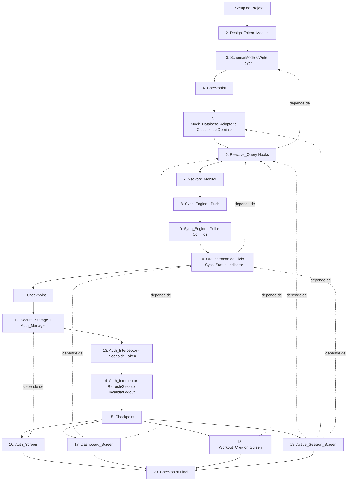

# Implementation Plan: Frontend Mobile Implementation (GymNight)

## Overview

Este plano converte o design aprovado em uma sequência incremental de tarefas de código. A ordem respeita as dependências arquiteturais: tokens de design (sem dependências) → schema/models do WatermelonDB → camada de mocks de teste → hooks reativos → Sync_Engine → Auth_Manager → Auth_Interceptor → telas. Cada tarefa de teste de propriedade referencia exatamente uma das 48 Correctness Properties do `design.md` e é posicionada imediatamente após a implementação que ela valida, nunca em uma fase de testes separada ao final. Linguagem de implementação: TypeScript (React Native / Expo SDK 57), conforme definido no design.

## Tasks

- [x] 1. Configurar projeto Expo TypeScript e dependências
  - Inicializar projeto Expo SDK 57 com template TypeScript
  - Instalar dependências de produção: `@nozbe/watermelondb`, `@supabase/supabase-js`, `@react-native-community/netinfo`, `expo-secure-store`, `zustand`
  - Instalar dependências de desenvolvimento: `jest`, `@testing-library/react-native`, `fast-check`, `@types/jest`
  - Criar a estrutura de pastas `src/db`, `src/sync`, `src/auth`, `src/designSystem`, `src/hooks`, `src/screens`, `src/test/mocks`
  - _Requirements: 20.4, 21.5_

  - [x] 1.1 Configurar Jest, React Native Testing Library e fast-check
    - Configurar `jest.config.js` com preset `react-native`, mapeamento de módulos e ambiente de testes
    - Configurar `fc.assert`/`fc.property` como padrão de projeto para testes de propriedade, com `numRuns: 100` como valor mínimo global
    - Garantir que a suíte de testes execute sem backend real ou arquivo SQLite real (apenas mocks)
    - _Requirements: 20.4, 21.5_

- [x] 2. Implementar Design_Token_Module
  - Criar `src/designSystem/tokens.ts` exportando `colors`, `typography`, `spacing`, `radii` como named exports de um único módulo
  - Definir tokens de cor: `background`, `surface`, `primary`, `primaryText`, `secondaryText`, `success`, `error`, cada um com valor distinto dos demais
  - Definir escala de tipografia (`heading`, `body`, `caption`) e escala de espaçamento com pelo menos 4 valores distintos em ordem crescente (ex.: 8/16/24/32)
  - Garantir que nenhum token de light-mode seja definido, exportado ou incluído no módulo
  - Configurar regra de ESLint (`no-restricted-syntax` ou plugin equivalente) que proíbe valores literais de cor/espaçamento/tipografia/border-radius em arquivos de `screens/` e `components/`, fora do `designSystem/tokens.ts`
  - _Requirements: 13.1, 13.2, 13.3, 13.5, 14.1, 14.2, 14.3_

  - [x] 2.1 Escrever testes unitários do Design_Token_Module
    - Verificar que todos os tokens de cor exigidos existem e são distintos entre si
    - Verificar que a escala de espaçamento é estritamente crescente e possui pelo menos 4 valores
    - Verificar que nenhuma chave de light-mode está presente no módulo exportado
    - _Requirements: 13.1, 13.2, 13.5_

- [x] 3. Implementar schema, Model classes e camada de escrita local do WatermelonDB
  - Criar `src/db/schema.ts` com as 6 tabelas (`users`, `exercises`, `workouts`, `workout_exercises`, `workout_sessions`, `logged_sets`) espelhando o contrato do backend
  - Criar as 6 Model classes em `src/db/models/` com decorators `@field`/`@date`/`@relation`/`@children`, incluindo associações (`belongs_to`, `has_many`)
  - Criar `src/db/database.ts` como instância singleton do `Database`, garantindo que seja a única fonte de leitura de dados de domínio no app
  - Implementar funções auxiliares de escrita local (`createRecord`, `updateRecord`, `deleteRecord`) que envolvem `database.write(...)`, retornando sucesso somente após o commit local e preservando o estado anterior em caso de falha
  - _Requirements: 1.1, 1.2, 2.1, 2.2, 2.3, 2.4_

  - [x] 3.1 Escrever teste de propriedade para confirmação de sucesso pós-persistência
    - **Property 4: Success confirmation never precedes local persistence**
    - **Validates: Requirements 2.1**

  - [x] 3.2 Escrever teste de propriedade para escrita local falha
    - **Property 5: Failed local write leaves state unchanged and signals no success**
    - **Validates: Requirements 2.4**

- [x] 4. Checkpoint — Garantir que os testes da camada de dados local passam
  - Ensure all tests pass, ask the user if questions arise.

- [x] 5. Implementar Mock_Database_Adapter e utilitários de cálculo de domínio
  - Criar `src/test/mocks/MockDatabaseAdapter.ts` implementando `find`, `query`, `observe`, `create`, `update`, `markAsDeleted` em memória, com suporte a pré-seed de registros para qualquer uma das 6 tabelas
  - Criar módulo de utilitários de domínio (`computeEstimatedOneRm`, `computeVolume`, `maxOneRmPerExercise`) implementando a Epley_Formula e as agregações de Volume/1RM, como funções puras independentes do Sync_Engine e de chamadas de rede
  - _Requirements: 19.5, 19.6, 21.1, 21.2_

  - [x] 5.1 Escrever testes unitários do Mock_Database_Adapter
    - Verificar seed, `find`, `query` e notificação de `observe` após `create`/`update`/`markAsDeleted`
    - _Requirements: 21.1, 21.2_

  - [x] 5.2 Escrever teste de propriedade para o cálculo do Epley_Formula
    - **Property 45: estimated_one_rm always equals the Epley formula result when no explicit value is supplied**
    - **Validates: Requirements 19.5, 21.3**

  - [x] 5.3 Escrever teste de propriedade para Volume e máximo de 1RM por exercício
    - **Property 46: Volume and per-exercise max estimated_one_rm always equal their exact aggregate definitions, recomputed without network calls**
    - **Validates: Requirements 17.6, 19.6, 21.4**

- [x] 6. Implementar fundação dos hooks de Reactive_Query
  - Criar utilitário genérico de observação (ex.: `useReactiveQuery`) que encapsula `.observe()`/`withObservables` sobre uma `Collection`, com `isLoading` iniciando `true` e passando a `false` apenas na primeira emissão, e que, ao receber erro, descarta o último valor bem-sucedido e expõe apenas `error`
  - Garantir que nenhum dado de domínio observado seja copiado para Zustand/Context; bibliotecas de estado global devem ser restritas a rascunhos de formulário, navegação e visibilidade de modais
  - _Requirements: 1.1, 1.2, 1.3, 1.4, 1.6_

  - [x] 6.1 Escrever teste de propriedade para reflexo de escritas locais na mesma emissão
    - **Property 1: Reactive_Query reflects local writes in the same emission cycle**
    - **Validates: Requirements 1.5**

  - [x] 6.2 Escrever teste de propriedade para ausência de dado obsoleto em falha/recuperação
    - **Property 2: Failed or recovering Reactive_Query never exposes stale or partial data**
    - **Validates: Requirements 1.6**

  - [x] 6.3 Implementar `useObserveDashboard`, `useObserveExerciseCatalog` e `useObserveActiveSession` usando a fundação de `useReactiveQuery`
    - Cada hook retorna dados tipados, `isLoading` e `error`, e permite derivações locais via `useMemo` sobre a última emissão
    - _Requirements: 1.4, 1.7, 17.1, 18.4, 19.6_

  - [x] 6.4 Escrever teste de propriedade para derivações puras sobre a última emissão
    - **Property 3: Derived selectors are pure recomputations of the latest emission**
    - **Validates: Requirements 1.7**

- [x] 7. Implementar Network_Monitor
  - Criar `src/sync/NetworkMonitor.ts` como wrapper sobre NetInfo, expondo o estado atual de conectividade e emitindo transições `offline → online` somente após estabilidade de pelo menos 2 segundos
  - Garantir que a detecção de mudança de conectividade em foreground ocorra dentro de 3 segundos da mudança real
  - _Requirements: 3.1_

  - [x] 7.1 Escrever teste de propriedade para independência de escrita local em relação à conectividade
    - **Property 7: Local write behavior is independent of connectivity state**
    - **Validates: Requirements 3.3, 18.7, 19.9**

- [x] 8. Implementar Sync_Engine — etapa de push
  - Criar `src/sync/syncAdapters.ts` com a função de push, agrupando os registros da Pending_Sync_Queue por tabela no formato `{ changes: { <table>: { created, updated, deleted } } }`
  - Implementar o tratamento das respostas `200 { status: "ok" }` (marcar registros como `synced`), `500` (mantém pendente, sem rollback) e `403` (interrompe retry apenas do payload rejeitado, loga ids, preserva registros não relacionados)
  - Garantir que o reenvio de um payload de push após falha não produza registros duplicados local ou remotamente (idempotência por id)
  - _Requirements: 4.4, 4.6, 5.2, 5.3, 5.5_

  - [x] 8.1 Escrever teste de propriedade para formato do payload de push
    - **Property 12: Push payload groups pending records by table with exact created/updated/deleted shape**
    - **Validates: Requirements 4.4**

  - [x] 8.2 Escrever teste de propriedade para marcação de registros como sincronizados
    - **Property 14: Successful push marks exactly the sent records as synced**
    - **Validates: Requirements 4.6**

  - [x] 8.3 Escrever teste de propriedade para quarentena de payload rejeitado com HTTP 403
    - **Property 16: HTTP 403 quarantines only the rejected payload, preserving unrelated pending records**
    - **Validates: Requirements 5.3**

  - [x] 8.4 Escrever teste de propriedade para retry idempotente sem duplicação
    - **Property 18: Idempotent retry of a push payload never produces duplicate local or remote records**
    - **Validates: Requirements 5.5**

- [x] 9. Implementar Sync_Engine — etapa de pull e resolução de conflitos
  - Implementar a função de pull, omitindo o parâmetro `last_pulled_at` na primeira sincronização e enviando o valor persistido nas sincronizações subsequentes
  - Implementar `src/sync/lastPulledAt.ts` para persistir o cursor fora do Secure_Storage, atualizado somente após a aplicação completa e bem-sucedida das mudanças do pull
  - Implementar a aplicação atômica das mudanças (`created`/`updated`/`deleted`) via `synchronize()` do WatermelonDB, incluindo as regras de resolução de conflito: merge por coluna (`updated` × `updated` pendente), tombstone remove registro e descarta update pendente, e `_status = deleted` local sempre vence dados entrantes do pull
  - Tratar erros não-transientes na aplicação do pull abortando toda a resposta sem persistir mudanças parciais e sem avançar `last_pulled_at`
  - _Requirements: 4.2, 4.3, 4.5, 5.6, 6.1, 6.2, 6.3, 6.4_

  - [x] 9.1 Escrever teste unitário para primeira sincronização sem `last_pulled_at`
    - Verificar que a query string do pull omite completamente o parâmetro quando nenhum cursor foi persistido
    - _Requirements: 4.2_

  - [x] 9.2 Escrever teste de propriedade para envio do valor exato de `last_pulled_at`
    - **Property 11: Pull request always sends the exact persisted last_pulled_at value**
    - **Validates: Requirements 4.3**

  - [x] 9.3 Escrever teste de propriedade para aplicação atômica do pull
    - **Property 13: Successful pull applies changes atomically and advances last_pulled_at only after full success; non-transient apply errors abort atomically**
    - **Validates: Requirements 4.5, 6.4**

  - [x] 9.4 Escrever teste de propriedade para merge por coluna em conflito updated×updated
    - **Property 19: Conflicting pull/local updates merge per-column and remain pending for re-push**
    - **Validates: Requirements 6.1**

  - [x] 9.5 Escrever teste de propriedade para tombstone sobre update pendente
    - **Property 20: An incoming tombstone always deletes the local record and discards any pending update**
    - **Validates: Requirements 6.2**

  - [x] 9.6 Escrever teste de propriedade para deleção local vencendo dados entrantes
    - **Property 21: A local deleted status always wins over incoming pull data for the same id**
    - **Validates: Requirements 6.3**

- [x] 10. Implementar orquestração do ciclo de sincronização e Sync_Status_Indicator
  - Implementar `src/sync/SyncEngine.ts` com `requestSyncCycle()`/`runSyncCycle()`, lock anti-concorrência (`cycleInProgress`), execução de push seguida de pull somente após o push atingir um outcome terminal, e os três gatilhos (transição de conectividade estável por 2s, timer fixo de 30s em foreground+online, ação manual)
  - Garantir que escritas locais no WatermelonDB nunca sejam bloqueadas enquanto um ciclo de sincronização está em andamento
  - Implementar `useSyncStatus()` e o componente `Sync_Status_Indicator`, mapeando os estados `synced`/`pending`/`syncing`/`offline` para os tokens `success`/`error`/`primary`/`primary` respectivamente
  - _Requirements: 3.2, 3.4, 3.5, 3.6, 3.7, 4.1, 4.7, 4.8, 5.1, 5.2, 5.6, 15.1, 15.2, 15.3, 15.6, 17.2_

  - [x] 10.1 Escrever teste de propriedade para gatilhos de conectividade estável e intervalo fixo
    - **Property 6: Stable connectivity transitions and fixed interval trigger exactly one sync cycle each**
    - **Validates: Requirements 3.2, 4.7**

  - [x] 10.2 Escrever teste de propriedade para preservação da Pending_Sync_Queue em falhas tratadas
    - **Property 8: Sync failures of any handled type preserve the pending queue and last_pulled_at**
    - **Validates: Requirements 3.5, 5.1, 5.2, 5.6**

  - [x] 10.3 Escrever teste de propriedade para mapeamento exato de cor do Sync_Status_Indicator
    - **Property 9: Sync_Status_Indicator color always equals the exact current sync state mapping**
    - **Validates: Requirements 3.4, 3.6, 3.7, 15.1, 15.2, 15.3, 15.6, 17.2**

  - [x] 10.4 Escrever teste de propriedade para ordenação push-antes-de-pull
    - **Property 10: Push always completes before pull is dispatched**
    - **Validates: Requirements 4.1**

  - [x] 10.5 Escrever teste de propriedade para no máximo um ciclo de sincronização concorrente
    - **Property 15: At most one synchronization cycle runs at a time**
    - **Validates: Requirements 4.8**

- [x] 11. Checkpoint — Garantir que os testes do Sync_Engine passam
  - Ensure all tests pass, ask the user if questions arise.

- [x] 12. Implementar Secure_Storage e Auth_Manager (login, cadastro, restauração de sessão)
  - Criar `src/auth/SecureStorage.ts` com `saveSession`, `loadSession`, `clearSession` sobre `expo-secure-store`
  - Criar `src/auth/AuthManager.ts` e `SessionContext.tsx`, implementando `signIn`/`signUp` exclusivamente via `@supabase/supabase-js`, persistindo a Session em Secure_Storage antes de navegar para fora do Auth_Screen, e tratando o caso de cadastro sem Session retornada (permanece no Auth_Screen com mensagem de confirmação de email)
  - Implementar a restauração de sessão no launch: UI_State `loading` durante `loadSession()`, navegação direta ao Dashboard_Screen se o token for válido, disparo do fluxo de refresh (Requirement 10) se expirado com `refresh_token` presente, e limpeza do Secure_Storage com navegação ao Auth_Screen se ausente ou não-parseável
  - _Requirements: 7.1, 7.2, 7.4, 8.1, 8.2, 8.3, 8.5_

  - [x] 12.1 Escrever teste de propriedade para persistência de sessão antes da navegação
    - **Property 22: Session persistence completes before navigation away from Auth_Screen**
    - **Validates: Requirements 7.3**

  - [x] 12.2 Escrever teste de propriedade para falhas de autenticação mantendo o usuário no Auth_Screen
    - **Property 23: Auth failures of any handled type keep the user on Auth_Screen with an error message**
    - **Validates: Requirements 7.5**

  - [x] 12.3 Escrever teste de propriedade para falha de escrita no Secure_Storage pós-login
    - **Property 24: Secure_Storage write failure after successful auth discards the in-memory session and blocks navigation**
    - **Validates: Requirements 7.6**

  - [x] 12.4 Escrever teste de propriedade para refresh antes da decisão de navegação no launch
    - **Property 25: Expired access token with a present refresh_token always triggers the refresh flow before the navigation decision**
    - **Validates: Requirements 8.4**

  - [x] 12.5 Escrever teste de propriedade para sessão ausente/não-parseável no launch
    - **Property 26: Absent or unparseable stored session always clears storage and routes to Auth_Screen**
    - **Validates: Requirements 8.5**

- [x] 13. Implementar Auth_Interceptor — injeção de token e controle de despacho por sessão
  - Criar `src/auth/AuthInterceptor.ts`, anexando exatamente um header `Authorization: Bearer <access_token>` a cada requisição do Sync_Engine, lendo sempre o token da Session em memória mais recentemente atualizada
  - Implementar o comportamento de skip do ciclo de sincronização quando a Session em memória está ausente (sem enviar requisição, sem alterar a Pending_Sync_Queue) e o processamento completo da fila assim que a Session se torna disponível
  - _Requirements: 9.1, 9.2, 9.3, 9.4, 9.5_

  - [x] 13.1 Escrever teste de propriedade para header de autorização único e atualizado
    - **Property 27: Exactly one Authorization header is attached per dispatched sync request, always reflecting the latest completed session**
    - **Validates: Requirements 9.1, 9.2**

  - [x] 13.2 Escrever teste de propriedade para skip/dispatch exaustivo por presença de sessão
    - **Property 28: Absent session always skips the cycle without side effects; presence always dispatches — no undefined third state**
    - **Validates: Requirements 9.3, 9.4**

  - [x] 13.3 Escrever teste de propriedade para esvaziamento total da fila ao restaurar a sessão
    - **Property 29: Session becoming available flushes the entire pending queue on the very next cycle**
    - **Validates: Requirements 9.5**

- [x] 14. Implementar fluxo de refresh de token, sessão inválida e logout
  - Implementar no `Auth_Interceptor` o tratamento de HTTP 401 "Token expirado" com `refresh_token` presente (solicita refresh ao Supabase, retry único do request original), enfileiramento de requisições concorrentes durante o refresh (no máximo um refresh simultâneo), e o fallback de "sessão inválida direta" para "Token inválido", "Token não fornecido", 401 sem `refresh_token`, e mensagens 401 não mapeadas
  - Implementar a invalidação de sessão (limpar Secure_Storage e Session em memória, descartar requests não-dispatchados da fila, navegar ao Auth_Screen) sem nunca deletar dados de domínio do WatermelonDB nem alterar `_status` de registros pendentes
  - Implementar o fluxo de logout: prompt de confirmação quando a Pending_Sync_Queue não está vazia, invalidação de sessão no Supabase (best-effort), limpeza do Secure_Storage independente do resultado do Supabase, e deleção das 6 tabelas do WatermelonDB + `last_pulled_at` com um retry imediato em caso de falha
  - _Requirements: 10.1, 10.2, 10.4, 10.5, 10.6, 10.7, 10.8, 11.1, 11.2, 11.3, 11.4, 11.5, 12.1, 12.3, 12.4, 12.5, 12.6_

  - [x] 14.1 Escrever teste de propriedade para classificação consistente de outcomes de 401/refresh
    - **Property 30: 401 responses and refresh outcomes are classified and handled consistently across all cases**
    - **Validates: Requirements 10.1, 10.2, 10.5, 10.6, 10.7, 10.8, 11.1, 11.2, 11.4, 11.5**

  - [x] 14.2 Escrever teste de propriedade para refresh único concorrente com fila de espera
    - **Property 31: At most one concurrent token refresh call; queued requests dispatch only after it resolves**
    - **Validates: Requirements 10.4**

  - [x] 14.3 Escrever teste de propriedade para não-bloqueio de escritas locais durante sync/refresh em andamento
    - **Property 17: In-flight synchronization or token refresh never blocks new local writes**
    - **Validates: Requirements 5.4, 10.3**

  - [x] 14.4 Escrever teste de propriedade para logout cancelado deixando estado inalterado
    - **Property 32: Declining the logout confirmation leaves session, domain records, and pending queue byte-for-byte unchanged**
    - **Validates: Requirements 12.2**

  - [x] 14.5 Escrever teste de propriedade para limpeza do Secure_Storage independente do outcome do Supabase
    - **Property 33: Secure_Storage is always cleared on confirmed/empty-queue logout regardless of the Supabase invalidation outcome**
    - **Validates: Requirements 12.3**

  - [x] 14.6 Escrever teste de propriedade para wipe completo das 6 tabelas com retry único
    - **Property 34: Logout completion always wipes all six local tables and last_pulled_at, retrying once before blocking navigation on repeated failure**
    - **Validates: Requirements 12.4, 12.5, 12.6**

- [x] 15. Checkpoint — Garantir que os testes de autenticação e sincronização passam
  - Ensure all tests pass, ask the user if questions arise.

- [x] 16. Implementar Auth_Screen
  - Criar os componentes `AuthForm` (toggle login/cadastro), `SubmitButton`, `ErrorBanner`, `OfflineBanner`, consumindo exclusivamente Design_Tokens
  - Implementar a validação de submit (email não-vazio contendo "@", senha não-vazia), o UI_State `loading` com submit desabilitado durante a requisição, o UI_State `offline` que bloqueia a chamada de rede, e o UI_State `error` retendo o email e limpando a senha
  - Exibir a mensagem de sessão expirada quando o app navega ao Auth_Screen por sessão inválida (Requirement 11.3), garantindo que o usuário não permaneça na tela sem entender o motivo
  - _Requirements: 16.1, 16.2, 16.3, 16.4, 16.5, 11.3_

  - [x] 16.1 Escrever teste de propriedade para habilitação exata do submit
    - **Property 35: Auth_Screen submit is enabled exactly when the email/password validation predicate holds**
    - **Validates: Requirements 16.2, 16.5**

  - [x] 16.2 Escrever teste de propriedade para submissão offline nunca chamar a rede
    - **Property 36: Offline submission never invokes the network call regardless of field validity**
    - **Validates: Requirements 16.3**

  - [x] 16.3 Escrever teste de propriedade para retenção de email e limpeza de senha em erro
    - **Property 37: Supabase auth error retains the entered email and clears the password**
    - **Validates: Requirements 16.4**

  - [x] 16.4 Escrever testes de componente do Auth_Screen por UI_State e interação
    - Testes de render para `loading`, `offline` e `error`, e teste de interação verificando que o submit aciona o callback esperado
    - _Requirements: 20.1, 20.2, 20.3_

- [x] 17. Implementar Dashboard_Screen
  - Criar os componentes `TodayWorkoutCard`, `QuickStats`, `OfflineBanner`, `EmptyStateCTA`, integrando `useObserveDashboard(userId)` e `useSyncStatus()`
  - Implementar os UI_States `loading` (antes da primeira emissão), `empty` (zero Workouts, com CTA para criar o primeiro), `offline` (banner sobre dados locais) e `success`, e exibir as estatísticas rápidas (total de sessões concluídas e Volume total) computadas localmente
  - _Requirements: 17.1, 17.2, 17.3, 17.4, 17.6_

  - [x] 17.1 Escrever teste de propriedade para banner offline coexistindo com dados locais
    - **Property 38: Offline banner and locally available data render simultaneously, never one replacing the other**
    - **Validates: Requirements 17.5**

  - [x] 17.2 Escrever testes de componente do Dashboard_Screen por UI_State e interação
    - Testes de render para `loading`, `empty`, `offline` e `success`, e teste de interação verificando que o CTA de criar treino aciona a navegação/callback esperado
    - _Requirements: 20.1, 20.2, 20.3_

- [x] 18. Implementar Workout_Creator_Screen
  - Criar os componentes `WorkoutNameInput`, `ExercisePicker`, `ExerciseTargetForm`, `SaveButton`, integrando `useObserveExerciseCatalog()`
  - Implementar a exigência de `series_target`, `reps_target` e `weight_target` antes de salvar uma WorkoutExercise, a persistência do Workout e suas WorkoutExercise em uma única transação local, a validação de nome não-vazio/não-whitespace, e os UI_States `loading` (catálogo carregando), `empty` (catálogo vazio, sugere conectar à rede) e `error` (nome inválido)
  - _Requirements: 18.1, 18.4, 18.5_

  - [x] 18.1 Escrever teste de propriedade para bloqueio de exercício sem targets completos
    - **Property 39: Adding a WorkoutExercise is blocked unless series_target, reps_target, and weight_target are all present**
    - **Validates: Requirements 18.2**

  - [x] 18.2 Escrever teste de propriedade para atomicidade do salvamento de Workout + exercícios
    - **Property 40: Saving a Workout with its exercises is atomic — no partial commit under interruption**
    - **Validates: Requirements 18.3**

  - [x] 18.3 Escrever teste de propriedade para rejeição de nomes vazios/whitespace
    - **Property 41: Whitespace-only or empty Workout names are always rejected without a write**
    - **Validates: Requirements 18.6**

  - [x] 18.4 Escrever testes de componente do Workout_Creator_Screen por UI_State e interação
    - Testes de render para `loading`, `empty` e `error`, e teste de interação verificando que salvar um Workout válido aciona a persistência esperada
    - _Requirements: 20.1, 20.2, 20.3_

- [x] 19. Implementar Active_Session_Screen
  - Criar os componentes `SessionTimer`, `SetLogger`, `VolumeSummary`, `PerExerciseOneRmSummary`, `EndSessionButton`, integrando `useObserveActiveSession(sessionId)` e os utilitários de cálculo de domínio (tarefa 5)
  - Implementar o início de sessão (com ou sem Workout pré-definido, criando Freestyle_Session quando aplicável), o timer de elapsed time atualizado a pelo menos 1x/segundo, o registro de LoggedSets com cálculo de `estimated_one_rm` via Epley_Formula quando não informado explicitamente, o encerramento de sessão (`ended_at`), a oferta de retomar sessões com `ended_at` nulo a partir do Dashboard_Screen, e o UI_State `error` isolado por item de LoggedSet que falhar ao persistir
  - _Requirements: 19.1, 19.2, 19.3, 19.4, 19.7, 19.8_

  - [x] 19.1 Escrever teste de propriedade para campos de ciclo de vida de início/fim de sessão
    - **Property 42: Starting and ending a WorkoutSession always sets the correct lifecycle fields**
    - **Validates: Requirements 19.1, 19.2, 19.7**

  - [x] 19.2 Escrever teste de propriedade para o timer de tempo decorrido
    - **Property 43: Displayed elapsed time always equals the difference between now and started_at**
    - **Validates: Requirements 19.3**

  - [x] 19.3 Escrever teste de propriedade para criação de LoggedSet corretamente vinculado
    - **Property 44: Logging a set always creates a correctly-linked LoggedSet with completed_at set to now**
    - **Validates: Requirements 19.4**

  - [x] 19.4 Escrever teste de propriedade para sessões retomáveis exatamente com ended_at nulo
    - **Property 47: Resumable sessions surfaced to the Dashboard are exactly those with ended_at == null**
    - **Validates: Requirements 19.8**

  - [x] 19.5 Escrever teste de propriedade para isolamento de erro de persistência de LoggedSet
    - **Property 48: A failed LoggedSet persistence isolates the error to that entry and retains its entered values**
    - **Validates: Requirements 19.10**

  - [x] 19.6 Escrever testes de componente do Active_Session_Screen por UI_State e interação
    - Teste de render para o UI_State `error` isolado por item, e teste de interação verificando que registrar uma série aciona a persistência e a atualização de Volume/1RM exibidos
    - _Requirements: 20.1, 20.2, 20.3_

- [x] 20. Checkpoint final — Garantir que toda a suíte de testes passa
  - Ensure all tests pass, ask the user if questions arise.

## Task Dependency Graph

## Notes

- Tarefas marcadas com `*` são de teste (unitário ou de propriedade) e são opcionais/puláveis para um MVP mais rápido; o agente de implementação NÃO deve implementá-las automaticamente.
- Todas as demais tarefas (`- [ ]` sem `*`) devem ser implementadas.
- Cada teste de propriedade referencia exatamente uma das 48 Correctness Properties do `design.md` e usa `fast-check` com `numRuns: 100` como mínimo.
- Os checkpoints (tarefas 4, 11, 15 e 20) marcam pontos de validação incremental — a suíte de testes completa até aquele ponto deve passar antes de avançar.
- O Design_Token_Module (tarefa 2) é implementado antes de qualquer tela para eliminar valores hardcoded desde o início (Requirement 14.1).
- O Mock_Database_Adapter (tarefa 5) é implementado antes dos hooks e telas para servir de base a todos os testes de componente subsequentes (Requirement 20.4, 21.5).
