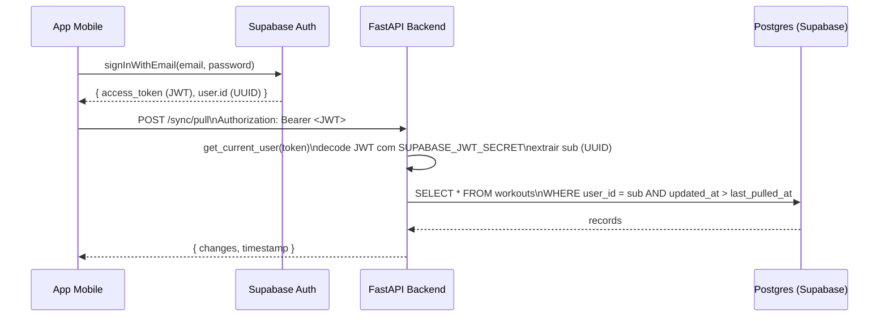

# Design Document: Migração do Backend GymNight para Supabase

## Overview

Este documento descreve o design técnico da migração do backend FastAPI do GymNight Mobile de um sistema de autenticação manual (bcrypt + JWT próprio) para o Supabase como BaaS (Backend as a Service).

### Objetivo

Remover toda a infraestrutura de autenticação local e substituí-la pela validação stateless do JWT emitido pelo Supabase Auth. O FastAPI continua sendo a camada de serviço responsável pela lógica de sincronização WatermelonDB (pull/push) — nada muda nessa responsabilidade.

### Resultado esperado

- `security.py` passa a conter apenas `get_current_user` (decode-only, HS256, `SUPABASE_JWT_SECRET`)
- `config.py` passa a usar `pydantic-settings` `BaseSettings` com as três variáveis obrigatórias do Supabase
- `bcrypt`, `passlib` e `python-jose` são removidos do projeto
- A coluna `password_hash` é removida da tabela `users` via migração Alembic
- Os modelos SQLAlchemy offline-first (colunas `_status`, `_changed`, timestamps BigInteger, `deleted_records`, triggers) permanecem completamente intactos

---

## Architecture

### Fluxo de autenticação pós-migração



### Componentes e responsabilidades

| Componente | Responsabilidade atual | Responsabilidade pós-migração |
|---|---|---|
| `Supabase Auth` | Não existia | Registro, login, emissão de JWT assinado com `SUPABASE_JWT_SECRET` |
| `app/core/security.py` | `hash_password`, `verify_password`, `create_access_token` | Apenas `get_current_user` — decode-only |
| `app/core/config.py` | `os.getenv()` + `load_dotenv()` com variáveis JWT antigas | `BaseSettings` com `SUPABASE_URL`, `SUPABASE_JWT_SECRET`, `DATABASE_URL` |
| `app/routers/auth.py` | Login local com bcrypt | **Removido** — autenticação ocorre diretamente no frontend via SDK Supabase |
| `app/routers/users.py` | `POST /users` com `UserCreate` (senha) | `POST /users` com `UserProfileCreate` (sem senha), protegido por `Depends(get_current_user)` |
| `app/schemas/user.py` | `UserCreate` (com `password`), `UserLogin`, `UserResponse` | `UserProfileCreate`, `UserProfileUpdate`, `UserProfileResponse` |
| `app/database/models/user.py` | Modelo com `password_hash` | Modelo sem `password_hash`; `id` mapeado diretamente ao `sub` do JWT |
| WatermelonDB sync routes | Sem autenticação ou com autenticação manual | `Depends(get_current_user)` obrigatório em todos os handlers |

### Decisão de arquitetura: FastAPI como decode-only validator

O Supabase emite JWTs assinados com `SUPABASE_JWT_SECRET` (HS256). O FastAPI apenas **verifica a assinatura e extrai o `sub`** — nunca gera tokens. Isso elimina todo o estado de sessão do backend e torna o sistema horizontalmente escalável.

**Alternativa considerada e rejeitada**: usar o Supabase Python Client no backend para validar tokens via chamada HTTP à API do Supabase. Rejeitada por: latência adicional em cada requisição, dependência de disponibilidade de rede para validação, e necessidade de cache. A verificação local via `PyJWT` com `SUPABASE_JWT_SECRET` é suficiente, segura e síncrona.

### Decisão: manter FastAPI, não substituir por Supabase Edge Functions

A lógica de Pull/Push do WatermelonDB envolve queries complexas com múltiplos filtros, joins e ordenação. Migrar isso para Edge Functions aumentaria a complexidade sem benefício. O FastAPI permanece.

---

## Components and Interfaces

### `app/core/config.py` (novo)

```python
from pydantic_settings import BaseSettings, SettingsConfigDict

class Settings(BaseSettings):
    model_config = SettingsConfigDict(env_file=".env", env_file_encoding="utf-8")

    SUPABASE_URL: str
    SUPABASE_JWT_SECRET: str
    DATABASE_URL: str  # Use Connection Pooling URL (PgBouncer, porta 6543) em produção

settings = Settings()
```

**Comportamento de falha**: Se qualquer uma das três variáveis estiver ausente no ambiente, `Settings()` lança `pydantic.ValidationError` imediatamente, impedindo a inicialização da aplicação. Isso substitui o comportamento silencioso anterior (`os.getenv()` retornava `None`).

**Variáveis removidas**: `SECRET_KEY`, `ALGORITHM`, `ACCESS_TOKEN_EXPIRE_MINUTES` — não fazem mais sentido pois o FastAPI não emite tokens.

### `app/core/security.py` (novo)

```python
from fastapi import Depends, HTTPException, status
from fastapi.security import HTTPBearer, HTTPAuthorizationCredentials
import jwt
from jwt.exceptions import ExpiredSignatureError, InvalidSignatureError, DecodeError
from app.core.config import settings

bearer_scheme = HTTPBearer(auto_error=False)

def get_current_user(
    credentials: HTTPAuthorizationCredentials | None = Depends(bearer_scheme)
) -> str:
    """
    FastAPI dependency que valida o JWT do Supabase e retorna o sub (UUID do usuário).

    Retorna: str — UUID v4 do usuário autenticado (claim `sub` do JWT)

    Exceções:
    - HTTP 401 "Token não fornecido"  — header ausente ou malformado
    - HTTP 401 "Token expirado"       — claim exp no passado
    - HTTP 401 "Token inválido"       — assinatura inválida ou token malformado
    """
    if credentials is None:
        raise HTTPException(status_code=401, detail="Token não fornecido")

    token = credentials.credentials
    if not token:
        raise HTTPException(status_code=401, detail="Token não fornecido")

    try:
        payload = jwt.decode(
            token,
            settings.SUPABASE_JWT_SECRET,
            algorithms=["HS256"],
        )
        sub: str = payload.get("sub", "")
        if not sub:
            raise HTTPException(status_code=401, detail="Token inválido")
        return sub

    except ExpiredSignatureError:
        raise HTTPException(status_code=401, detail="Token expirado")
    except (InvalidSignatureError, DecodeError):
        raise HTTPException(status_code=401, detail="Token inválido")
```

**Biblioteca**: `PyJWT>=2.8.0` (substitui `python-jose`). PyJWT é mantida ativamente, usada pela comunidade FastAPI e não depende de `cryptography` para HS256.

### `app/schemas/user.py` (atualizado)

```python
from pydantic import BaseModel
from typing import Optional
from datetime import date

class UserProfileCreate(BaseModel):
    """Cria perfil após registro bem-sucedido no Supabase Auth."""
    name: Optional[str] = None        # 1–100 caracteres
    weight: Optional[float] = None    # 1.0–500.0 kg
    height: Optional[float] = None    # 50.0–300.0 cm
    birth_date: Optional[str] = None  # ISO 8601 YYYY-MM-DD
    gender: Optional[str] = None      # "male" | "female" | "other"

class UserProfileUpdate(BaseModel):
    """Atualização parcial de perfil. Todos os campos opcionais."""
    name: Optional[str] = None
    weight: Optional[float] = None
    height: Optional[float] = None
    birth_date: Optional[str] = None
    gender: Optional[str] = None

class UserProfileResponse(BaseModel):
    id: str
    name: Optional[str]
    weight: Optional[float]
    height: Optional[float]
    birth_date: Optional[str]
    gender: Optional[str]

    model_config = {"from_attributes": True}
```

**Removidos**: `UserCreate` (com `password`), `UserLogin`, `GoogleLoginRequest`.

### `app/routers/users.py` (atualizado)

```python
from fastapi import APIRouter, HTTPException, Depends
from sqlalchemy.orm import Session
from app.database.connection import get_db
from app.database import models
from app.schemas.user import UserProfileCreate, UserProfileResponse
from app.core.security import get_current_user

router = APIRouter(prefix="/users", tags=["users"])

@router.post("", response_model=UserProfileResponse)
def create_user_profile(
    profile: UserProfileCreate,
    current_user_id: str = Depends(get_current_user),
    db: Session = Depends(get_db),
):
    """
    Cria ou inicializa o perfil do usuário autenticado.
    O users.id é o sub do JWT — nunca gerado pelo backend.
    """
    existing = db.query(models.User).filter(models.User.id == current_user_id).first()
    if existing:
        raise HTTPException(status_code=400, detail="Perfil já existe")

    new_user = models.User(
        id=current_user_id,  # sub do JWT = Supabase Auth UUID
        name=profile.name,
        weight=profile.weight,
        height=profile.height,
        birth_date=profile.birth_date,
        gender=profile.gender,
    )
    db.add(new_user)
    db.commit()
    db.refresh(new_user)
    return new_user
```

**Removido**: `app/routers/auth.py` — o arquivo inteiro, pois login agora ocorre no frontend via SDK Supabase.

### `app/database/models/user.py` (atualizado)

A coluna `password_hash` é **removida** do modelo. O campo `email` também pode ser removido do modelo SQLAlchemy (o Supabase Auth é a fonte de verdade para email), mas pode ser mantido como campo opcional se a aplicação precisar exibi-lo. A decisão de design recomendada é remover `email` do modelo de perfil e obter o email diretamente do JWT claim `email` quando necessário.

Colunas preservadas intactas:
- `id` (String(36), primary key) — agora mapeado diretamente ao `sub` do JWT
- `name`, `weight`, `height`, `birth_date`, `gender`
- `_status` (String(10), nullable)
- `_changed` (String(500), nullable)
- `created_at`, `updated_at` (BigInteger)
- `deleted_at` (BigInteger)
- `workouts` relationship (cascade delete)
- `workout_sessions` relationship (cascade delete)

---

## Data Models

### Migração Alembic: remoção de `password_hash`

Criar nova migração em `app/database/migrations/`:

```python
# app/database/migrations/004_remove_password_hash.py
"""Remove password_hash column from users table

Revision ID: 004
"""
from alembic import op

def upgrade():
    op.drop_column('users', 'password_hash')

def downgrade():
    import sqlalchemy as sa
    op.add_column('users', sa.Column('password_hash', sa.String(255), nullable=True))
```

**Observação crítica**: A migração de `downgrade` adiciona `password_hash` como `nullable=True` para não quebrar dados existentes ao reverter. Em uma reversão real, o campo ficará vazio — o que é esperado, pois as senhas não existem mais no sistema.

### Mapeamento `users.id` ↔ Supabase Auth UUID

```
Supabase Auth (tabela auth.users)     FastAPI Postgres (tabela public.users)
─────────────────────────────────     ──────────────────────────────────────
auth.users.id  (UUID)          ────→  public.users.id  (String(36))
JWT claim: sub  (string)       ────→  public.users.id  (lookup por id)
```

O frontend obtém o UUID do usuário via `supabase.auth.getUser().data.user.id` e inclui esse valor no `id` ao criar o perfil via `POST /users`. O backend valida que `current_user_id` (extraído do JWT) é igual ao `id` fornecido no corpo — ou, de forma mais segura, ignora o `id` no corpo e usa exclusivamente o `sub` do JWT.

### Schema do banco de dados pós-migração (tabela `users`)

```sql
CREATE TABLE users (
    id          VARCHAR(36) PRIMARY KEY,    -- Supabase Auth UUID (= JWT sub)
    name        VARCHAR(255),
    weight      FLOAT,
    height      FLOAT,
    birth_date  VARCHAR(20),
    gender      VARCHAR(10),
    created_at  BIGINT NOT NULL,
    updated_at  BIGINT NOT NULL,
    deleted_at  BIGINT,
    _status     VARCHAR(10),
    _changed    VARCHAR(500)
    -- password_hash REMOVIDA via migração 004
);
```

### Dependências Python: o que muda

**Remover** de `requirements.txt` / `pyproject.toml`:
```
bcrypt
passlib[bcrypt]
python-jose[cryptography]
python-dotenv
```

**Adicionar**:
```
pydantic-settings>=2.2.0   # BaseSettings com env_file
PyJWT>=2.8.0               # Decode-only, HS256, sem crypto extra
```

**Manter** (inalterado):
```
fastapi
uvicorn
sqlalchemy
psycopg2-binary
pydantic
```

---

## Correctness Properties

*Uma propriedade é uma característica ou comportamento que deve ser verdadeiro para todas as execuções válidas de um sistema — essencialmente, uma declaração formal sobre o que o sistema deve fazer. Propriedades servem como ponte entre especificações legíveis por humanos e garantias de corretude verificáveis por máquina.*

---

### Property 1: Validação bem-sucedida preserva o sub do JWT

*Para qualquer* UUID v4 válido usado como claim `sub` em um JWT assinado com `SUPABASE_JWT_SECRET` (HS256) e com `exp` no futuro, `get_current_user` deve retornar exatamente esse UUID sem modificação.

**Validates: Requirements 2.1, 2.3, 5.8**

---

### Property 2: Tokens expirados sempre resultam em HTTP 401 "Token expirado"

*Para qualquer* JWT assinado corretamente com `SUPABASE_JWT_SECRET` cujo claim `exp` seja um timestamp no passado, `get_current_user` deve lançar `HTTPException` com `status_code=401` e `detail="Token expirado"` — independentemente do conteúdo do payload.

**Validates: Requirements 2.4**

---

### Property 3: Tokens com assinatura incorreta sempre resultam em HTTP 401 "Token inválido"

*Para qualquer* token criado com uma chave de assinatura diferente de `SUPABASE_JWT_SECRET` (seja qual for o conteúdo do payload), `get_current_user` deve lançar `HTTPException` com `status_code=401` e `detail="Token inválido"`.

**Validates: Requirements 2.5**

---

### Property 4: Headers ausentes ou malformados sempre resultam em HTTP 401 "Token não fornecido"

*Para qualquer* combinação de header `Authorization` inválido — incluindo ausência total do header, valor vazio, formato sem prefixo `Bearer`, ou `Bearer` seguido de string vazia — `get_current_user` deve lançar `HTTPException` com `status_code=401` e `detail="Token não fornecido"`.

**Validates: Requirements 2.6, 6.3, 7.3**

---

### Property 5: Settings rejeita qualquer configuração com variável obrigatória ausente

*Para qualquer* subconjunto próprio de `{SUPABASE_URL, SUPABASE_JWT_SECRET, DATABASE_URL}` (ou seja, qualquer combinação onde pelo menos uma das três variáveis esteja ausente), instanciar `Settings` deve lançar `pydantic.ValidationError`.

**Validates: Requirements 2.7, 3.1, 3.2, 3.3**

---

### Property 6: Corpo de requisição com campo `password` sempre resulta em HTTP 422

*Para qualquer* corpo de requisição JSON enviado a qualquer endpoint de perfil de usuário que contenha um campo `password` (independentemente dos outros campos presentes), o sistema deve retornar HTTP 422 Unprocessable Entity.

**Validates: Requirements 6.5**

---

### Property 7: Perfil de usuário aceita qualquer subconjunto válido dos campos permitidos

*Para qualquer* subconjunto não-vazio dos campos `{name, weight, height, birth_date, gender}` com valores dentro dos limites válidos, e acompanhado de um JWT válido, a requisição ao endpoint de criação/atualização de perfil deve ter sucesso (HTTP 200 ou 201).

**Validates: Requirements 6.4**

---

### Property 8: Autorização multi-tenant — push rejeita registros com user_id divergente

*Para qualquer* payload de push do WatermelonDB que contenha ao menos um registro cujo `user_id` seja diferente do claim `sub` do JWT autenticado, o sistema deve retornar HTTP 403 Forbidden e não persistir nenhum registro do payload.

**Validates: Requirements 7.4**

---

### Property 9: Autorização multi-tenant — pull retorna apenas registros do usuário autenticado

*Para qualquer* estado do banco de dados contendo registros de múltiplos usuários, uma requisição de pull autenticada como usuário `U` deve retornar apenas registros cujo `user_id` seja igual ao `sub` do JWT de `U` — nunca registros de outros usuários.

**Validates: Requirements 7.5**

---

### Property 10: Colunas de sincronização preservadas em todos os modelos sincronizáveis

*Para qualquer* tabela do conjunto `{users, exercises, workouts, workout_exercises, workout_sessions, logged_sets}`, os modelos SQLAlchemy devem conter: coluna `_status` (String(10), nullable), coluna `_changed` (String(500), nullable), colunas `created_at` e `updated_at` (BigInteger), e chave primária `id` do tipo String(36).

**Validates: Requirements 5.1, 5.2, 5.3, 5.6**

---

## Error Handling

### Hierarquia de erros do JWT_Validator

| Condição | HTTP Status | `detail` | Exceção PyJWT capturada |
|---|---|---|---|
| Header `Authorization` ausente | 401 | `"Token não fornecido"` | `HTTPBearer` retorna `None` |
| `Bearer ` sem token | 401 | `"Token não fornecido"` | `credentials.credentials` vazio |
| Token expirado | 401 | `"Token expirado"` | `ExpiredSignatureError` |
| Assinatura inválida | 401 | `"Token inválido"` | `InvalidSignatureError` |
| Token malformado (não é JWT) | 401 | `"Token inválido"` | `DecodeError` |
| Claim `sub` ausente ou vazio | 401 | `"Token inválido"` | Checagem manual pós-decode |
| `SUPABASE_JWT_SECRET` ausente | 500 (startup crash) | — | `pydantic.ValidationError` na inicialização |

### Ordem de verificação no `get_current_user`

```
1. credentials is None?          → 401 "Token não fornecido"
2. credentials.credentials vazio? → 401 "Token não fornecido"
3. jwt.decode() lança ExpiredSignatureError? → 401 "Token expirado"
4. jwt.decode() lança InvalidSignatureError ou DecodeError? → 401 "Token inválido"
5. payload.get("sub") vazio? → 401 "Token inválido"
6. Retorna sub (string UUID v4)
```

### Erro multi-tenant no push

```
1. Decodificar JWT → extrair sub
2. Para cada registro no payload verificar record.user_id == sub
3. Se qualquer registro divergir → 403 "Operação não autorizada"
4. Rollback implícito (nenhum dado persistido)
```

### Falha de configuração

`Settings()` é instanciado no nível de módulo em `config.py`. Se uma variável obrigatória estiver ausente, o erro ocorre **antes** de qualquer rota ser registrada, com uma mensagem clara do Pydantic indicando qual campo falhou.

---

## Testing Strategy

### Abordagem dual

O projeto usa `pytest` com `hypothesis` (já instalado, evidenciado pelo diretório `.hypothesis/`). A estratégia combina:

- **Testes de propriedade** (Hypothesis): cobrem o espaço de inputs gerados aleatoriamente para propriedades universais
- **Testes de exemplo** (pytest puro): cobrem casos específicos, integração de componentes e smoke tests

### Configuração de testes de propriedade

```python
from hypothesis import given, settings as h_settings, HealthCheck
from hypothesis import strategies as st

@h_settings(max_examples=200, suppress_health_check=[HealthCheck.too_slow])
@given(sub=st.uuids().map(str), extra=st.dictionaries(st.text(), st.text()))
def test_property_1_valid_jwt_returns_sub(sub, extra):
    # Feature: supabase-migration, Property 1: valid JWT preserves sub
    ...
```

Tag format: `# Feature: supabase-migration, Property {N}: {property_text}`

### Mocks para testes unitários do JWT_Validator

Os testes do `get_current_user` **não** devem fazer chamadas ao Supabase. Usar `pytest-mock` para mockar `settings.SUPABASE_JWT_SECRET` e `PyJWT` para gerar tokens de teste:

```python
import jwt as pyjwt

TEST_SECRET = "test-secret-for-hypothesis-runs"

def make_token(sub: str, exp_delta_seconds: int = 3600, secret: str = TEST_SECRET) -> str:
    payload = {"sub": sub, "exp": int(time.time()) + exp_delta_seconds}
    return pyjwt.encode(payload, secret, algorithm="HS256")
```

### Testes de propriedade por requirement

| Propriedade | Estratégia Hypothesis | Arquivo de teste sugerido |
|---|---|---|
| P1: JWT válido preserva sub | `st.uuids().map(str)` + payload aleatório | `tests/test_jwt_validator_properties.py` |
| P2: Token expirado → 401 | `st.integers(max_value=int(time.time())-1)` para `exp` | `tests/test_jwt_validator_properties.py` |
| P3: Assinatura inválida → 401 | `st.text(min_size=10)` para chave errada | `tests/test_jwt_validator_properties.py` |
| P4: Header malformado → 401 | `st.one_of(st.none(), st.text())` para header | `tests/test_jwt_validator_properties.py` |
| P5: Settings rejeita config incompleta | `st.frozensets(st.sampled_from([...]))` | `tests/test_settings_properties.py` |
| P6: password no body → 422 | `st.fixed_dictionaries({"password": st.text()})` | `tests/test_user_router_properties.py` |
| P7: subconjunto válido → 200 | `st.fixed_dictionaries({...}).filter(len > 0)` | `tests/test_user_router_properties.py` |
| P8: push com user_id divergente → 403 | `st.uuids()` para gerar dois UUIDs diferentes | `tests/test_sync_authorization_properties.py` |
| P9: pull filtra por usuário | `st.lists(st.builds(Record, ...))` | `tests/test_sync_authorization_properties.py` |
| P10: colunas sync preservadas | `st.sampled_from(SYNCABLE_TABLES)` | `tests/test_model_preservation_properties.py` |

### Smoke tests (pytest puro)

```
tests/
├── test_jwt_validator_properties.py    # Properties 1–4
├── test_settings_properties.py         # Property 5
├── test_user_router_properties.py      # Properties 6–7
├── test_sync_authorization_properties.py # Properties 8–9
├── test_model_preservation_properties.py # Property 10
└── smoke/
    ├── test_no_legacy_auth_imports.py  # Requirements 1.1–1.7 (scan de imports)
    ├── test_settings_validation.py     # Requirements 3.4–3.6
    ├── test_env_file_content.py        # Requirements 4.1–4.4
    └── test_schema_structure.py        # Requirements 5.4, 5.5, 5.7
```

### Cobertura de testes de integração (não property-based)

Para os requisitos de integridade dos modelos SQLAlchemy (5.4, 5.5), usar os testes existentes em `tests/test_preservation_properties.py` como base — eles já testam a estrutura dos modelos contra o banco real.

### Nota sobre o banco de dados nos testes

- Testes de propriedade do JWT_Validator são **totalmente in-memory** (sem banco)
- Testes de autorização de sync (P8, P9) usam SQLite in-memory para velocidade
- Testes de preservação de modelos (P10) podem usar SQLite in-memory com `check_same_thread=False`
- Testes de integração com Postgres real ficam em `tests/` (já existe infraestrutura)
