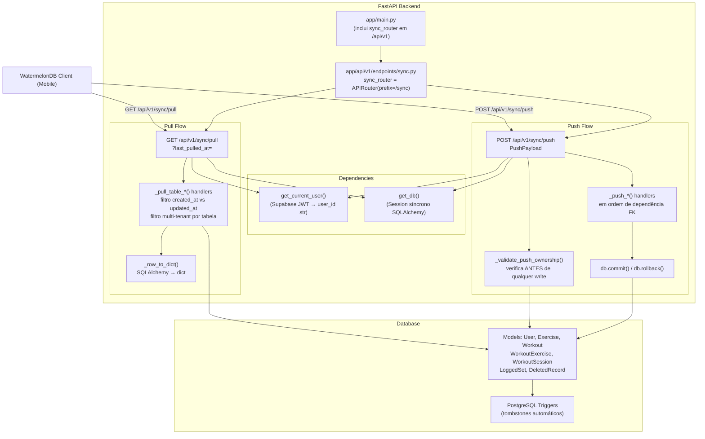

# Design Document: watermelondb-sync-router

## Overview

Este documento descreve o design técnico do `Sync_Router` — a migração e correção
do endpoint de sincronização WatermelonDB do GymNight Mobile Backend.

O código existente em `app/routers/sync.py` tem dois bugs críticos de protocolo:

1. **Ausência de separação `created` vs `updated` no Pull** — o WatermelonDB exige
   arrays distintos; o código atual coloca tudo em `updated` com `created: []`.
2. **Ownership scan incompleto no Push** — `workout_exercises` e `logged_sets`
   não têm `user_id` direto; a verificação precisa de JOIN com a tabela pai.

A nova implementação vive em `app/api/v1/endpoints/sync.py`, registrada em
`/api/v1`, mantendo a lógica do código legado onde está correta e corrigindo
esses dois pontos.

## Architecture



## Components and Interfaces

### Estrutura de Diretórios

```
app/
├── api/
│   ├── __init__.py                    (vazio)
│   └── v1/
│       ├── __init__.py                (vazio)
│       └── endpoints/
│           ├── __init__.py            (vazio)
│           └── sync.py                ← implementação principal
├── routers/
│   └── sync.py                        (legado — mantido, não removido)
└── main.py                            (atualizado: inclui novo router)
```

### `app/api/v1/endpoints/sync.py` — Interface Pública

```python
# Router registrado com prefix="/sync", tags=["sync v1"]
sync_router = APIRouter(prefix="/sync", tags=["sync v1"])

# Endpoint Pull
@sync_router.get("/pull")
def pull(
    last_pulled_at: int = Query(0, ge=0),   # ge=0 rejeita negativos com 422
    current_user_id: str = Depends(get_current_user),
    db: Session = Depends(get_db),
) -> dict[str, Any]: ...

# Endpoint Push
@sync_router.post("/push")
def push(
    payload: PushPayload,
    current_user_id: str = Depends(get_current_user),
    db: Session = Depends(get_db),
) -> dict[str, str]: ...
```

### `app/main.py` — Registro do Router

```python
from app.api.v1.endpoints.sync import sync_router
app.include_router(sync_router, prefix="/api/v1")
# Resultado: GET /api/v1/sync/pull, POST /api/v1/sync/push
```

O router legado `app/routers/sync.py` continua registrado em `/sync` durante
a transição, mas novos clientes devem usar `/api/v1/sync`.

## Data Models

### Schemas Pydantic

```python
class TableChanges(BaseModel):
    created: list[dict[str, Any]] = []
    updated: list[dict[str, Any]] = []
    deleted: list[str] = []           # lista de IDs (strings)

class PushPayload(BaseModel):
    changes: dict[str, TableChanges] = {}
    last_pulled_at: int = 0           # ignorado no Push, incluído por compatibilidade
```

**Nota:** `PushRecord` com `model_config = {"extra": "allow"}` não é necessário
porque os registros chegam como `dict[str, Any]` direto no `TableChanges`.

### Tabelas Sincronizáveis e Suas Colunas

| Tabela | Tipo de Ownership | Colunas Relevantes |
|---|---|---|
| `users` | User-Owned (`id == user_id`) | `id`, `name`, `email`, `created_at`, `updated_at`, `_status`, `_changed` |
| `exercises` | Shared (sem user_id) | `id`, `name`, `created_at`, `updated_at`, `_status`, `_changed` |
| `workouts` | User-Owned (`user_id`) | `id`, `user_id`, `name`, `created_at`, `updated_at`, `_status`, `_changed` |
| `workout_exercises` | Indiretamente (JOIN workouts) | `id`, `workout_id`, `exercise_id`, `series_target`, `reps_target`, `weight_target`, `created_at`, `updated_at`, `_status`, `_changed` |
| `workout_sessions` | User-Owned (`user_id`) | `id`, `user_id`, `workout_id`, `started_at`, `ended_at`, `created_at`, `updated_at`, `_status`, `_changed` |
| `logged_sets` | Indiretamente (JOIN workout_sessions) | `id`, `session_id`, `exercise_id`, `weight`, `repetitions`, `estimated_one_rm`, `completed_at`, `created_at`, `updated_at`, `_status`, `_changed` |
| `deleted_records` | Tombstone | `id`, `table_name`, `record_id`, `user_id`, `deleted_at` |

### Formato de Resposta Pull (WatermelonDB Protocol)

```json
{
  "changes": {
    "users":            { "created": [...], "updated": [...], "deleted": ["<uuid>", ...] },
    "exercises":        { "created": [...], "updated": [...], "deleted": ["<uuid>", ...] },
    "workouts":         { "created": [...], "updated": [...], "deleted": ["<uuid>", ...] },
    "workout_exercises":{ "created": [...], "updated": [...], "deleted": ["<uuid>", ...] },
    "workout_sessions": { "created": [...], "updated": [...], "deleted": ["<uuid>", ...] },
    "logged_sets":      { "created": [...], "updated": [...], "deleted": ["<uuid>", ...] }
  },
  "timestamp": 1705318245123
}
```

### Formato de Request Push

```json
{
  "changes": {
    "workouts": {
      "created": [{ "id": "uuid", "user_id": "uuid", "name": "Push Day A", "created_at": 1705000000000, "updated_at": 1705000000000 }],
      "updated": [{ "id": "uuid", "name": "Push Day B", "updated_at": 1705001000000 }],
      "deleted": ["uuid-to-delete"]
    }
  }
}
```

## Pull Endpoint — Fluxo Detalhado

### Pseudocódigo

```
GET /api/v1/sync/pull?last_pulled_at=<int>
  Autenticação: current_user_id = get_current_user() → 401 se inválido
  Validação: last_pulled_at >= 0 (Query ge=0) → 422 se negativo

  1. current_server_timestamp = int(time.time() * 1000)
     # DEVE capturar antes de qualquer query para evitar race condition

  2. Para cada tabela sincronizável:
     a. Consultar registros onde updated_at > last_pulled_at (+ filtro de usuário)
     b. Separar:
        created = [r for r in rows if r.created_at > last_pulled_at]
        updated = [r for r in rows if r.created_at <= last_pulled_at]
     c. Serializar cada row com _row_to_dict()

  3. Consultar tombstones:
     WHERE deleted_at > last_pulled_at
       AND (user_id == current_user_id OR user_id IS NULL)
     Agrupar por table_name → dict[str, list[str]]

  4. Montar e retornar:
     {
       "changes": { <tabela>: { "created": [...], "updated": [...], "deleted": [...] } },
       "timestamp": current_server_timestamp
     }
```

### Por Que Capturar Timestamp Antes das Queries

Se um registro for criado entre a query e o retorno da resposta, ele teria
`created_at > current_server_timestamp`. O cliente armazena `timestamp` como seu
próximo `last_pulled_at`, então esse registro seria incluído na próxima sincronização.
Se o timestamp fosse capturado após as queries, haveria uma janela onde registros
poderiam ser perdidos permanentemente.

### Separação created vs updated — Decisão de Design

O protocolo WatermelonDB exige distinção porque o cliente tem lógica diferente:
- `created`: insere novo registro local
- `updated`: aplica merge sobre registro local existente

A query usa o filtro `updated_at > last_pulled_at` para pegar tudo que mudou,
depois separa localmente em Python com base em `created_at`. Isso é mais eficiente
que duas queries separadas e é correto porque `created_at` é imutável.

```python
def _split_created_updated(rows, last_pulled_at):
    created, updated = [], []
    for row in rows:
        d = _row_to_dict(row)
        if row.created_at > last_pulled_at:
            created.append(d)
        else:
            updated.append(d)
    return created, updated
```

### Queries por Tabela

```python
# users — filtra pelo próprio id do usuário
users_rows = db.query(User).filter(
    User.id == current_user_id,
    User.updated_at > last_pulled_at,
).all()

# exercises — sem filtro de usuário (catálogo compartilhado)
exercises_rows = db.query(Exercise).filter(
    Exercise.updated_at > last_pulled_at,
).all()

# workouts — filtra por user_id direto
workouts_rows = db.query(Workout).filter(
    Workout.user_id == current_user_id,
    Workout.updated_at > last_pulled_at,
).all()

# workout_exercises — JOIN com workouts (sem user_id direto)
workout_exercises_rows = (
    db.query(WorkoutExercise)
    .join(Workout, WorkoutExercise.workout_id == Workout.id)
    .filter(
        Workout.user_id == current_user_id,
        WorkoutExercise.updated_at > last_pulled_at,
    ).all()
)

# workout_sessions — filtra por user_id direto
sessions_rows = db.query(WorkoutSession).filter(
    WorkoutSession.user_id == current_user_id,
    WorkoutSession.updated_at > last_pulled_at,
).all()

# logged_sets — JOIN com workout_sessions (sem user_id direto)
logged_sets_rows = (
    db.query(LoggedSet)
    .join(WorkoutSession, LoggedSet.session_id == WorkoutSession.id)
    .filter(
        WorkoutSession.user_id == current_user_id,
        LoggedSet.updated_at > last_pulled_at,
    ).all()
)

# tombstones — user_id == uid OU NULL (exercícios deletados)
tombstones = db.query(DeletedRecord).filter(
    DeletedRecord.deleted_at > last_pulled_at,
    (DeletedRecord.user_id == current_user_id) | (DeletedRecord.user_id.is_(None))
).all()
```

## Push Endpoint — Fluxo Detalhado

### Pseudocódigo

```
POST /api/v1/sync/push
  Body: PushPayload
  Autenticação: current_user_id = get_current_user() → 401 se inválido

  # FASE 1: Ownership Scan (ANTES de qualquer write)
  _validate_push_ownership(payload, current_user_id, db)
  → Se falhar: HTTP 403, sem writes

  # FASE 2: Persistência Atômica
  try:
    _push_exercises(changes.get("exercises"), db)
    _push_users(changes.get("users"), current_user_id, db)
    _push_workouts(changes.get("workouts"), current_user_id, db)
    _push_workout_exercises(changes.get("workout_exercises"), current_user_id, db)
    _push_workout_sessions(changes.get("workout_sessions"), current_user_id, db)
    _push_logged_sets(changes.get("logged_sets"), current_user_id, db)
    db.commit()
    return {"status": "ok"}
  except HTTPException:
    db.rollback()
    raise
  except Exception as exc:
    db.rollback()
    raise HTTPException(status_code=500, detail=str(exc))
```

### Ownership Scan — Detalhamento

O scan ocorre **antes** de qualquer `db.add()`, `db.delete()` ou atualização.
Se qualquer verificação falhar, retorna HTTP 403 imediatamente sem nenhuma escrita.

```
_validate_push_ownership(payload, current_user_id, db):

  # Tabelas com user_id DIRETO: users, workouts, workout_sessions
  Para cada record em changes["users"].created + changes["users"].updated:
    SE record["id"] != current_user_id → HTTP 403

  Para cada record em changes["workouts"].created + changes["workouts"].updated:
    SE record.get("user_id") is not None AND record["user_id"] != current_user_id
      → HTTP 403

  Para cada record em changes["workout_sessions"].created + changes["workout_sessions"].updated:
    SE record.get("user_id") is not None AND record["user_id"] != current_user_id
      → HTTP 403

  # Tabela INDIRETA: workout_exercises (via JOIN workouts)
  Para cada record em changes["workout_exercises"].created + changes["workout_exercises"].updated:
    workout = db.query(Workout).filter(Workout.id == record["workout_id"]).first()
    SE workout is None OR workout.user_id != current_user_id → HTTP 403

  # Tabela INDIRETA: logged_sets (via JOIN workout_sessions)
  Para cada record em changes["logged_sets"].created + changes["logged_sets"].updated:
    session = db.query(WorkoutSession).filter(WorkoutSession.id == record["session_id"]).first()
    SE session is None OR session.user_id != current_user_id → HTTP 403

  # exercises: SKIP — catálogo compartilhado, sem verificação de ownership
```

**Por que separar scan e persistência?** Se misturarmos ownership check e write no
mesmo loop, um payload com 10 workouts válidos + 1 workout inválido poderia persistir
os 10 válidos antes de detectar o inválido. O scan antecipado garante atomicidade
semântica além da atomicidade de transação SQL.

### Handlers Internos por Tabela

#### _push_exercises

```python
def _push_exercises(changes, db):
    if not changes: return
    # created: idempotente — insert somente se id não existe
    for rec in changes.created:
        if not db.query(Exercise).filter(Exercise.id == rec["id"]).first():
            db.add(Exercise(**{k: v for k, v in rec.items() if hasattr(Exercise, k)}))
    # updated: sem filtro de user (compartilhado)
    for rec in changes.updated:
        obj = db.query(Exercise).filter(Exercise.id == rec["id"]).first()
        if obj:
            for k, v in rec.items():
                if hasattr(obj, k): setattr(obj, k, v)
    # deleted: sem filtro de user (compartilhado)
    for record_id in changes.deleted:
        obj = db.query(Exercise).filter(Exercise.id == record_id).first()
        if obj: db.delete(obj)
```

#### _push_users

```python
def _push_users(changes, current_user_id, db):
    if not changes: return
    # created: somente o próprio usuário pode criar/atualizar/deletar seu perfil
    for rec in changes.created:
        if rec.get("id") != current_user_id: raise HTTPException(403, ...)
        if not db.query(User).filter(User.id == rec["id"]).first():
            db.add(User(**{k: v for k, v in rec.items() if hasattr(User, k)}))
    for rec in changes.updated:
        if rec.get("id") != current_user_id: raise HTTPException(403, ...)
        obj = db.query(User).filter(User.id == rec["id"]).first()
        if obj:
            for k, v in rec.items():
                if hasattr(obj, k): setattr(obj, k, v)
    for record_id in changes.deleted:
        if record_id != current_user_id: raise HTTPException(403, ...)
        obj = db.query(User).filter(User.id == record_id).first()
        if obj: db.delete(obj)
```

#### _push_workouts / _push_workout_sessions

```python
# Padrão: setdefault("user_id", current_user_id) para criações
# Updates e deletes: filter(Workout.user_id == current_user_id)
```

#### _push_workout_exercises / _push_logged_sets

```python
# Updates: JOIN com tabela pai para verificar user_id indiretamente
# Deletes: JOIN com tabela pai para verificar user_id indiretamente
```

### Helper `_row_to_dict`

```python
def _row_to_dict(row) -> dict[str, Any]:
    return {col.name: getattr(row, col.name) for col in row.__table__.columns}
```

Itera as colunas da tabela via `__table__.columns` em vez de `__dict__` para evitar
incluir atributos internos do SQLAlchemy (`_sa_instance_state`, etc.).

## Correctness Properties

*A property é uma característica ou comportamento que deve ser verdadeiro em todas as execuções válidas do sistema — essencialmente, uma declaração formal sobre o que o sistema deve fazer. Properties servem como ponte entre especificações legíveis por humanos e garantias de corretude verificáveis por máquina.*

As propriedades abaixo foram derivadas das acceptance criteria dos requisitos via análise de prework. São adequadas para property-based testing com **Hypothesis** (pytest + hypothesis).

---

### Property 1: Completude da Resposta Pull

*Para qualquer* chamada Pull válida (qualquer `last_pulled_at >= 0`, qualquer usuário autenticado), a resposta deve conter o campo `changes` com exatamente as seis chaves `users`, `exercises`, `workouts`, `workout_exercises`, `workout_sessions`, `logged_sets`, cada uma contendo os arrays `created`, `updated` e `deleted`.

**Validates: Requirements 6.1, 6.3, 4.3**

---

### Property 2: Classificação Correta created vs updated

*Para qualquer* registro em qualquer tabela sincronizável e qualquer valor de `last_pulled_at`, se `record.created_at > last_pulled_at`, o registro aparece somente no array `created`; se `record.updated_at > last_pulled_at AND record.created_at <= last_pulled_at`, o registro aparece somente no array `updated`. Nenhum registro pode aparecer em ambos os arrays simultaneamente.

**Validates: Requirements 4.1, 4.2, 4.5**

---

### Property 3: Isolamento Multi-Tenant no Pull

*Para qualquer* usuário autenticado e qualquer estado do banco de dados contendo múltiplos usuários, a resposta Pull contém somente registros pertencentes ao usuário autenticado (exceto `exercises`, que são compartilhados). Especificamente: todos os `workouts`, `workout_sessions`, `workout_exercises` (via JOIN), e `logged_sets` (via JOIN) retornados têm ownership ligado a `current_user_id`.

**Validates: Requirements 5.1, 5.2, 5.3, 5.4, 5.5**

---

### Property 4: Isolamento de Tombstones

*Para qualquer* usuário autenticado, os tombstones retornados no Pull contêm somente registros onde `deleted_records.user_id == current_user_id` ou `deleted_records.user_id IS NULL` (exercícios deletados do catálogo compartilhado).

**Validates: Requirements 5.7**

---

### Property 5: Ownership Scan Previne Writes Parciais

*Para qualquer* payload Push contendo ao menos um registro com ownership inválido (qualquer tabela), o endpoint retorna HTTP 403 e o estado do banco de dados permanece inalterado — nenhum registro é inserido, atualizado ou deletado.

**Validates: Requirements 7.1, 7.2, 7.3, 7.4**

---

### Property 6: Atomicidade do Push

*Para qualquer* payload Push válido em que uma exceção de banco de dados ocorra durante o processamento (qualquer tabela, qualquer operação), a transação inteira é revertida e o estado do banco permanece idêntico ao estado anterior à chamada.

**Validates: Requirements 8.1, 8.2**

---

### Property 7: Idempotência de Criações no Push

*Para qualquer* registro válido enviado no array `created` de qualquer tabela, enviá-lo duas vezes resulta no mesmo estado do banco de dados que enviá-lo uma vez — sem duplicatas, sem erros.

**Validates: Requirements 9.1**

---

### Property 8: user_id Padrão em Criações

*Para qualquer* registro no array `created` de `workouts` ou `workout_sessions` que não contenha o campo `user_id` no payload, após o Push o registro no banco tem `user_id == current_user_id`.

**Validates: Requirements 9.11**

---

### Property 9: Proteção de Ownership da Tabela users

*Para qualquer* operação Push sobre a tabela `users` (created, updated ou deleted) onde o `id` do registro não é igual a `current_user_id`, o endpoint retorna HTTP 403 sem persistir nada.

**Validates: Requirements 10.1, 10.2, 10.3**

## Error Handling

### Pull Endpoint

| Condição | Resposta |
|---|---|
| JWT ausente ou inválido | HTTP 401 (via `get_current_user`) |
| `last_pulled_at < 0` | HTTP 422 (via `Query(ge=0)`) |
| Tabela ausente na resposta por erro interno | HTTP 500 |
| Erro de banco durante queries | HTTP 500 com mensagem do erro |

### Push Endpoint

| Condição | Resposta |
|---|---|
| JWT ausente ou inválido | HTTP 401 (via `get_current_user`) |
| Payload inválido (Pydantic) | HTTP 422 |
| Ownership violation (qualquer tabela) | HTTP 403, sem writes |
| Exceção de banco durante transação | HTTP 500 + rollback |
| Rollback falha após erro de banco | HTTP 500 (erro original reportado) |
| Push bem-sucedido | HTTP 200 `{"status": "ok"}` |

### Tratamento de HTTPException no Push

O `except HTTPException` é capturado separadamente antes do `except Exception`
para garantir que erros HTTP 403 dos handlers internos (ex: `_push_users`) sejam
re-levantados corretamente após o rollback, e não encapsulados em HTTP 500.

```python
try:
    ...
    db.commit()
except HTTPException:
    db.rollback()
    raise                        # propaga 403 intacto
except Exception as exc:
    db.rollback()
    raise HTTPException(status_code=500, detail=str(exc))
```

## Testing Strategy

### Abordagem Dual

A estratégia usa **testes de unidade** para exemplos concretos e casos de borda,
e **testes de propriedade** (Hypothesis) para invariantes universais.

### Biblioteca: Hypothesis

```bash
pip install hypothesis pytest-asyncio
```

Cada property test usa `@given` do Hypothesis com estratégias customizadas para
gerar dados de usuários, registros de treino e timestamps válidos.

**Configuração mínima:** 100 iterações por property (padrão Hypothesis, ajustável
via `settings(max_examples=100)`).

**Tag format:** `# Feature: watermelondb-sync-router, Property N: <título>`

### Testes de Propriedade (Hypothesis)

```python
# Feature: watermelondb-sync-router, Property 1: Completude da Resposta Pull
@given(last_pulled_at=st.integers(min_value=0, max_value=9_999_999_999_999))
def test_pull_response_completeness(last_pulled_at, authenticated_client):
    response = authenticated_client.get(f"/api/v1/sync/pull?last_pulled_at={last_pulled_at}")
    assert response.status_code == 200
    body = response.json()
    assert set(body["changes"].keys()) == REQUIRED_TABLES
    for table in REQUIRED_TABLES:
        assert set(body["changes"][table].keys()) == {"created", "updated", "deleted"}
    assert isinstance(body["timestamp"], int)
```

```python
# Feature: watermelondb-sync-router, Property 2: Classificação created vs updated
@given(...)  # gera registros com timestamps variados
def test_classification_created_vs_updated(db_with_records, last_pulled_at, authenticated_client):
    # verifica que created_at > last_pulled_at → array created
    # verifica que updated_at > last_pulled_at AND created_at <= last_pulled_at → array updated
    # verifica que nenhum registro aparece em ambos os arrays
```

```python
# Feature: watermelondb-sync-router, Property 5: Ownership Scan Previne Writes Parciais
@given(valid_records=..., invalid_record=...)
def test_ownership_scan_prevents_partial_writes(client, db, valid_records, invalid_record):
    state_before = snapshot_db(db)
    response = client.post("/api/v1/sync/push", json={...invalid_record...})
    assert response.status_code == 403
    assert snapshot_db(db) == state_before  # DB inalterado
```

```python
# Feature: watermelondb-sync-router, Property 7: Idempotência de Criações
@given(record=valid_record_strategy())
def test_create_idempotent(client, db, record):
    client.post("/api/v1/sync/push", json={"changes": {"workouts": {"created": [record]}}})
    client.post("/api/v1/sync/push", json={"changes": {"workouts": {"created": [record]}}})
    count = db.query(Workout).filter(Workout.id == record["id"]).count()
    assert count == 1
```

### Testes de Unidade / Exemplos

- **Autenticação:** Pull sem token → 401; Push sem token → 401
- **Validação:** `last_pulled_at=-1` → 422
- **Resposta Pull:** Timestamp presente e é inteiro
- **Push bem-sucedido:** payload válido → 200 `{"status": "ok"}`
- **Push com FK correto:** payload com todas as 6 tabelas relacionadas → sem erros
- **Exercises compartilhados:** dois usuários veem os mesmos exercícios no Pull

### Testes de Integração

- **Tombstones automáticos:** DELETE físico em workout → tombstone aparece em `deleted_records`
  (verifica trigger PostgreSQL, não lógica de aplicação)
- **Cascade:** DELETE em workout_session → logged_sets correspondentes são deletados

### O Que NÃO é Testado por PBT

- Comportamento dos triggers PostgreSQL (INTEGRATION)
- Configuração do Supabase JWT (SMOKE)
- Existência de arquivos `__init__.py` (SMOKE)
- Comportamento do SQLAlchemy com banco real (INTEGRATION)

## Design Decisions

### 1. Separação Pull em Python vs Duas Queries SQL

**Alternativas consideradas:**
- (A) Uma query com `updated_at > last_pulled_at`, separação em Python — **escolhido**
- (B) Duas queries separadas: `created_at > last_pulled_at` e `updated_at > last_pulled_at AND created_at <= last_pulled_at`

**Decisão:** Opção A. Uma query é mais eficiente em I/O. O campo `created_at` é imutável
(nunca muda após a criação), então a separação em Python é determinística e sem custo
de rede adicional. Dois round-trips ao banco para cada tabela (12 queries extras) não
justificam a separação.

---

### 2. Ownership Scan Separado vs Integrado aos Handlers

**Alternativas consideradas:**
- (A) Scan antecipado antes de qualquer write — **escolhido**
- (B) Verificação de ownership dentro de cada handler durante o write

**Decisão:** Opção A. Se o scan fosse integrado, um payload com 9 records válidos
e 1 inválido poderia persistir os 9 antes de encontrar o inválido. O scan antecipado
garante semântica all-or-nothing mesmo antes de abrir a transação SQL, tornando mais
fácil raciocinar sobre segurança. O custo extra de leitura (queries de verificação)
é mínimo pois são queries de SELECT por primary key ou FK.

---

### 3. Leitura de `workout_id`/`session_id` no Scan vs Confiar no Payload

Para `workout_exercises`, o scan verifica no banco se `workout_id` pertence ao usuário.
Poderíamos confiar no campo `user_id` implícito via payload, mas:
- O payload pode não incluir todos os campos
- Um cliente malicioso poderia omitir `user_id` para burlar a verificação
- A consulta ao banco é a única fonte de verdade sobre ownership

---

### 4. Preservação do Router Legado

O router em `app/routers/sync.py` continua registrado durante a transição.
Remover imediatamente poderia quebrar clientes existentes. A migração
deve ser coordenada com o deploy do app mobile.

**Ação recomendada:** Deprecar `/sync/*` no Swagger após confirmar que todos
os clientes mobile migraram para `/api/v1/sync/*`.

---

### 5. Sem async — SQLAlchemy Síncrono

O projeto usa SQLAlchemy síncrono em todo o codebase. Introduzir `AsyncSession`
apenas para este endpoint criaria inconsistência e complexidade de setup
(engine assíncrono separado, diferente pool de conexões). O ganho de performance
não justifica o overhead de manutenção para uma API de sincronização cujo
throughput é naturalmente limitado pelo cliente mobile.

---

### 6. Filtro de Campos no Insert (`hasattr` check)

Ao inserir registros chegados no payload, iteramos sobre os campos do dict e usamos
`hasattr(model_class, k)` antes de `setattr` para evitar erros com campos extras que
o cliente possa enviar (campos WatermelonDB internos como `_status`, `_changed` já
existem nos modelos, mas campos completamente desconhecidos seriam ignorados).

Alternativa: `Model(**rec)` diretamente causaria `TypeError` para campos não mapeados.
O filtro explícito é mais robusto para clientes que possam enviar campos extras.
