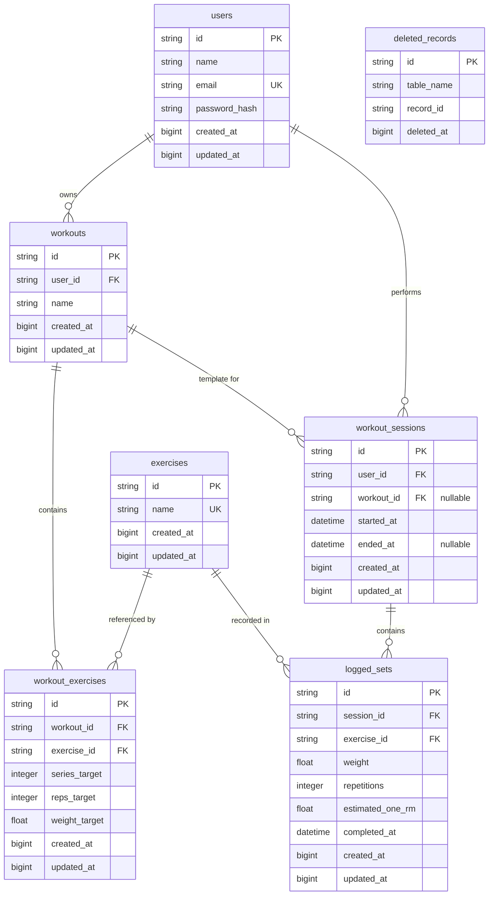

# Design Document: Offline-First Database Rebuild

## Overview

This design specifies the complete rebuild of the GymNight database schema to support offline-first synchronization with mobile clients using the WatermelonDB Sync Protocol. The current architecture uses PostgreSQL-specific UUID types and integer auto-increment patterns that are incompatible with offline-first requirements. The new architecture replaces all primary keys with client-generated String UUIDs, adds sync timestamp tracking columns, implements tombstone deletion tracking, and restructures the data model to separate workout templates from workout sessions.

### Key Architectural Changes

1. **Primary Keys**: Replace all integer auto-increment IDs with String(36) UUID columns that can be generated offline by mobile clients
2. **Sync Timestamps**: Add `created_at` and `updated_at` BigInteger columns storing Unix milliseconds to enable incremental sync
3. **Deletion Tracking**: Implement `deleted_records` tombstone table to propagate deletions to offline clients
4. **Data Model Separation**: Split workout concept into:
   - `workouts`: Workout templates with planned exercises and targets
   - `workout_sessions`: Actual workout instances with timer tracking
   - `logged_sets`: Individual completed exercise sets with actual performance data
5. **One-RM Calculation**: Automatic calculation and storage of estimated one-rep max using Epley formula for PR tracking

### Sync Protocol Compatibility

The WatermelonDB Sync Protocol requires:
- Client-side ID generation (UUIDs) to avoid server roundtrips during offline creation
- Timestamp-based change tracking (`updated_at`) to identify modified records since last sync
- Tombstone records (`deleted_records`) to track deletions that occurred while client was offline
- Bidirectional sync where both client and server can create/modify/delete records independently

This design ensures full compatibility with WatermelonDB's sync requirements while maintaining PostgreSQL as the authoritative backend store.

## Architecture

### Database Technology Stack

- **ORM**: SQLAlchemy 2.x with declarative Base
- **Database**: PostgreSQL 14+
- **Connection Pool**: SQLAlchemy default pool (5 connections)
- **Migration Tool**: Alembic (to be integrated separately)
- **Sync Protocol**: WatermelonDB bidirectional sync


### Schema Design Principles

1. **Offline-First ID Generation**: All tables use String(36) UUIDs as primary keys, generated client-side using standard UUID v4 libraries
2. **Timestamp-Based Sync**: All syncable tables include `created_at` and `updated_at` columns stored as BigInteger Unix milliseconds
3. **Soft Deletion with Tombstones**: Deletes create records in `deleted_records` table instead of immediate hard deletion
4. **Referential Integrity**: Foreign keys with explicit cascade rules (CASCADE, RESTRICT, SET NULL) based on business logic
5. **Normalized Structure**: Separate tables for templates (workouts), sessions (workout_sessions), and performance data (logged_sets)

### Sync Workflow

**Client-to-Server Push**:
1. Client collects all local changes since `last_pulled_at` timestamp
2. Client sends created/modified records with their UUIDs and timestamps
3. Server validates and inserts/updates records, preserving client timestamps
4. Server returns timestamp of sync completion

**Server-to-Client Pull**:
1. Client sends `last_pulled_at` timestamp from previous sync
2. Server queries all records where `updated_at > last_pulled_at`
3. Server queries `deleted_records` where `deleted_at > last_pulled_at`
4. Client applies changes: updates existing records, creates new ones, deletes tombstoned records
5. Client stores new `last_pulled_at` timestamp

## Components and Interfaces

### SQLAlchemy Base Configuration

All models inherit from `Base = declarative_base()` defined in `app/database/connection.py`. The existing connection infrastructure remains unchanged:

```python
engine = create_engine(DATABASE_URL)
SessionLocal = sessionmaker(autocommit=False, autoflush=False, bind=engine)
Base = declarative_base()
```

### Common Sync Mixin Pattern


All syncable models share common columns for WatermelonDB compatibility:

```python
import time

def current_timestamp_ms():
    """Generate current Unix timestamp in milliseconds"""
    return int(time.time() * 1000)

# Common columns for all syncable models:
id = Column(String(36), primary_key=True)  # Client-generated UUID
created_at = Column(BigInteger, nullable=False, default=current_timestamp_ms)
updated_at = Column(BigInteger, nullable=False, default=current_timestamp_ms, onupdate=current_timestamp_ms)
```

## Data Models

### 1. User Model (`users` table)

**Purpose**: Store user accounts with profile information and authentication credentials.

**Columns**:
- `id`: String(36) - Client-generated UUID, primary key
- `name`: String(255) - User's full name, not null
- `email`: String(255) - Unique email for authentication, indexed, not null
- `password_hash`: String(255) - Bcrypt hashed password, not null
- `created_at`: BigInteger - Unix milliseconds when created, not null
- `updated_at`: BigInteger - Unix milliseconds when last modified, not null

**Relationships**:
- `workouts`: One-to-many with Workout, `back_populates="user"`, `cascade="all, delete-orphan"`
- `workout_sessions`: One-to-many with WorkoutSession, `back_populates="user"`, `cascade="all, delete-orphan"`

**Constraints**:
- UNIQUE constraint on `email`
- INDEX on `email` for fast login queries

**Cascade Behavior**:
When a user is deleted, all owned workouts and workout sessions are automatically deleted (CASCADE).


### 2. Exercise Model (`exercises` table)

**Purpose**: Master list of exercise definitions that can be referenced by workout plans and logged sets. This is a shared reference table - exercises are not owned by users.

**Columns**:
- `id`: String(36) - Client-generated UUID, primary key
- `name`: String(255) - Exercise name (e.g., "Barbell Bench Press"), unique, indexed, not null
- `created_at`: BigInteger - Unix milliseconds when created, not null
- `updated_at`: BigInteger - Unix milliseconds when last modified, not null

**Relationships**:
- `workout_exercises`: One-to-many with WorkoutExercise, `back_populates="exercise"`, no cascade
- `logged_sets`: One-to-many with LoggedSet, `back_populates="exercise"`, no cascade

**Constraints**:
- UNIQUE constraint on `name`
- INDEX on `name` for fast exercise lookup

**Cascade Behavior**:
Exercises are protected from deletion when referenced by workout plans or logged sets (RESTRICT on foreign keys). This prevents data loss - historical logged sets must retain exercise names even if removed from current workout plans.

### 3. Workout Model (`workouts` table)

**Purpose**: Store workout templates (planned workouts) owned by users. These are the workout "plans" that define which exercises to perform with target sets/reps/weight.

**Columns**:
- `id`: String(36) - Client-generated UUID, primary key
- `user_id`: String(36) - Foreign key to users.id, not null, CASCADE on delete
- `name`: String(255) - Workout template name (e.g., "Push Day A"), not null
- `created_at`: BigInteger - Unix milliseconds when created, not null
- `updated_at`: BigInteger - Unix milliseconds when last modified, not null

**Relationships**:
- `user`: Many-to-one with User, `back_populates="workouts"`
- `workout_exercises`: One-to-many with WorkoutExercise, `back_populates="workout"`, `cascade="all, delete-orphan"`
- `workout_sessions`: One-to-many with WorkoutSession, `back_populates="workout"`, no cascade (SET NULL on delete)

**Constraints**:
- FOREIGN KEY `user_id` references `users.id` ON DELETE CASCADE

**Cascade Behavior**:
- When user deleted: workout is deleted (CASCADE from users)
- When workout deleted: all workout_exercises are deleted (CASCADE)
- When workout deleted: workout_sessions.workout_id is set to NULL (SET NULL) - session history preserved but template reference removed


### 4. WorkoutExercise Model (`workout_exercises` table)

**Purpose**: Define planned exercises within a workout template, specifying target performance goals (sets, reps, weight). This is the "prescription" for what should be performed in a workout.

**Columns**:
- `id`: String(36) - Client-generated UUID, primary key
- `workout_id`: String(36) - Foreign key to workouts.id, not null, CASCADE on delete
- `exercise_id`: String(36) - Foreign key to exercises.id, not null, RESTRICT on delete
- `series_target`: Integer - Target number of sets, not null
- `reps_target`: Integer - Target repetitions per set, not null
- `weight_target`: Float - Target weight in kg, not null
- `created_at`: BigInteger - Unix milliseconds when created, not null
- `updated_at`: BigInteger - Unix milliseconds when last modified, not null

**Relationships**:
- `workout`: Many-to-one with Workout, `back_populates="workout_exercises"`
- `exercise`: Many-to-one with Exercise, `back_populates="workout_exercises"`

**Constraints**:
- FOREIGN KEY `workout_id` references `workouts.id` ON DELETE CASCADE
- FOREIGN KEY `exercise_id` references `exercises.id` ON DELETE RESTRICT

**Cascade Behavior**:
- When workout deleted: workout_exercises are deleted (CASCADE)
- When exercise deleted: operation fails if workout_exercises reference it (RESTRICT)

### 5. WorkoutSession Model (`workout_sessions` table)

**Purpose**: Track actual workout instances with start/end timestamps. This represents a real workout session that occurred, optionally based on a workout template.

**Columns**:
- `id`: String(36) - Client-generated UUID, primary key
- `user_id`: String(36) - Foreign key to users.id, not null, CASCADE on delete
- `workout_id`: String(36) - Foreign key to workouts.id, nullable, SET NULL on delete
- `started_at`: DateTime(timezone=True) - When workout session began, not null
- `ended_at`: DateTime(timezone=True) - When workout session ended, nullable (null = in progress)
- `created_at`: BigInteger - Unix milliseconds when created, not null
- `updated_at`: BigInteger - Unix milliseconds when last modified, not null

**Relationships**:
- `user`: Many-to-one with User, `back_populates="workout_sessions"`
- `workout`: Many-to-one with Workout, `back_populates="workout_sessions"`
- `logged_sets`: One-to-many with LoggedSet, `back_populates="session"`, `cascade="all, delete-orphan"`


**Constraints**:
- FOREIGN KEY `user_id` references `users.id` ON DELETE CASCADE
- FOREIGN KEY `workout_id` references `workouts.id` ON DELETE SET NULL

**Cascade Behavior**:
- When user deleted: all workout sessions are deleted (CASCADE)
- When workout template deleted: workout_id is set to NULL but session preserved (SET NULL)
- When session deleted: all logged_sets for that session are deleted (CASCADE)

**Nullable Fields**:
- `workout_id`: Nullable to support freestyle sessions not based on a template
- `ended_at`: Nullable to represent in-progress sessions that haven't been completed

### 6. LoggedSet Model (`logged_sets` table)

**Purpose**: Record individual completed exercise sets with actual performance data (weight, reps) and calculated one-rep max for PR tracking.

**Columns**:
- `id`: String(36) - Client-generated UUID, primary key
- `session_id`: String(36) - Foreign key to workout_sessions.id, not null, CASCADE on delete
- `exercise_id`: String(36) - Foreign key to exercises.id, not null, RESTRICT on delete
- `weight`: Float - Actual weight lifted in kg, not null
- `repetitions`: Integer - Actual repetitions completed, not null
- `estimated_one_rm`: Float - Calculated one-rep max using Epley formula, not null
- `completed_at`: DateTime(timezone=True) - When set was completed, not null
- `created_at`: BigInteger - Unix milliseconds when created, not null
- `updated_at`: BigInteger - Unix milliseconds when last modified, not null

**Relationships**:
- `session`: Many-to-one with WorkoutSession, `back_populates="logged_sets"`
- `exercise`: Many-to-one with Exercise, `back_populates="logged_sets"`

**Constraints**:
- FOREIGN KEY `session_id` references `workout_sessions.id` ON DELETE CASCADE
- FOREIGN KEY `exercise_id` references `exercises.id` ON DELETE RESTRICT

**Cascade Behavior**:
- When workout session deleted: all logged_sets for that session are deleted (CASCADE)
- When exercise deleted: operation fails if logged_sets reference it (RESTRICT) - preserves historical data

**Calculated Fields**:
- `estimated_one_rm`: Automatically calculated using Epley formula: `weight × (1 + repetitions/30)`
- Can be calculated via SQLAlchemy hybrid property or application logic before insert

# TECH DESIGN SPECIFICATION: WATERMELONDB COMPATIBLE MODELS

## 1. ARCHITECTURAL OVERVIEW
This specification defines the SQLAlchemy ORM models for GymNight backend, fully adapted to the WatermelonDB Sync Protocol. Every table uses client-generated String UUIDs as Primary Keys and tracks mutations using Unix Milliseconds (BigInteger) to enable seamless offline-first synchronization.

## 2. DATABASE SCHEMA DESIGN

### 2.1 Base Mixin for Synchronization
To avoid repetition and guarantee architectural safety, all syncable models must inherit or implement these synchronization columns:
- `id`: String(36), Primary Key, no auto-increment (generated client-side).
- `created_at`: BigInteger, Not Null, stores current Unix time in milliseconds.
- `updated_at`: BigInteger, Not Null, stores current Unix time in milliseconds, updates automatically on mutation.

---

## 3. MODELS SPECIFICATION (SQLALCHEMY)

### 3.1 User (`users`)
- **Columns**:
  - `id`: String(36), Primary Key
  - `name`: String(255), Not Null
  - `email`: String(255), Unique, Index, Not Null
  - `password_hash`: String(255), Not Null
  - `created_at` / `updated_at`: BigInteger
- **Relationships**:
  - `workouts`: back_populates="user", cascade="all, delete-orphan"
  - `workout_sessions`: back_populates="user", cascade="all, delete-orphan"

### 3.2 Exercise (`exercises`)
- **Columns**:
  - `id`: String(36), Primary Key
  - `name`: String(255), Unique, Index, Not Null
  - `created_at` / `updated_at`: BigInteger
- **Relationships**:
  - `workout_exercises`: back_populates="exercise" (No cascade delete)
  - `logged_sets`: back_populates="exercise" (No cascade delete)

### 3.3 Workout (`workouts`)
- **Columns**:
  - `id`: String(36), Primary Key
  - `user_id`: String(36), ForeignKey('users.id', ondelete='CASCADE'), Not Null
  - `name`: String(255), Not Null
  - `created_at` / `updated_at`: BigInteger
- **Relationships**:
  - `user`: back_populates="workouts"
  - `workout_exercises`: back_populates="workout", cascade="all, delete-orphan"
  - `workout_sessions`: back_populates="workout" (set null on delete)

### 3.4 WorkoutExercise (`workout_exercises`)
- **Columns**:
  - `id`: String(36), Primary Key
  - `workout_id`: String(36), ForeignKey('workouts.id', ondelete='CASCADE'), Not Null
  - `exercise_id`: String(36), ForeignKey('exercises.id', ondelete='RESTRICT'), Not Null
  - `series_target`: Integer, Not Null
  - `reps_target`: Integer, Not Null
  - `weight_target`: Float, Not Null
  - `created_at` / `updated_at`: BigInteger
- **Relationships**:
  - `workout`: back_populates="workout_exercises"
  - `exercise`: back_populates="workout_exercises"

### 3.5 WorkoutSession (`workout_sessions`)
- **Columns**:
  - `id`: String(36), Primary Key
  - `user_id`: String(36), ForeignKey('users.id', ondelete='CASCADE'), Not Null
  - `workout_id`: String(36), ForeignKey('workouts.id', ondelete='SET NULL'), Nullable
  - `started_at`: DateTime(timezone=True), Not Null
  - `ended_at`: DateTime(timezone=True), Nullable
  - `created_at` / `updated_at`: BigInteger
- **Relationships**:
  - `user`: back_populates="workout_sessions"
  - `workout`: back_populates="workout_sessions"
  - `logged_sets`: back_populates="session", cascade="all, delete-orphan"

### 3.6 LoggedSet (`logged_sets`)
- **Columns**:
  - `id`: String(36), Primary Key
  - `session_id`: String(36), ForeignKey('workout_sessions.id', ondelete='CASCADE'), Not Null
  - `exercise_id`: String(36), ForeignKey('exercises.id', ondelete='RESTRICT'), Not Null
  - `weight`: Float, Not Null
  - `repetitions`: Integer, Not Null
  - `estimated_one_rm`: Float, Not Null (Computed or stored using Epley Formula: weight * (1 + repetitions / 30))
  - `completed_at`: DateTime(timezone=True), Not Null
  - `created_at` / `updated_at`: BigInteger
- **Relationships**:
  - `session`: back_populates="logged_sets"
  - `exercise`: back_populates="logged_sets"

### 3.7 DeletedRecord (`deleted_records`)
- **Columns**:
  - `id`: String(36), Primary Key
  - `table_name`: String(255), Not Null (e.g., 'workouts', 'logged_sets')
  - `record_id`: String(36), Not Null (The UUID of the deleted record)
  - `deleted_at`: BigInteger, Not Null (Unix timestamp in ms)

---

## 4. TASK LIST FOR IMPLEMENTATION

- [ ] **Task 1**: Import all required modules from SQLAlchemy (`Column`, `String`, `Integer`, `Float`, `BigInteger`, `DateTime`, `ForeignKey`, `event`) and `time`.
- [ ] **Task 2**: Define a helper function or default generator to return current Unix time in milliseconds (`int(time.time() * 1000)`).
- [ ] **Task 3**: Implement the `User` model with sync timestamps and cascade configuration for templates and sessions.
- [ ] **Task 4**: Implement the `Exercise` model ensuring unique naming constraints and relationships without cascade deletes.
- [ ] **Task 5**: Implement the `Workout` and `WorkoutExercise` models to map planned schedules.
- [ ] **Task 6**: Implement `WorkoutSession` and `LoggedSet`. Inside `LoggedSet`, add a Python property or hooks to ensure `estimated_one_rm` auto-calculates if not sent by the client.
- [ ] **Task 7**: Implement the `DeletedRecord` tombstone model.
- [ ] **Task 8**: Add comprehensive line-by-line comments detailing the Sync Architecture constraints (UUID justification, Unix millisecond timestamps, Epley formula breakdown, and deletion tracking).

### 7. DeletedRecord Model (`deleted_records` table)

**Purpose**: Tombstone table tracking deletions for sync protocol. When a syncable record is deleted, a tombstone is created to inform offline clients during next sync.

**Columns**:
- `id`: String(36) - UUID for this tombstone record, primary key
- `table_name`: String(255) - Name of table where deletion occurred (e.g., "workouts"), not null
- `record_id`: String(36) - UUID of the deleted record, not null
- `deleted_at`: BigInteger - Unix milliseconds when deletion occurred, not null

**No Relationships**: This is a standalone tracking table

**Constraints**:
- INDEX on `deleted_at` for efficient sync queries
- INDEX on `table_name` for filtering by entity type

**Sync Protocol Usage**:
When client syncs with `last_pulled_at = 1234567890`:
1. Server queries: `SELECT * FROM deleted_records WHERE deleted_at > 1234567890`
2. Client receives list of deleted records: `[{table: "workouts", id: "abc-123"}, ...]`
3. Client deletes these records from local WatermelonDB
4. Tombstones can be periodically cleaned (e.g., older than 90 days) to prevent table growth

## Components and Interfaces

### SQLAlchemy Model Structure

Each model class will follow this pattern:

```python
from sqlalchemy import Column, String, Integer, Float, BigInteger, DateTime, ForeignKey
from sqlalchemy.orm import relationship
from app.database.connection import Base
import time

def current_timestamp_ms():
    return int(time.time() * 1000)

class ModelName(Base):
    __tablename__ = "table_name"
    
    # Primary key - client-generated UUID
    id = Column(String(36), primary_key=True)
    
    # Sync timestamps
    created_at = Column(BigInteger, nullable=False, default=current_timestamp_ms)
    updated_at = Column(BigInteger, nullable=False, default=current_timestamp_ms, onupdate=current_timestamp_ms)
    
    # Additional columns...
    
    # Relationships with back_populates
    related_entity = relationship("RelatedModel", back_populates="reverse_relation")
```


### API Endpoint Interface Changes

**Sync Endpoint** (new):
```
POST /api/sync
Request Body:
{
  "last_pulled_at": 1234567890,  // Unix ms timestamp
  "changes": {
    "users": { "created": [...], "updated": [...] },
    "workouts": { "created": [...], "updated": [...] },
    // ... other tables
  }
}

Response:
{
  "changes": {
    "users": { "created": [...], "updated": [...], "deleted": [...] },
    "workouts": { "created": [...], "updated": [...], "deleted": [...] },
    // ... other tables
  },
  "timestamp": 1234567999  // Server timestamp after sync
}
```

**Create/Update Endpoints**:
All create/update endpoints must accept client-provided `id` and `created_at`/`updated_at` timestamps to support offline creation:

```
POST /api/workouts
{
  "id": "550e8400-e29b-41d4-a716-446655440000",  // Client-generated UUID
  "user_id": "...",
  "name": "Push Day A",
  "created_at": 1234567890,
  "updated_at": 1234567890
}
```

## Correctness Properties

**Property-Based Testing Applicability**: Not applicable for this feature.

**Rationale**: This feature implements Infrastructure as Code (declarative SQLAlchemy ORM schema definitions). Property-based testing requires pure functions with parameterized inputs, which does not apply to static schema configuration. Testing will rely on example-based unit tests, schema validation, and integration tests as detailed in the Testing Strategy section.

## Error Handling

### Database Constraint Violations

**Unique Constraint Violations**:
- **Scenario**: Client attempts to create user with duplicate email, or exercise with duplicate name
- **Handling**: Catch `sqlalchemy.exc.IntegrityError`, check if constraint is UNIQUE, return HTTP 409 Conflict with message: "Email already exists" or "Exercise name already exists"
- **Client Behavior**: Client should handle 409 by updating existing record instead of creating new one

**Foreign Key Violations**:
- **Scenario**: Client references non-existent user_id, workout_id, or exercise_id
- **Handling**: Catch `sqlalchemy.exc.IntegrityError`, check if constraint is FOREIGN KEY, return HTTP 400 Bad Request with message: "Referenced user/workout/exercise does not exist"
- **Client Behavior**: Client should sync pulls before pushing to ensure all referenced entities exist

**Cascade Delete Prevention**:
- **Scenario**: Server attempts to delete exercise that is referenced by workout_exercises or logged_sets (RESTRICT constraint)
- **Handling**: Catch `sqlalchemy.exc.IntegrityError`, return HTTP 409 Conflict with message: "Cannot delete exercise: still referenced by workout plans or logged sets"
- **Client Behavior**: Client should prevent user from deleting exercises that are in use

### Sync Conflict Resolution

**Timestamp Conflicts**:
- **Scenario**: Client pushes update with `updated_at` timestamp older than server's current version (indicates concurrent modification)
- **Handling**: Implement "Last Write Wins" strategy - accept client update but log warning for audit trail
- **Alternative**: Implement conflict detection - return HTTP 409 with both versions, let client merge

**Orphaned References During Sync**:
- **Scenario**: Client creates logged_set referencing session_id that doesn't exist on server yet (out-of-order sync)
- **Handling**: Process creates in dependency order: users → workout_sessions → logged_sets. If reference still missing, return HTTP 400 with specific missing entity
- **Client Behavior**: Client should batch sync operations and send in correct dependency order


### Data Validation Errors

**Invalid UUID Format**:
- **Scenario**: Client sends malformed UUID (not 36 characters, invalid format)
- **Handling**: Pydantic schema validation catches before database, return HTTP 422 Unprocessable Entity
- **Prevention**: Use Pydantic `UUID4` type in request schemas

**Negative Values**:
- **Scenario**: Client sends negative weight, repetitions, or series_target
- **Handling**: Add Pydantic validators to check `>= 0`, return HTTP 422 with message: "Weight/reps must be positive"
- **Database**: Consider adding CHECK constraints for extra safety

**Timestamp Consistency**:
- **Scenario**: Client sends `ended_at` timestamp before `started_at` in workout_session
- **Handling**: Add Pydantic validator checking `ended_at >= started_at`, return HTTP 422
- **Database**: Consider adding CHECK constraint: `ended_at IS NULL OR ended_at >= started_at`

### Epley Formula Edge Cases

**Zero Repetitions**:
- **Scenario**: LoggedSet with `repetitions = 0`
- **Handling**: Epley formula: `weight × (1 + 0/30) = weight × 1 = weight` (valid result)
- **Business Rule**: Should this be allowed? Consider minimum `repetitions >= 1` validation

**Very High Repetitions**:
- **Scenario**: LoggedSet with `repetitions = 100` (Epley formula becomes less accurate for high reps)
- **Handling**: Formula still calculates: `weight × (1 + 100/30) ≈ weight × 4.33`
- **Business Rule**: Consider warning or capping at reasonable maximum (e.g., 30 reps) since Epley is designed for 1-10 rep range

**Zero Weight**:
- **Scenario**: Bodyweight exercises with `weight = 0`
- **Handling**: Epley formula: `0 × (1 + reps/30) = 0` (valid but not useful for PR tracking)
- **Business Rule**: Consider allowing but excluding from PR calculations, or requiring minimum weight

## Testing Strategy

Since property-based testing is not applicable to this database schema feature, testing will focus on:

### 1. Schema Validation Tests

**DDL Generation Tests**:
- Generate SQLAlchemy DDL using `Base.metadata.create_all()`
- Compare generated DDL against expected schema snapshot
- Verify all tables exist with correct column types
- Verify all foreign keys and constraints are present


**Constraint Validation Tests**:
```python
def test_unique_email_constraint():
    """Verify users.email UNIQUE constraint works"""
    user1 = User(id=str(uuid.uuid4()), name="Alice", email="alice@example.com", password_hash="...")
    db.add(user1)
    db.commit()
    
    user2 = User(id=str(uuid.uuid4()), name="Bob", email="alice@example.com", password_hash="...")
    db.add(user2)
    with pytest.raises(IntegrityError, match="unique constraint.*email"):
        db.commit()
```

**Foreign Key Constraint Tests**:
```python
def test_foreign_key_prevents_orphan_workout():
    """Verify workout.user_id foreign key prevents orphaned records"""
    workout = Workout(id=str(uuid.uuid4()), user_id="nonexistent-uuid", name="Test")
    db.add(workout)
    with pytest.raises(IntegrityError, match="foreign key constraint"):
        db.commit()
```

### 2. Cascade Delete Tests

**User Cascade Delete**:
```python
def test_cascade_delete_user_removes_workouts_and_sessions():
    """Verify deleting user cascades to workouts and workout_sessions"""
    user = create_user()
    workout = create_workout(user_id=user.id)
    session = create_workout_session(user_id=user.id)
    
    db.delete(user)
    db.commit()
    
    assert db.query(Workout).filter_by(id=workout.id).first() is None
    assert db.query(WorkoutSession).filter_by(id=session.id).first() is None
```

**Workout Cascade Delete**:
```python
def test_cascade_delete_workout_removes_exercises_but_preserves_sessions():
    """Verify deleting workout cascades to workout_exercises but sets workout_id to NULL in sessions"""
    workout = create_workout()
    workout_exercise = create_workout_exercise(workout_id=workout.id)
    session = create_workout_session(workout_id=workout.id)
    
    db.delete(workout)
    db.commit()
    
    assert db.query(WorkoutExercise).filter_by(id=workout_exercise.id).first() is None
    session_after = db.query(WorkoutSession).filter_by(id=session.id).first()
    assert session_after is not None
    assert session_after.workout_id is None
```


**Exercise RESTRICT Protection**:
```python
def test_restrict_delete_exercise_with_references():
    """Verify exercises cannot be deleted when referenced by workout_exercises or logged_sets"""
    exercise = create_exercise(name="Bench Press")
    workout_exercise = create_workout_exercise(exercise_id=exercise.id)
    
    db.delete(exercise)
    with pytest.raises(IntegrityError, match="foreign key constraint"):
        db.commit()
```

### 3. Sync Timestamp Tests

**Automatic Timestamp Generation**:
```python
def test_created_at_set_automatically():
    """Verify created_at is set to current Unix milliseconds on creation"""
    before = int(time.time() * 1000)
    user = User(id=str(uuid.uuid4()), name="Test", email="test@example.com", password_hash="...")
    db.add(user)
    db.commit()
    after = int(time.time() * 1000)
    
    assert before <= user.created_at <= after

def test_updated_at_changes_on_modification():
    """Verify updated_at is updated when record is modified"""
    user = create_user()
    original_updated_at = user.updated_at
    
    time.sleep(0.01)  # Ensure timestamp difference
    user.name = "New Name"
    db.commit()
    
    assert user.updated_at > original_updated_at
```

**Client-Provided Timestamps**:
```python
def test_accept_client_generated_timestamps():
    """Verify server accepts client-provided created_at and updated_at values"""
    client_timestamp = 1234567890000
    user = User(
        id=str(uuid.uuid4()),
        name="Test",
        email="test@example.com",
        password_hash="...",
        created_at=client_timestamp,
        updated_at=client_timestamp
    )
    db.add(user)
    db.commit()
    
    assert user.created_at == client_timestamp
    assert user.updated_at == client_timestamp
```

### 4. One-RM Calculation Tests

**Epley Formula Accuracy**:
```python
def test_epley_formula_calculation():
    """Verify estimated_one_rm is calculated correctly using Epley formula"""
    logged_set = LoggedSet(
        id=str(uuid.uuid4()),
        session_id=session.id,
        exercise_id=exercise.id,
        weight=100.0,
        repetitions=10,
        completed_at=datetime.now(timezone.utc)
    )
    
    # Epley: 100 × (1 + 10/30) = 100 × 1.333... ≈ 133.33
    expected_one_rm = 100.0 * (1 + 10/30)
    assert abs(logged_set.estimated_one_rm - expected_one_rm) < 0.01
```


**Edge Case Tests**:
```python
def test_one_rm_with_zero_repetitions():
    """Verify one-RM calculation with 0 reps returns weight"""
    logged_set = create_logged_set(weight=100.0, repetitions=0)
    assert logged_set.estimated_one_rm == 100.0

def test_one_rm_with_high_repetitions():
    """Verify one-RM calculation with high reps (formula becomes less accurate)"""
    logged_set = create_logged_set(weight=50.0, repetitions=100)
    expected = 50.0 * (1 + 100/30)  # ≈ 216.67
    assert abs(logged_set.estimated_one_rm - expected) < 0.01
```

### 5. Tombstone Deletion Tests

**Tombstone Creation on Delete**:
```python
def test_tombstone_created_when_workout_deleted():
    """Verify deleted_records entry is created when workout is deleted"""
    workout = create_workout()
    workout_id = workout.id
    
    db.delete(workout)
    db.commit()
    
    tombstone = db.query(DeletedRecord).filter_by(
        table_name="workouts",
        record_id=workout_id
    ).first()
    assert tombstone is not None
    assert tombstone.deleted_at > 0
```

**Sync Query with Tombstones**:
```python
def test_sync_returns_deleted_records_since_timestamp():
    """Verify sync endpoint returns tombstones for records deleted since last pull"""
    last_pulled_at = int(time.time() * 1000)
    
    workout = create_workout()
    db.delete(workout)
    db.commit()
    
    deleted_records = db.query(DeletedRecord).filter(
        DeletedRecord.deleted_at > last_pulled_at
    ).all()
    
    assert len(deleted_records) == 1
    assert deleted_records[0].table_name == "workouts"
```

### 6. Integration Tests

**Full Sync Workflow**:
```python
def test_full_sync_push_and_pull():
    """Integration test: client pushes changes, then pulls server changes"""
    # Client creates workout offline
    client_workout = {
        "id": str(uuid.uuid4()),
        "user_id": user.id,
        "name": "Offline Workout",
        "created_at": int(time.time() * 1000),
        "updated_at": int(time.time() * 1000)
    }
    
    # Push to server
    response = client.post("/api/sync", json={"changes": {"workouts": {"created": [client_workout]}}})
    assert response.status_code == 200
    
    # Verify workout exists on server
    workout = db.query(Workout).filter_by(id=client_workout["id"]).first()
    assert workout is not None
    assert workout.name == "Offline Workout"
```


**Bidirectional Relationship Navigation**:
```python
def test_bidirectional_relationship_navigation():
    """Verify back_populates enables navigation in both directions"""
    user = create_user()
    workout = create_workout(user_id=user.id)
    
    # Navigate from parent to child
    assert workout in user.workouts
    
    # Navigate from child to parent
    assert workout.user.id == user.id
```

### 7. Performance Tests

**Sync Query Performance**:
```python
def test_sync_query_with_large_dataset():
    """Verify sync queries perform efficiently with large datasets"""
    # Create 10,000 workouts
    for i in range(10000):
        create_workout()
    
    last_pulled_at = int(time.time() * 1000) - 86400000  # 24 hours ago
    
    start = time.time()
    changes = db.query(Workout).filter(Workout.updated_at > last_pulled_at).all()
    duration = time.time() - start
    
    assert duration < 1.0  # Should complete within 1 second
    assert len(changes) > 0
```

### Test Coverage Goals

- **Unit Tests**: 100% coverage of model class definitions and constraints
- **Integration Tests**: All CRUD operations and sync workflows
- **Edge Case Tests**: Boundary conditions for Epley formula, timestamps, nullable fields
- **Performance Tests**: Sync queries with realistic data volumes (10k+ records)

### Test Database Configuration

Use separate test database with:
- Isolated PostgreSQL instance or SQLite in-memory for unit tests
- Automatic schema creation via `Base.metadata.create_all()`
- Transaction rollback after each test for isolation
- Fixtures for common test data (users, workouts, exercises)

## Implementation Notes

### Migration Strategy

**Step 1: Create New Schema**
- Generate Alembic migration creating all 7 tables with new structure
- Do NOT drop existing tables yet

**Step 2: Data Migration**
- Write migration script to transform old data to new schema:
  - Copy `users` table data (excluding removed weight/height/birth_date/gender columns)
  - Transform old `workouts` table to new `workout_sessions` + `logged_sets` structure
  - Split old `exercises` table into `exercises` + `workout_exercises` based on context
- Generate UUIDs for existing records and populate timestamps


**Step 3: API Updates**
- Update all endpoints to work with new schema
- Maintain backward compatibility if needed (feature flag)

**Step 4: Client Update**
- Release mobile app update with WatermelonDB integration
- Force update to ensure all clients use new sync protocol

**Step 5: Cleanup**
- Drop old tables after confirming new system works
- Remove backward compatibility code

### UUID Generation

**Server-side helper**:
```python
import uuid

def generate_uuid():
    """Generate UUID v4 string in standard format"""
    return str(uuid.uuid4())
```

**Client-side (React Native)**:
```javascript
import uuid from 'react-native-uuid';

const id = uuid.v4(); // "550e8400-e29b-41d4-a716-446655440000"
```

### Timestamp Helper Functions

```python
import time

def current_timestamp_ms():
    """Get current Unix timestamp in milliseconds"""
    return int(time.time() * 1000)

def timestamp_to_datetime(ms_timestamp):
    """Convert Unix milliseconds to Python datetime"""
    return datetime.fromtimestamp(ms_timestamp / 1000, tz=timezone.utc)

def datetime_to_timestamp(dt):
    """Convert Python datetime to Unix milliseconds"""
    return int(dt.timestamp() * 1000)
```

### Epley Formula Implementation

**SQLAlchemy hybrid property**:
```python
from sqlalchemy.ext.hybrid import hybrid_property

class LoggedSet(Base):
    # ... columns ...
    
    @hybrid_property
    def estimated_one_rm(self):
        """Calculate estimated one-rep max using Epley formula"""
        if self.weight is None or self.repetitions is None:
            return None
        return self.weight * (1 + self.repetitions / 30)
```

**Alternative: Application-level calculation**:
```python
def calculate_one_rm(weight: float, repetitions: int) -> float:
    """
    Calculate estimated one-rep max using Epley formula.
    
    Formula: weight × (1 + repetitions / 30)
    
    Note: This formula is most accurate for 1-10 repetitions.
    Results become less reliable for very high rep counts.
    """
    return weight * (1 + repetitions / 30)
```


### Tombstone Cleanup Job

**Periodic Cleanup Strategy**:
```python
def cleanup_old_tombstones(days_to_keep=90):
    """
    Remove tombstone records older than specified days.
    
    Rationale: After 90 days, assume all clients have synced and 
    don't need old deletion information. Prevents unbounded growth.
    """
    cutoff_timestamp = current_timestamp_ms() - (days_to_keep * 86400000)
    
    deleted_count = db.query(DeletedRecord).filter(
        DeletedRecord.deleted_at < cutoff_timestamp
    ).delete()
    
    db.commit()
    return deleted_count
```

**Scheduled Execution**:
- Run as daily cron job or scheduled task
- Log number of tombstones cleaned for monitoring
- Consider keeping tombstones longer (180 days) for rarely-syncing users

### Index Recommendations

**Performance-Critical Indexes**:
```sql
-- Users table
CREATE INDEX idx_users_email ON users(email);  -- Login queries

-- Workout-related indexes
CREATE INDEX idx_workouts_user_id ON workouts(user_id);  -- User's workouts
CREATE INDEX idx_workout_exercises_workout_id ON workout_exercises(workout_id);
CREATE INDEX idx_workout_exercises_exercise_id ON workout_exercises(exercise_id);

-- Session-related indexes
CREATE INDEX idx_workout_sessions_user_id ON workout_sessions(user_id);
CREATE INDEX idx_workout_sessions_started_at ON workout_sessions(started_at);  -- Date range queries
CREATE INDEX idx_logged_sets_session_id ON logged_sets(session_id);
CREATE INDEX idx_logged_sets_exercise_id ON logged_sets(exercise_id);  -- PR queries

-- Sync indexes
CREATE INDEX idx_users_updated_at ON users(updated_at);
CREATE INDEX idx_workouts_updated_at ON workouts(updated_at);
CREATE INDEX idx_workout_exercises_updated_at ON workout_exercises(updated_at);
CREATE INDEX idx_workout_sessions_updated_at ON workout_sessions(updated_at);
CREATE INDEX idx_logged_sets_updated_at ON logged_sets(updated_at);
CREATE INDEX idx_exercises_updated_at ON exercises(updated_at);
CREATE INDEX idx_deleted_records_deleted_at ON deleted_records(deleted_at);

-- Composite indexes for PR queries
CREATE INDEX idx_logged_sets_exercise_user ON logged_sets(exercise_id, estimated_one_rm DESC);
```

### PR (Personal Record) Query Example

```python
def get_user_pr_for_exercise(user_id: str, exercise_id: str):
    """
    Get user's personal record (highest one-RM) for an exercise.
    
    Joins workout_sessions to filter by user since logged_sets don't
    directly reference user_id.
    """
    return db.query(LoggedSet).join(
        WorkoutSession, LoggedSet.session_id == WorkoutSession.id
    ).filter(
        WorkoutSession.user_id == user_id,
        LoggedSet.exercise_id == exercise_id
    ).order_by(
        LoggedSet.estimated_one_rm.desc()
    ).first()
```


## Database Schema Diagram



## Security Considerations

### Password Storage
- Use bcrypt with cost factor 12+ for password hashing
- Never store plaintext passwords
- Consider using FastAPI's `passlib` integration

### UUID Predictability
- UUID v4 is cryptographically random and safe for public exposure
- No risk of enumeration attacks (unlike sequential IDs)


### Sync Authentication
- Require JWT token or session authentication for sync endpoint
- Validate that user can only sync their own data:
  ```python
  if workout.user_id != current_user.id:
      raise HTTPException(status_code=403, detail="Unauthorized")
  ```

### SQL Injection Prevention
- SQLAlchemy ORM automatically parameterizes queries
- Avoid raw SQL queries; if needed, use bound parameters

### Rate Limiting
- Implement rate limiting on sync endpoint (e.g., 100 requests/hour per user)
- Prevent abuse from compromised clients

## Performance Considerations

### Database Connection Pool
- Current configuration: 5 connections (SQLAlchemy default)
- Consider increasing for production based on concurrent users
- Monitor pool exhaustion metrics

### Batch Sync Operations
- Accept bulk creates/updates in single transaction
- Use SQLAlchemy `bulk_insert_mappings()` for large batches:
  ```python
  db.bulk_insert_mappings(Workout, workout_dicts)
  ```

### Query Optimization
- Use `joinedload()` for eager loading relationships to avoid N+1 queries:
  ```python
  workouts = db.query(Workout).options(
      joinedload(Workout.workout_exercises).joinedload(WorkoutExercise.exercise)
  ).filter(Workout.user_id == user_id).all()
  ```

### Index Maintenance
- Run `ANALYZE` regularly to update PostgreSQL query planner statistics
- Monitor slow queries and add indexes as needed

### Tombstone Table Growth
- Implement automatic cleanup job (daily or weekly)
- Monitor table size and adjust retention period if needed

## Deployment Checklist

### Pre-Deployment
- [ ] Create Alembic migration for new schema
- [ ] Test migration on copy of production database
- [ ] Verify all indexes are created
- [ ] Test sync endpoint with realistic data volumes
- [ ] Load test with concurrent clients

### Deployment Steps
1. Take database backup
2. Enable maintenance mode
3. Run Alembic migration
4. Verify schema with `\d` commands in psql
5. Deploy updated API code
6. Run smoke tests
7. Enable new sync endpoint
8. Release mobile app update
9. Monitor logs for errors


### Post-Deployment
- [ ] Monitor sync endpoint latency and error rates
- [ ] Verify mobile clients successfully sync
- [ ] Check tombstone table growth rate
- [ ] Monitor database connection pool usage
- [ ] Validate no foreign key violations in logs

## Future Enhancements

### Conflict Resolution
Current design uses "Last Write Wins" based on `updated_at` timestamp. Future improvements:
- Implement operational transformation for fine-grained merging
- Add `version` column for optimistic locking
- Store conflict history for user resolution

### Partial Sync
Current design syncs all changes since last pull. Optimizations:
- Table-specific `last_pulled_at` timestamps
- Sync only changed tables
- Delta encoding for large text fields

### Compression
- Compress sync payloads with gzip for bandwidth savings
- Especially beneficial for large logged_sets batches

### Real-Time Sync
- WebSocket connection for instant sync
- Push notifications for server-side changes
- Reduces need for polling

### Soft Deletes
Current design uses hard deletes with tombstones. Alternative:
- Add `deleted` boolean column to all tables
- Keep deleted records for audit trail
- Filter queries with `.filter(deleted=False)`
- Trade-off: increased storage vs. simpler sync

## Glossary Reference

Terms defined in requirements document:
- **UUID**: String(36) primary keys generated client-side
- **Sync_Timestamp**: BigInteger Unix milliseconds in `created_at`/`updated_at`
- **Tombstone_Record**: Entry in `deleted_records` table
- **One_RM**: `estimated_one_rm` calculated via Epley formula
- **Epley_Formula**: `weight × (1 + repetitions/30)`
- **Workout_Template**: Record in `workouts` table
- **Workout_Session**: Record in `workout_sessions` table
- **Logged_Set**: Record in `logged_sets` table
- **Cascade_Delete**: SQLAlchemy `cascade="all, delete-orphan"` parameter

